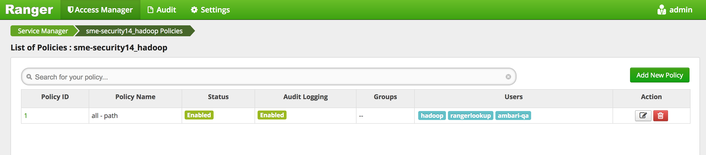
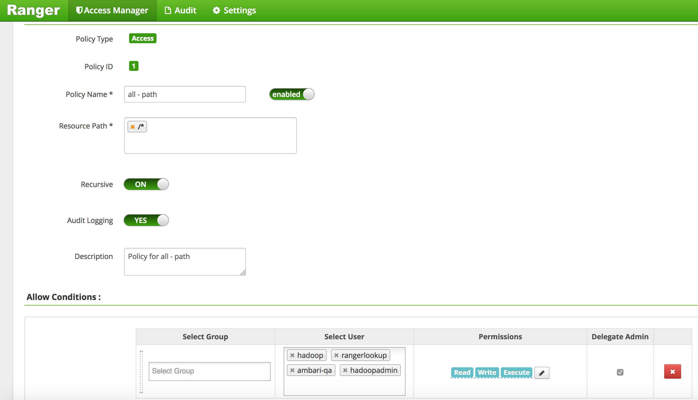
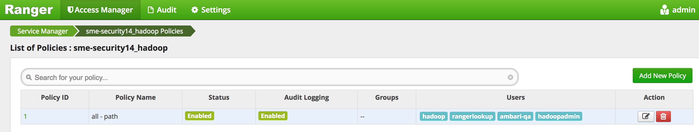
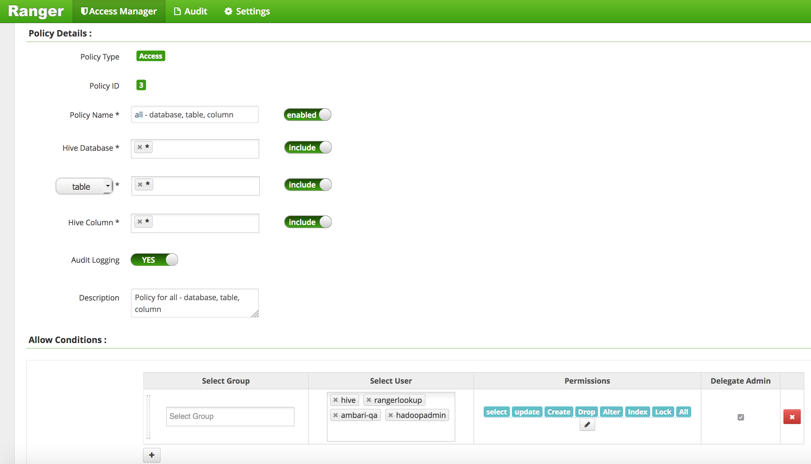
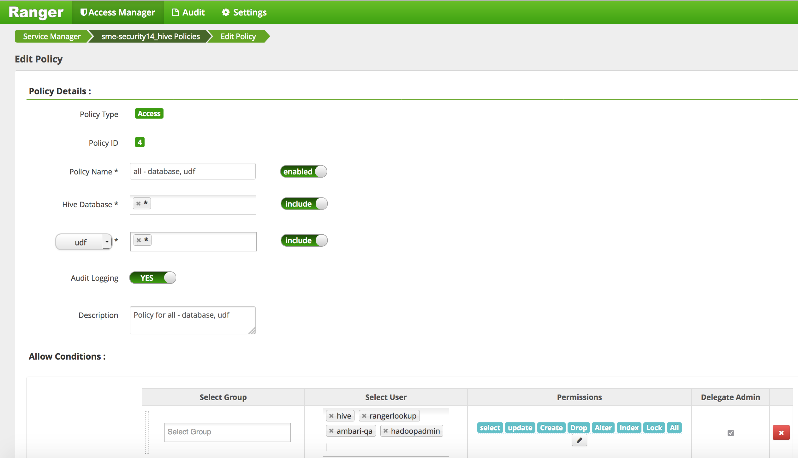
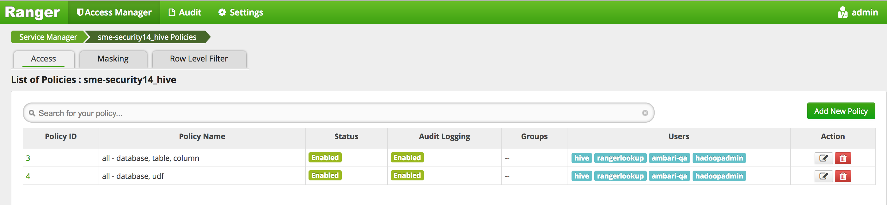
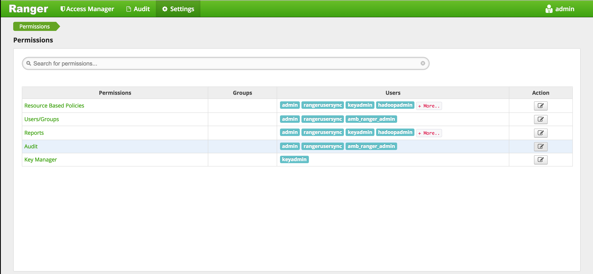
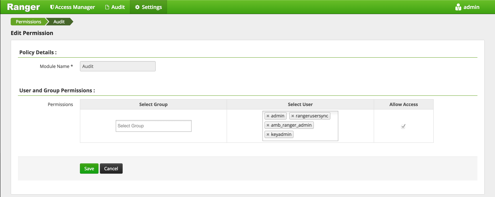
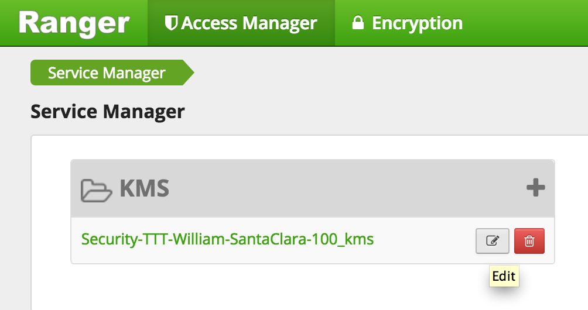
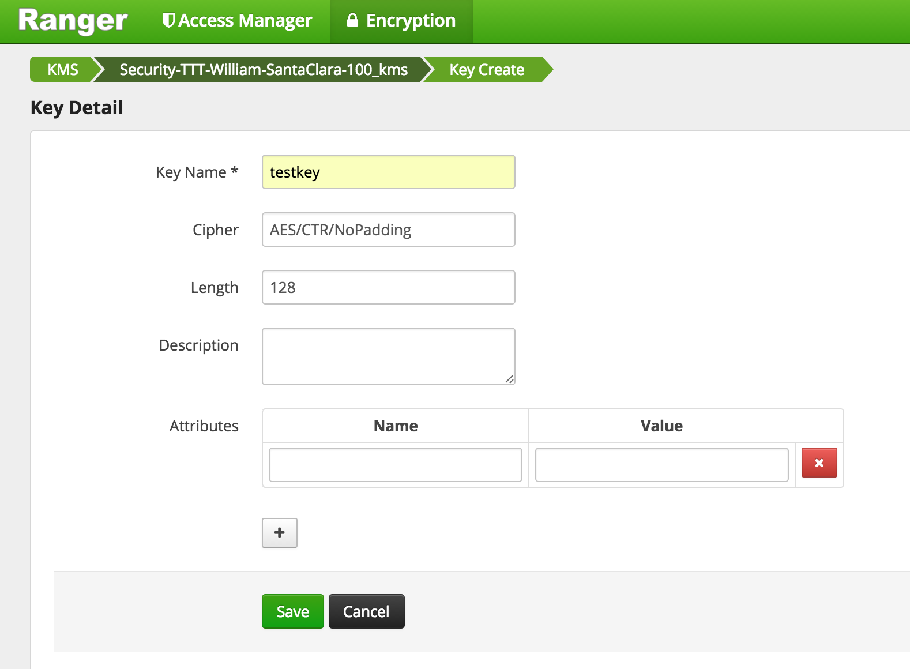

## Instuctions for IPA Lab 

### Pre-reqs
- HDP 3.x / Ambari 2.7.1 cluster<br>
- Access to an IPA server that has been setup as descibed in [Hortonworks documentation](https://docs.hortonworks.com/HDPDocuments/HDP3/HDP-3.0.1/authentication-with-kerberos/content/kerberos_optional_use_an_existing_ipa.html). See sample [script](https://github.com/HortonworksUniversity/Security_Labs/blob/master/extras/ipa.md) to set up

**Lab Topics**<br>

1. [Register cluster nodes as IPA Clients](#section-1)
2. [Secure Ambari via ambari-server setup-security](#section-2)
3. [Enable Kerberos for cluster services](#section-3)
4. [Enable LDAP for ambari](#section-4)


## <a name="section-1"></a>1. Register cluster nodes as IPA clients
- Run below on *all nodes of HDP cluster* (replace $INTERNAL_IP_OF_IPA)

```
echo "$INTERNAL_IP_OF_IPA ipa.us-west-2.compute.internal ipa" >> /etc/hosts
```

- Install yum packages
```
sudo yum install -y ipa-client
```

- Update /etc/resolve.conf (replace INTERNAL_IP_OF_IPA)
```
mv /etc/resolv.conf /etc/resolv.conf.bak 
echo "search us-west-2.compute.internal" > /etc/resolv.conf
echo "nameserver $INTERNAL_IP_OF_IPA" >> /etc/resolv.conf
```
- Install IPA client

  ```	
	sudo ipa-client-install \
	--server=ipa.us-west-2.compute.internal \
	--realm=US-WEST-2.COMPUTE.INTERNAL \
	--domain=us-west-2.compute.internal \
	--mkhomedir \
	--principal=admin -w BadPass#1 \
	--unattended
  ```
Note: restarting dbus seems to be required sometimes `service dbus restart`

- Make sure you don't see below message from the output of previous command
```
Missing A/AAAA record(s) for host xxxxxxxxx
```

- If you do, uninstall and try again:
```
service dbus restart
sudo ipa-client-install --uninstall
```

- Note by changing the DNS, its possible the node may not be able to connect to public internet. When you need to do so (e.g. for yum install, you can temporarily revert back the /etc/resolv.conf.bak)


### Verify

- By registering as a client of the IPA server, SSSD is automatically setup. So now the host recognizes users defined in IPA
```
id hadoopadmin
```

- You can also authenticate and get a kerberos ticket (password is BadPass#1)
```
kinit -V hadoopadmin
```

---


# <a name="section-2"></a> 2. Secure Ambari via ambari-server setup-security

Lets use FreeIPA Generated certificate for Options 1 and 4 in `ambari-server setup-security`
	
  ```
Security setup options...
===========================================================================
Choose one of the following options:
  *[1] Enable HTTPS for Ambari server.
  *[2] Encrypt passwords stored in ambari.properties file.
  [3] Setup Ambari kerberos JAAS configuration.
  *[4] Setup truststore.
  [5] Import certificate to truststore.
===========================================================================
  ```

**Preparation:** Create certificates on all ipa-client hosts (run this on each node)

Ensure SELinux is not enforcing, else requesting a certificate as the root user with admin's kerberos ticket will be denied by the system and certificate will not be created. 

```
getenforce
# If result is "Enforcing", run the following
sudo su
setenforce 0
```

Obtain kerberos ticket as **admin**(or an IPA Privileged User), and request a x509 certificate pair saved as "host.key" and "host.crt" on each host. 

```
echo BadPass#1 | kinit admin 
mkdir /etc/security/certificates/
cd /etc/security/certificates/
ipa-getcert request -v -f /etc/security/certificates/host.crt -k /etc/security/certificates/host.key
```

List the directory to verify certificates are created. 

```
[root@demo certificates]# ls -ltr /etc/security/certificates/
total 8
-rw------- 1 root root 1704 Sep 30 04:56 host.key
-rw------- 1 root root 1724 Sep 30 04:56 host.crt
```


### 2.1 Enable HTTPS for Ambari server
If you are running Knox on this host (which is highly not recommended) changing the default port from 8443 will avoid the port conflict. 

```
[root@demo ~]$ambari-server setup-security
 
Security setup options...
===========================================================================
Choose one of the following options:
  [1] Enable HTTPS for Ambari server.
  [2] Encrypt passwords stored in ambari.properties file.
  [3] Setup Ambari kerberos JAAS configuration.
  [4] Setup truststore.
  [5] Import certificate to truststore.
===========================================================================

# Enable SSL
Enter choice, (1-5): 1
Do you want to configure HTTPS [y/n] (y)? y
SSL port [8443] ? 8444
Enter path to Certificate: /etc/security/certificates/host.crt
Enter path to Private Key: /etc/security/certificates/host.key
Please enter password for Private Key: changeit
```

### Verify
Restart ambari-server. Curl Ambari on the new https port **without** specifying the "-k" flag.
```
[root@demo ~]$ curl -u admin:"password" https://`hostname -f`:8444/api/v1/clusters
```

### 2.2 Encrypt passwords stored in ambari.properties file.
This step is required for the kerberos wizard to persist the KDC credentials (`hadoopadmin`). It is also required for persisting the `ldapbind` password, without which, enabling ldaps in Ambari 2.7.1 seems to have some challenges.  

```
[root@demo ~]# ambari-server setup-security
Using python  /usr/bin/python
Security setup options...
===========================================================================
Choose one of the following options:
  [1] Enable HTTPS for Ambari server.
  [2] Encrypt passwords stored in ambari.properties file.
  [3] Setup Ambari kerberos JAAS configuration.
  [4] Setup truststore.
  [5] Import certificate to truststore.
===========================================================================
Enter choice, (1-5): 2
Please provide master key for locking the credential store:
Re-enter master key:
Do you want to persist master key. If you choose not to persist, you need to provide the Master Key while starting the ambari server as an env variable named AMBARI_SECURITY_MASTER_KEY or the start will prompt for the master key. Persist [y/n] (y)? y
Adjusting ambari-server permissions and ownership...
Ambari Server 'setup-security' completed successfully.
```


### 2.3 Setup truststore.

Setting up the truststore ahead of time and restarting Ambari seems to make the ldap integration happier. 
Ambari can leverage the `/etc/pki/java/cacerts` truststore managed by IPA Clients on the hosts. This truststore contains the public CAs, along with the IPA CA, which should be the only certificates needed.    

```
# Example for ipa hostname: ipa.us-west-2.compute.internal

[root@demo ~]# /usr/java/default/bin/keytool -list \
-keystore /etc/pki/java/cacerts \
-v -storepass changeit | grep ipa

Alias name: hortonworks.comipaca
   accessLocation: URIName: http://ipa-ca.us-west-2.compute.internal/ca/ocsp
```


```
[root@demo certificates]# ambari-server setup-security
Using python  /usr/bin/python
Security setup options...
===========================================================================
Choose one of the following options:
  [1] Enable HTTPS for Ambari server.
  [2] Encrypt passwords stored in ambari.properties file.
  [3] Setup Ambari kerberos JAAS configuration.
  [4] Setup truststore.
  [5] Import certificate to truststore.
===========================================================================
Enter choice, (1-5): 4
Do you want to configure a truststore [y/n] (y)? y
TrustStore type [jks/jceks/pkcs12] (jks):
Path to TrustStore file :/etc/pki/java/cacerts
Password for TrustStore: changeit
Re-enter password: changeit
Ambari Server 'setup-security' completed successfully.
```


### 2.4 Restart Ambari for changes to take effect

```
ambari-server restart
```

<br> 

---

# <a name="section-3"></a>3. Enable kerberos on the cluster

Enable Kerberos for cluster services via the wizard in Ambari, located in the Cluster Admin menu in the bottom left navigation panel. https://demo.us-west-2.compute.internal:8444/#/main/admin/kerberos

 
  


At this point, requirements are met.The ambari-managed principals group is not required and password expiration policies should not affect the service keytabs as they have not been given passwords. The `hadoopadmin` and `ldapbind` user password will expire and need to be changed in 90 days (along with the rest of the users), but that's a good thing. See the docs for explanations https://docs.hortonworks.com/HDPDocuments/HDP3/HDP-3.0.1/authentication-with-kerberos/content/kerberos_optional_use_an_existing_ipa.html 


- KDC host: `ipa.us-west-2.compute.internal`
- Realm name: `US-WEST-2.COMPUTE.INTERNAL`
- Domain: `us-west-2.compute.internal`

- Kadmin host: `ipa.us-west-2.compute.internal`
- Admin principal: `hadoopadmin`
- Admin password: `BadPass#1`
- Save Admin Credentials: true


If all goes well, go grab a beer. 


Useful CLI for verifying the newly created Service Principals:

	#Usage: ipa service-show <principal>
	[root@demo ~]# ipa service-show spark/demo.us-west-2.compute.internal@US-WEST-2.COMPUTE.INTERNAL
	  Principal name: spark/demo.us-west-2.compute.internal@US-WEST-2.COMPUTE.INTERNAL
	  Principal alias: spark/demo.us-west-2.compute.internal@US-WEST-2.COMPUTE.INTERNAL
	  Keytab: True
	  Managed by: demo.us-west-2.compute.internal

---  


# <a name="section-4"></a>4. Enable LDAP For Ambari

#### FreeIPA Tips for determining LDAP Search Properties

- IPA Clients contain `/etc/ipa/default.conf` with various ldap server properties 

		[root@demo ~]# cat /etc/ipa/default.conf 
		basedn = dc=us-west-2,dc=compute,dc=internal
		realm = US-WEST-2.COMPUTE.INTERNAL
		domain = us-west-2.compute.internal
		server = ipa.us-west-2.compute.internal

- Determining valid **user** attributes (posixaccount, uid, etc):
		
		ipa user-show hadoopadmin --raw --all
		
- Determining valid **group** attributes (posixgroup, member, memberUid, etc)

		ipa group-show admins --raw --all
		
- Verifying ldapbind account and search base via `ldapsearch`

		[root@demo ~]# yum install -y openldap-clients 
		
		# Test ldap bind properties
		AM_LDAP_SEARCHBASE="cn=accounts,dc=us-west-2,dc=compute,dc=internal"
		AM_LDAP_BINDDN="uid=ldapbind,cn=users,cn=accounts,dc=us-west-2,dc=compute,dc=internal"
		AM_LDAP_BINDDN_PW="BadPass#1"
		AM_LDAP_URL=ldaps://ipa.us-west-2.compute.internal:636
		
		# Search for a valid uid and ensure the searchbase, bind dn, and ldapurl resolve properly
		[root@demo ~]# ldapsearch -D ${AM_LDAP_BINDDN} \
		-w ${AM_LDAP_BINDDN_PW} \
		-b ${AM_LDAP_SEARCHBASE} \
		-H ${AM_LDAP_URL} uid=hadoopadmin
		
		# Tail results of a valid ldapsearch for a single uid:
		numResponses: 2
		numEntries: 1


### 4.1 Enable LDAP for Ambari Server

Ambari 2.7.1 offers a CLI option in `ambari-server setup-ldap` for choosing ldap type as IPA, which attempts to set some of the defaults required for integration. It seems to still have a few challenges, so few of the defaults need to be change. 

On the ambari-server host:

```
[root@demo certificates]# ambari-server setup-ldap
Currently 'no auth method' is configured, do you wish to use LDAP instead [y/n] (y)?  
Please select the type of LDAP you want to use (AD, IPA, Generic LDAP):IPA
Primary LDAP Host (ipa.ambari.apache.org): ipa.us-west-2.compute.internal
Primary LDAP Port (636):
Secondary LDAP Host <Optional>:
Secondary LDAP Port <Optional>:
Use SSL [true/false] (true):
Do you want to provide custom TrustStore for Ambari [y/n] (y)?
TrustStore type [jks/jceks/pkcs12] (jks):
Path to TrustStore file (/etc/pki/java/cacerts):
Password for TrustStore: changeit
Re-enter password: changeit
User object class (posixUser): posixaccount
User ID attribute (uid):
Group object class (posixGroup):
Group name attribute (cn):
Group member attribute (memberUid): member
Distinguished name attribute (dn):
Search Base (dc=ambari,dc=apache,dc=org): cn=accounts,dc=us-west-2,dc=compute,dc=internal
Referral method [follow/ignore] (follow):
Bind anonymously [true/false] (false):
Bind DN (uid=ldapbind,cn=users,cn=accounts,dc=ambari,dc=apache,dc=org): uid=ldapbind,cn=users,cn=accounts,dc=us-west-2,dc=compute,dc=internal
Enter Bind DN Password: BadPass#1
Confirm Bind DN Password: BadPass#1
Handling behavior for username collisions [convert/skip] for LDAP sync (skip):
Force lower-case user names [true/false]:
Results from LDAP are paginated when requested [true/false]:
```
- Then enter Ambari credentials (admin/BadPass#1)

### 4.2 Sync users
LDAP Users must be synced by invoked a command on the Ambari Server host. User additions, and group associations made on the LDAP server will not propagate to Ambari automatically, only when this command is invoked. 

```
[root@demo ~]# ambari-server sync-ldap --all
Using python  /usr/bin/python
Syncing with LDAP...
Enter Ambari Admin login: admin
Enter Ambari Admin password:

Fetching LDAP configuration from DB.
Syncing all...

Completed LDAP Sync.
Summary:
  memberships:
    removed = 0
    created = 16
  users:
    skipped = 1
    removed = 0
    updated = 0
    created = 15
  groups:
    updated = 0
    removed = 0
    created = 26

Ambari Server 'sync-ldap' completed successfully.
```

- Now restart ambari-server

### 4.2.1 Verify user group associations in Ambari

Log in to Ambari as an Admin and Navigate to Manage Ambari > Users. Example user/groups from this lab:


### Enabling SPNEGO Authentication for Hadoop

- Needed to secure the Hadoop components webUIs (e.g. Namenode UI, JobHistory UI, Yarn ResourceManager UI etc...)

- Run steps on ambari server node

- Create Secret Key Used for Signing Authentication Tokens
```
sudo dd if=/dev/urandom of=/etc/security/http_secret bs=1024 count=1
sudo chown hdfs:hadoop /etc/security/http_secret
sudo chmod 440 /etc/security/http_secret
```
- Place the file in Ambari resources dir so it gets pushed to all nodes
```
sudo cp /etc/security/http_secret /var/lib/ambari-server/resources/host_scripts/
sudo ambari-server restart
```

- Wait 30 seconds for the http_secret file to get pushed to all nodes under /var/lib/ambari-agent/cache/host_scripts

- On non-Ambari nodes, once the above file is available, run below to put it in right dir and correct its permissions
```
sudo cp /var/lib/ambari-agent/cache/host_scripts/http_secret /etc/security/
sudo chown hdfs:hadoop /etc/security/http_secret
sudo chmod 440 /etc/security/http_secret
```


- In Ambari > HDFS > Configs, set the below
  - Under Advanced core-site:
    - hadoop.http.authentication.simple.anonymous.allowed=false
  
  - Under Custom core-site, add the below properties (using bulk add tab):
  
  ```
  hadoop.http.authentication.signature.secret.file=/etc/security/http_secret
  hadoop.http.authentication.type=kerberos
  hadoop.http.authentication.kerberos.keytab=/etc/security/keytabs/spnego.service.keytab
  hadoop.http.authentication.kerberos.principal=HTTP/_HOST@LAB.HORTONWORKS.NET
  hadoop.http.authentication.cookie.domain=lab.hortonworks.net
  hadoop.http.filter.initializers=org.apache.hadoop.security.AuthenticationFilterInitializer
  ```
- Save configs

- Restart all services that require restart (HDFS, Mapreduce, YARN, HBase). You can use the 'Actions' > 'Restart All Required' button to restart all the services in one shot


- Now when you try to open any of the web UIs like below you will get `401: Authentication required`
  - HDFS: Namenode UI
  - Mapreduce: Job history UI
  - YARN: Resource Manager UI

------------------

# Lab 5

## Ranger install

Goal: In this lab we will install Apache Ranger via Ambari and setup Ranger plugins for Hadoop components: HDFS, Hive, Hbase, YARN, Knox. We will also enable Ranger audits to Solr and HDFS

### Ranger prereqs

##### Create & confirm MySQL user 'root'

Prepare MySQL DB for Ranger use.

- Run these steps on the node where MySQL/Hive is located. To find this, you can either:
  - use Ambari UI or
  - Just run `mysql` on each node: if it returns `mysql: command not found`, move onto next node

- `sudo mysql`
- Execute following in the MySQL shell to create "Ranger DB root User" in MySQL. Ambari will use this user to create rangeradmin user.
```sql
CREATE USER 'root'@'%';
GRANT ALL PRIVILEGES ON *.* to 'root'@'%' WITH GRANT OPTION;
SET PASSWORD FOR 'root'@'%' = PASSWORD('BadPass#1');
SET PASSWORD = PASSWORD('BadPass#1');
FLUSH PRIVILEGES;
exit
```

- Confirm MySQL user: `mysql -u root -h $(hostname -f) -p -e "select count(user) from mysql.user;"`
  - Output should be a simple count. 
  - In case of errors, check the previous step for errors. 
  - If you encounter below error, modeify /etc/my.conf by removing `skip-grant-tables` and then restarting the service by `service mysqld restart`
  
`ERROR 1290 (HY000): The MySQL server is running with the --skip-grant-tables option so it cannot execute this statement`
 
  - If it still does not work, try creating user admin instead. If you do this, make sure to enter admin insted of root when prompted for "Ranger DB root User" in Ambari

##### Prepare Ambari for MySQL
- Run this on Ambari node
- Add MySQL JAR to Ambari:
  - `sudo ambari-server setup --jdbc-db=mysql --jdbc-driver=/usr/share/java/mysql-connector-java.jar`
    - If the file is not present, it is available on RHEL/CentOS with: `sudo yum -y install mysql-connector-java`


###### Setup Solr for Ranger audit 

- Starting HDP 2.5, if you have deployed Ambari Infra service installed, this can be used for Ranger audits.
- **Make sure Ambari Infra service is installed and started before starting Ranger install**

- *TODO*: add steps to install/configure Banana dashboard for Ranger Audits

## Ranger install

##### Install Ranger

- Start the Ambari 'Add Service' wizard and select Ranger

- When prompted for where to install it, choose any node you like

- On the Ranger Requirements popup windows, you can check the box and continue as we have already completed the pre-requisite steps

- On the 'Customize Services' page of the wizard there are a number of tabs that need to be configured as below

- Go through each Ranger config tab, making below changes:

1. Ranger Admin tab:
  - Ranger DB Host = FQDN of host where Mysql is running (e.g. ip-172-30-0-242.us-west-2.compute.internal)
  - Enter passwords: BadPass#1
  - Click 'Test Connection' button


2. Ranger User info tab
  - 'Sync Source' = LDAP/AD 
  - Common configs subtab
    - Enter password: BadPass#1


3. Ranger User info tab 
  - User configs subtab
    - User Search Base = `cn=accounts,dc=us-west-2,dc=compute,dc=internal`
    - User Search Filter = `(objectcategory=posixaccount)`


4. Ranger User info tab 
  - Group configs subtab
    - Make sure Group sync is disabled


5. Ranger plugins tab
  - Enable all plugins


6. Ranger Audits tab 
  - SolrCloud = ON


7.Advanced tab
  - No changes needed (skipping configuring Ranger authentication against AD for now)


- Click Next > Proceed Anyway to proceed
    
- If prompted, on Configure Identities page, you may have to enter your AD admin credentials:
  - Admin principal: `hadoopadmin@LAB.HORTONWORKS.NET`
  - Admin password: BadPass#1
  - Notice that you can now save the admin credentials. Check this box too
  
  
- Click Next > Deploy to install Ranger

- Once installed, restart components that require restart (e.g. HDFS, YARN, Hive etc)

- (Optional) In case of failure (usually caused by incorrectly entering the Mysql nodes FQDN in the config above), delete Ranger service from Ambari and retry.


8 - (Optional) Enable Deny Conditions in Ranger 

The deny condition in policies is optional by default and must be enabled for use.

- From Ambari>Ranger>Configs>Advanced>Custom ranger-admin-site, add : 
`ranger.servicedef.enableDenyAndExceptionsInPolicies=true`

- Restart Ranger

https://docs.hortonworks.com/HDPDocuments/HDP2/HDP-2.6.1/bk_security/content/about_ranger_policies.html


##### Check Ranger

- Open Ranger UI at http://RANGERHOST_PUBLIC_IP:6080 using admin/admin
- Confirm that repos for HDFS, YARN, Hive, HBase, Knox appear under 'Access Manager tab'


- Confirm that audits appear under 'Audit' > 'Access' tab


  - If audits do not show up here, you may need to restart Ambari Infra Solr from Ambari
  - In case audits still don't show up and Ranger complains that audit collection not found: try [these steps](https://community.hortonworks.com/articles/96618/how-to-clean-up-recreate-collections-on-ambari-inf.html)
  
- Confirm that plugins for HDFS, YARN, Hive etc appear under 'Audit' > 'Plugins' tab 


- Confirm users/group sync from AD into Ranger are working by clicking 'Settings' > 'Users/Groups tab' in Ranger UI and noticing AD users/groups are present


- Confirm HDFS audits working by querying the audits dir in HDFS:

```
#### 1 authenticate
export PASSWORD=BadPass#1

#detect name of cluster
output=`curl -u hadoopadmin:$PASSWORD -k -i -H 'X-Requested-By: ambari'  https://localhost:8443/api/v1/clusters`
cluster=`echo $output | sed -n 's/.*"cluster_name" : "\([^\"]*\)".*/\1/p'`

echo $cluster
## this should show the name of your cluster

## if not you can manully set this as below
## cluster=Security-HWX-LabTesting-XXXX

#then kinit as hdfs using the headless keytab and the principal name
sudo -u hdfs kinit -kt /etc/security/keytabs/hdfs.headless.keytab "hdfs-${cluster,,}"
    
#### 2 read audit dir in hdfs 
sudo -u hdfs hdfs dfs -cat /ranger/audit/hdfs/*/*
```

<!---
- Confirm Solr audits working by querying Solr REST API *from any solr node* - SKIP 
```
curl "http://localhost:6083/solr/ranger_audits/select?q=*%3A*&df=id&wt=csv"
```

- Confirm Banana dashboard has started to show HDFS audits - SKIP
http://PUBLIC_IP_OF_SOLRLEADER_NODE:6083/solr/banana/index.html#/dashboard


--->
------------------

# Lab 6a

## Ranger KMS/Data encryption setup


- Goal: In this lab we will install Ranger KMS via Ambari. Next we will create some encryption keys and use them to create encryption zones (EZs) and copy files into them. Reference: [docs](http://docs.hortonworks.com/HDPDocuments/HDP2/HDP-2.3.4/bk_Ranger_KMS_Admin_Guide/content/ch_ranger_kms_overview.html)

- In this section we will have to setup proxyusers. This is done to enable *impersonation* whereby a superuser can submit jobs or access hdfs on behalf of another user (e.g. because superuser has kerberos credentials but user joe doesn’t have any)
  - For more details on this, refer to the [doc](https://hadoop.apache.org/docs/stable/hadoop-project-dist/hadoop-common/Superusers.html)

- Before starting KMS install, find and note down the below piece of information. These will be used during KMS install
  - Find the internal hostname of host running *Mysql* and note it down
    - From Ambari > Hive > Mysql > click the 'Mysql Server' hyperlink. The internal hostname should appear in upper left of the page.

  
- Open Ambari > start 'Add service' wizard > select 'Ranger KMS'.
- Pick any node to install on
- Keep the default configs except for 
  - under Ambari > Ranger KMS > Settings tab :
    - Ranger KMS DB host: <FQDN of Mysql>
    - Ranger KMS DB password: `BadPass#1` 
    - DBA password: `BadPass#1`
    - KMS master secret password: `BadPass#1`
      
      
    
        
  - Under Advanced > Custom kms-site, enter below configs (Tip: to avoid adding one at a time, you can use 'bulk add' mode):
      - hadoop.kms.proxyuser.oozie.users=*
      - hadoop.kms.proxyuser.ambari.users=*
      - hadoop.kms.proxyuser.oozie.hosts=*
      - hadoop.kms.proxyuser.ambari.hosts=*
      - hadoop.kms.proxyuser.keyadmin.groups=*
      - hadoop.kms.proxyuser.keyadmin.hosts=*
      - hadoop.kms.proxyuser.keyadmin.users=*     
         

- Click Next > Proceed Anyway to proceed with the wizard

- If prompted, on Configure Identities page, you may have to enter your AD admin credentials:
  - Admin principal: `hadoopadmin@LAB.HORTONWORKS.NET`
  - Admin password: BadPass#1
  - Check the "Save admin credentials" checkbox
  
- Click Next > Deploy to install RangerKMS
        
- Confirm these properties got populated to kms://http@(kmshostname):9292/kms
  - HDFS > Configs > Advanced core-site:
    - hadoop.security.key.provider.path
  - HDFS > Configs > Advanced hdfs-site:
    - dfs.encryption.key.provider.uri  
    
- Restart the services that require it e.g. HDFS, Mapreduce, YARN via Actions > Restart All Required

- Restart Ranger and RangerKMS services.

- (Optional) Add another KMS:
  - Ambari > Ranger KMS > Service Actions > Add Ranger KMS Server > Pick any host
   
  - After it is installed, you can start it by:
    - Ambari > Ranger KMS > Service Actions > Start
    
  - Once started you will see multiple KMS Servers running in Ambari:  
   

------------------

# Lab 6b

## Ranger KMS/Data encryption exercise

- Before we can start exercising HDFS encryption, we will need to set:
  - policy for hadoopadmin access to HDFS
  - policy for hadoopadmin access to Hive  
  - policy for hadoopadmin access to the KMS keys we created

  - Add the user hadoopadmin to the Ranger HDFS global policies. 
    - Access Manager > HDFS > (clustername)_hdfs   
    - This will open the list of HDFS policies
    
    - Edit the 'all - path' global policy (the first one) and add hadoopadmin to global HDFS policy and Save 
     
    - Your policy now includes hadoopadmin
     
    
  - Add the user hadoopadmin to the Ranger Hive global policies. (Hive has two global policies: one on Hive tables, and one on Hive UDFs)
    - Access Manager > HIVE > (clustername)_hive   
    - This will open the list of HIVE policies
    [Image](screenshots/Ranger-KMS-HIVE-list.png) 
    - Edit the 'all - database, table, column' global policy (the first one) and add hadoopadmin to global HIVE policy and Save  
     
    - Edit the 'all - database, udf' global policy (the second one) and add hadoopadmin to global HIVE policy and Save 
     
    - Your policies now includes hadoopadmin
      
     
  - Give keyadmin permission to view Audits screen in Ranger:
    - Settings tab > Permissions
     
    - Click 'Audit' to change users who have access to Audit screen
    - Under 'Select User', add 'keyadmin' user
     
    - Save
  
    
- Logout of Ranger
  - Top right > admin > Logout      
- Login to Ranger as keyadmin/keyadmin
- Confirm the KMS repo was setup correctly
  - Under Service Manager > KMS > Click the Edit icon (next to the trash icon) to edit the KMS repo
   
  - Click 'Test connection' and confirm it works

- Create a key called testkey - for reference: see [doc](http://docs.hortonworks.com/HDPDocuments/HDP2/HDP-2.5.0/bk_security/content/use_ranger_kms.html)
  - Select Encryption > Key Management
  - Select KMS service > pick your kms > Add new Key
    - if an error is thrown, go back and test connection as described in previous step
  - Create a key called `testkey` > Save
  

- Similarly, create another key called `testkey2`
  - Select Encryption > Key Management
  - Select KMS service > pick your kms > Add new Key
  - Create a key called `testkey2` > Save  

- Add user `hadoopadmin` to default KMS key policy
  - Click Access Manager tab
  - Click Service Manager > KMS > (clustername)_kms link
  

  - Edit the default policy
  
  
  - Under 'Select User', Add `hadoopadmin` user and click Save
   
  
    - Note that:
      - `hdfs` user  needs `GetMetaData` and `GenerateEEK` privilege - HDP 2.5
      - `nn` user  needs `GetMetaData` and `GenerateEEK` privilege - HDP 2.4
      - `hive` user needs `GetMetaData` and `DecryptEEK` privilege

  
- Run below to create a zone using the key and perform basic key and encryption zone (EZ) exercises 
  - Create EZs using keys
  - Copy file to EZs
  - Delete file from EZ
  - View contents for raw file
  - Prevent access to raw file
  - Copy file across EZs
  - move hive warehouse dir to EZ
  
```
#run below on Ambari node

export PASSWORD=BadPass#1

#detect name of cluster
output=`curl -u hadoopadmin:$PASSWORD -k -i -H 'X-Requested-By: ambari'  https://localhost:8443/api/v1/clusters`
cluster=`echo $output | sed -n 's/.*"cluster_name" : "\([^\"]*\)".*/\1/p'`

echo $cluster
## this should show the name of your cluster

## if not you can manully set this as below
## cluster=Security-HWX-LabTesting-XXXX

#first we will run login 3 different users: hdfs, hadoopadmin, sales1

#kinit as hadoopadmin and sales using BadPass#1 
sudo -u hadoopadmin kinit
## enter BadPass#1
sudo -u sales1 kinit
## enter BadPass#1

#then kinit as hdfs using the headless keytab and the principal name
sudo -u hdfs kinit -kt /etc/security/keytabs/hdfs.headless.keytab "hdfs-${cluster,,}"

#as hadoopadmin list the keys and their metadata
sudo -u hadoopadmin hadoop key list -metadata

#as hadoopadmin create dirs for EZs
sudo -u hadoopadmin hdfs dfs -mkdir /zone_encr
sudo -u hadoopadmin hdfs dfs -mkdir /zone_encr2

#as hdfs create 2 EZs using the 2 keys
sudo -u hdfs hdfs crypto -createZone -keyName testkey -path /zone_encr
sudo -u hdfs hdfs crypto -createZone -keyName testkey2 -path /zone_encr2
# if you get 'RemoteException' error it means you have not given namenode user permissions on testkey by creating a policy for KMS in Ranger

#check EZs got created
sudo -u hdfs hdfs crypto -listZones  

#create test files
sudo -u hadoopadmin echo "My test file1" > /tmp/test1.log
sudo -u hadoopadmin echo "My test file2" > /tmp/test2.log

#copy files to EZs
sudo -u hadoopadmin hdfs dfs -copyFromLocal /tmp/test1.log /zone_encr
sudo -u hadoopadmin hdfs dfs -copyFromLocal /tmp/test2.log /zone_encr

sudo -u hadoopadmin hdfs dfs -copyFromLocal /tmp/test2.log /zone_encr2

#Notice that hadoopadmin allowed to decrypt EEK but not sales user (since there is no Ranger policy allowing this)
sudo -u hadoopadmin hdfs dfs -cat /zone_encr/test1.log
sudo -u hadoopadmin hdfs dfs -cat /zone_encr2/test2.log
#this should work

sudo -u sales1      hdfs dfs -cat /zone_encr/test1.log
## this should give you below error
## cat: User:sales1 not allowed to do 'DECRYPT_EEK' on 'testkey'
```

- Check the Ranger > Audit page and notice that the request from hadoopadmin was allowed but the request from sales1 was denied


- Now lets test deleting and copying files between EZs - ([Reference doc](https://docs.hortonworks.com/HDPDocuments/HDP2/HDP-2.3.4/bk_hdfs_admin_tools/content/copy-to-from-encr-zone.html))
```
#try to remove file from EZ using usual -rm command 
sudo -u hadoopadmin hdfs dfs -rm /zone_encr/test2.log
## This works because as of HDP2.4.3 -skipTrash option no longer needs to be specified

#confirm that test2.log was deleted and that zone_encr only contains test1.log
sudo -u hadoopadmin hdfs dfs -ls  /zone_encr/
 
#copy a file between EZs using distcp with -skipcrccheck option
sudo -u hadoopadmin hadoop distcp -skipcrccheck -update /zone_encr2/test2.log /zone_encr/
```
- Lets now look at the contents of the raw file
```
#View contents of raw file in encrypted zone as hdfs super user. This should show some encrypted characters
sudo -u hdfs hdfs dfs -cat /.reserved/raw/zone_encr/test1.log

#Prevent user hdfs from reading the file by setting security.hdfs.unreadable.by.superuser attribute. Note that this attribute can only be set on files and can never be removed.
sudo -u hdfs hdfs dfs -setfattr -n security.hdfs.unreadable.by.superuser  /.reserved/raw/zone_encr/test1.log

# Now as hdfs super user, try to read the files or the contents of the raw file
sudo -u hdfs hdfs dfs -cat /.reserved/raw/zone_encr/test1.log

## You should get below error
##cat: Access is denied for hdfs since the superuser is not allowed to perform this operation.

```

- Configure Hive for HDFS Encryption using testkey. [Reference](http://docs.hortonworks.com/HDPDocuments/HDP2/HDP-2.3.4/bk_hdfs_admin_tools/content/hive-access-encr.html)
```
sudo -u hadoopadmin hdfs dfs -mv /apps/hive /apps/hive-old
sudo -u hadoopadmin hdfs dfs -mkdir /apps/hive
sudo -u hdfs hdfs crypto -createZone -keyName testkey -path /apps/hive
sudo -u hadoopadmin hadoop distcp -skipcrccheck -update /apps/hive-old/warehouse /apps/hive/warehouse
```

- To configure the Hive scratch directory (hive.exec.scratchdir) so that it resides inside the encryption zone:
  - Ambari > Hive > Configs > Advanced 
    - hive.exec.scratchdir = /apps/hive/tmp
  - Restart Hive
  

- Make sure that the permissions for /apps/hive/tmp are set to 1777
```
sudo -u hdfs hdfs dfs -chmod -R 1777 /apps/hive/tmp
```

- Confirm permissions by accessing the scratch dir as sales1
```
sudo -u sales1 hdfs dfs -ls /apps/hive/tmp
## this should provide listing
```

- Destroy ticket for sales1
```
sudo -u sales1 kdestroy
```

- Logout of Ranger as keyadmin user

------------------

# Lab 7a

## Secured Hadoop exercises

In this lab we will see how to interact with Hadoop components (HDFS, Hive, Hbase, Sqoop) running on a kerborized cluster and create Ranger appropriate authorization policies for access.

- We will Configure Ranger policies to:
  - Protect /sales HDFS dir - so only sales group has access to it
  - Protect sales hive table - so only sales group has access to it
  - Protect sales HBase table - so only sales group has access to it

#### Access secured HDFS

- Goal: Create a /sales dir in HDFS and ensure only users belonging to sales group (and admins) have access
 
 
- Login to Ranger (using admin/admin) and confirm the HDFS repo was setup correctly in Ranger
  - In Ranger > Under Service Manager > HDFS > Click the Edit icon (next to the trash icon) to edit the HDFS repo
  - Click 'Test connection' 
  - if it fails re-enter below fields and re-try:
    - Username: `rangeradmin@LAB.HORTONWORKS.NET`
    - Password: BadPass#1
    - RPC Protection type: Authentication
  - Once the test passes, click Save  
  
   
- Create /sales dir in HDFS as hadoopadmin
```
#authenticate
sudo -u hadoopadmin kinit
# enter password: BadPass#1

#create dir and set permissions to 000
sudo -u hadoopadmin hdfs dfs -mkdir /sales
sudo -u hadoopadmin hdfs dfs -chmod 000 /sales
```  

- Now login as sales1 and attempt to access it before adding any Ranger HDFS policy
```
sudo su - sales1

hdfs dfs -ls /sales
```
- This fails with `GSSException: No valid credentials provided` because the cluster is kerberized and we have not authenticated yet

- Authenticate as sales1 user and check the ticket
```
kinit
# enter password: BadPass#1

klist
## Default principal: sales1@LAB.HORTONWORKS.NET
```
- Now try accessing the dir again as sales1
```
hdfs dfs -ls /sales
```
- This time it fails with authorization error: 
  - `Permission denied: user=sales1, access=READ_EXECUTE, inode="/sales":hadoopadmin:hdfs:d---------`

- Login into Ranger UI e.g. at http://RANGER_HOST_PUBLIC_IP:6080/index.html as admin/admin

- In Ranger, click on 'Audit' to open the Audits page and filter by below. 
  - Service Type: `HDFS`
  - User: `sales1`
  
- Notice that Ranger captured the access attempt and since there is currently no policy to allow the access, it was "Denied"


- To create an HDFS Policy in Ranger, follow below steps:
  - On the 'Access Manager' tab click HDFS > (clustername)_hadoop
  
  - This will open the list of HDFS policies
  
  - Click 'Add New Policy' button to create a new one allowing `sales` group users access to `/sales` dir:
    - Policy Name: `sales dir`
    - Resource Path: `/sales`
    - Group: `sales`
    - Permissions : `Execute Read Write`
    - Add
  

- Wait 30s for policy to take effect
  
- Now try accessing the dir again as sales1 and now there is no error seen
```
hdfs dfs -ls /sales
```

- In Ranger, click on 'Audit' to open the Audits page and filter by below:
  - Service Type: HDFS
  - User: sales1
  
- Notice that Ranger captured the access attempt and since this time there is a policy to allow the access, it was `Allowed`
  

  - You can also see the details that were captured for each request:
    - Policy that allowed the access
    - Time
    - Requesting user
    - Service type (e.g. hdfs, hive, hbase etc)
    - Resource name 
    - Access type (e.g. read, write, execute)
    - Result (e.g. allowed or denied)
    - Access enforcer (i.e. whether native acl or ranger acls were used)
    - Client IP
    - Event count
    
- For any allowed requests, notice that you can quickly check the details of the policy that allowed the access by clicking on the policy number in the 'Policy ID' column
  

- Now let's check whether non-sales users can access the directory

- Logout as sales1 and log back in as hr1
```
kdestroy
#logout as sales1
logout

#login as hr1 and authenticate
sudo su - hr1

kinit
# enter password: BadPass#1

klist
## Default principal: hr1@LAB.HORTONWORKS.NET
```
- Try to access the same dir as hr1 and notice it fails
```
hdfs dfs -ls /sales
## ls: Permission denied: user=hr1, access=READ_EXECUTE, inode="/sales":hadoopadmin:hdfs:d---------
```

- In Ranger, click on 'Audit' to open the Audits page and this time filter by 'Resource Name'
  - Service Type: `HDFS`
  - Resource Name: `/sales`
  
- Notice you can see the history/details of all the requests made for /sales directory:
  - created by hadoopadmin 
  - initial request by sales1 user was denied 
  - subsequent request by sales1 user was allowed (once the policy was created)
  - request by hr1 user was denied
  

- Logout as hr1
```
kdestroy
logout
```
- We have successfully setup an HDFS dir which is only accessible by sales group (and admins)

#### Access secured Hive

- Goal: Setup Hive authorization policies to ensure sales users only have access to code, description columns in default.sample_07

- Enable Hive on tez by setting below and restarting Hive 
  - Ambari > Hive > Configs  	
    - Execution Engine = Tez

- Confirm the HIVE repo was setup correctly in Ranger
  - In Ranger > Service Manager > HIVE > Click the Edit icon (next to the trash icon) to edit the HIVE repo
  - Click 'Test connection' 
  - if it fails re-enter below fields and re-try:
    - Username: `rangeradmin@LAB.HORTONWORKS.NET`
    - Password: BadPass#1
  - Once the test passes, click Save  

- Now run these steps from node where Hive (or client) is installed 

- Login as sales1 and attempt to connect to default database in Hive via beeline and access sample_07 table

- Notice that in the JDBC connect string for connecting to an secured Hive while its running in default (ie binary) transport mode :
  - port remains 10000
  - *now a kerberos principal needs to be passed in*

- Login as sales1 without kerberos ticket and try to open beeline connection:
```
sudo su - sales1
kdestroy
beeline -u "jdbc:hive2://localhost:10000/default;principal=hive/$(hostname -f)@LAB.HORTONWORKS.NET"
```
- This fails with `GSS initiate failed` because the cluster is kerberized and we have not authenticated yet

- To exit beeline:
```
!q
```
- Authenticate as sales1 user and check the ticket
```
kinit
# enter password: BadPass#1

klist
## Default principal: sales1@LAB.HORTONWORKS.NET
```
- Now try connect to Hive via beeline as sales1
```
beeline -u "jdbc:hive2://localhost:10000/default;principal=hive/$(hostname -f)@LAB.HORTONWORKS.NET"
```

- If you get the below error, it is because you did not add hive to the global KMS policy in an earlier step (along with nn, hadoopadmin). Go back and add it in.
```
org.apache.hadoop.security.authorize.AuthorizationException: User:hive not allowed to do 'GET_METADATA' on 'testkey'
```

- This time it connects. Now try to run a query
```
beeline> select code, description from sample_07;
```
- Now it fails with authorization error: 
  - `HiveAccessControlException Permission denied: user [sales1] does not have [SELECT] privilege on [default/sample_07]`

- Login into Ranger UI e.g. at http://RANGER_HOST_PUBLIC_IP:6080/index.html as admin/admin

- In Ranger, click on 'Audit' to open the Audits page and filter by below. 
  - Service Type: `Hive`
  - User: `sales1`
  
- Notice that Ranger captured the access attempt and since there is currently no policy to allow the access, it was `Denied`


- To create an HIVE Policy in Ranger, follow below steps:
  - On the 'Access Manager' tab click HIVE > (clustername)_hive
  
  - This will open the list of HIVE policies
  
  - Click 'Add New Policy' button to create a new one allowing `sales` group users access to `code`, `description` and `total_emp` columns in `sample_07` dir:
    - Policy Name: `sample_07`
    - Hive Database: `default`
    - table: `sample_07`
    - Hive Column: `code` `description` `total_emp`
    - Group: `sales`
    - Permissions : `select`
    - Add
  
  
- Notice that as you typed the name of the DB and table, Ranger was able to look these up and autocomplete them
  -  This was done using the rangeradmin principal we provided during Ranger install

- Also, notice that permissions are only configurable for allowing access, and you are not able to explicitly deny a user/group access to a resource unless you have enabled Deny Conditions during your Ranger install (step 8).

- Wait 30s for the new policy to be picked up
  
- Now try accessing the columns again and now the query works
```
beeline> select code, description, total_emp from sample_07;
```

- Note though, that if instead you try to describe the table or query all columns, it will be denied - because we only gave sales users access to two columns in the table
  - `beeline> desc sample_07;`
  - `beeline> select * from sample_07;`
  
- In Ranger, click on 'Audit' to open the Audits page and filter by below:
  - Service Type: HIVE
  - User: sales1
  
- Notice that Ranger captured the access attempt and since this time there is a policy to allow the access, it was `Allowed`
  

  - You can also see the details that were captured for each request:
    - Policy that allowed the access
    - Time
    - Requesting user
    - Service type (e.g. hdfs, hive, hbase etc)
    - Resource name 
    - Access type (e.g. read, write, execute)
    - Result (e.g. allowed or denied)
    - Access enforcer (i.e. whether native acl or ranger acls were used)
    - Client IP
    - Event count
    
- For any allowed requests, notice that you can quickly check the details of the policy that allowed the access by clicking on the policy number in the 'Policy ID' column
  
 

- We are also able to limit sales1's access to only subset of data by using row-level filter.  Suppose we only want to allow the sales group access to data where `total_emp` is less than 5000. 

- On the Hive Policies page, select the 'Row Level Filter' tab and click on 'Add New Policy'
  
	- Please note that in order to apply a row level filter policy the user/group must already have 'select' permissions on the table. 

- Create a policy restricting access to only rows where `total_emp` is less than 5000:
    - Policy Name: `sample_07_filter_total_emp`
    - Hive Database: `default`
    - table: `sample_07`
    - Group: `sales`
    - Permissions : `select`
    - Row Level Filter : `total_emp<5000`
    	- The filter syntax is similar to what you would write after a 'WHERE' clause in a SQL query
    - Add
  
 
- Wait 30s for the new policy to be picked up
  
- Now try accessing the columns again and notice how only rows that match the filter criteria are shown
```
beeline> select code, description, total_emp from sample_07;
```

- Go back to the Ranger Audits page and notice how the filter policy was applied to the query


- Suppose we would now like to mask `total_emp` column from sales1.  This is different from denying/dis-allowing access in that the user can query the column but cannot see the actual data 

- On the Hive Policies page, select the 'Masking' tab and click on 'Add New Policy'
  
	- Please note that in order to mask a column, the user/group must already have 'select' permissions to that column.  Creating a masking policy on a column that a user does not have access to will deny the user access

- Create a policy masking the  `total_emp` column for `sales` group users:
    - Policy Name: `sample_07_total_emp`
    - Hive Database: `default`
    - table: `sample_07`
    - Hive Column: `total_emp`
    - Group: `sales`
    - Permissions : `select`
    - Masking Option : `redact`
    	- Notice the different masking options available
    	- The 'Custom' masking option can use any Hive UDF as long as it returns the same data type as that of the column 

    - Add
  
 
- Wait 30s for the new policy to be picked up
  
- Now try accessing the columns again and notice how the results for the `total_emp` column is masked
```
beeline> select code, description, total_emp from sample_07;
```

- Go back to the Ranger Audits page and notice how the masking policy was applied to the query.

- Exit beeline
```
!q
```
- Now let's check whether non-sales users can access the table

- Logout as sales1 and log back in as hr1
```
kdestroy
#logout as sales1
logout

#login as hr1 and authenticate
sudo su - hr1

kinit
# enter password: BadPass#1

klist
## Default principal: hr1@LAB.HORTONWORKS.NET
```
- Try to access the same table as hr1 and notice it fails
```
beeline -u "jdbc:hive2://localhost:10000/default;principal=hive/$(hostname -f)@LAB.HORTONWORKS.NET"
```
```
beeline> select code, description from sample_07;
```
- In Ranger, click on 'Audit' to open the Audits page and filter by 'Service Type' = 'Hive'
  - Service Type: `HIVE`

  
- Here you can see the request by sales1 was allowed but hr1 was denied

  

- Exit beeline
```
!q
```
- Logoff as hr1
```
logout
```


- We have setup Hive authorization policies to ensure only sales users have access to code, description columns in default.sample_07


#### Access secured HBase

- Goal: Create a table called 'sales' in HBase and setup authorization policies to ensure only sales users have access to the table
  
- Run these steps from any node where Hbase Master or RegionServer services are installed 

- Login as sales1
```
sudo su - sales1
```
-  Start the hbase shell
```
hbase shell
```
- List tables in default database
```
hbase> list 'default'
```
- This fails with `GSSException: No valid credentials provided` because the cluster is kerberized and we have not authenticated yet

- To exit hbase shell:
```
exit
```
- Authenticate as sales1 user and check the ticket
```
kinit
# enter password: BadPass#1

klist
## Default principal: sales1@LAB.HORTONWORKS.NET
```
- Now try connect to Hbase shell and list tables as sales1
```
hbase shell
hbase> list 'default'
```
- This time it works. Now try to create a table called `sales` with column family called `cf`
```
hbase> create 'sales', 'cf'
```
- Now it fails with authorization error: 
  - `org.apache.hadoop.hbase.security.AccessDeniedException: Insufficient permissions for user 'sales1@LAB.HORTONWORKS.NET' (action=create)`
  - Note: there will be a lot of output from above. The error will be on the line right after your create command

- Login into Ranger UI e.g. at http://RANGER_HOST_PUBLIC_IP:6080/index.html as admin/admin

- In Ranger, click on 'Audit' to open the Audits page and filter by below. 
  - Service Type: `Hbase`
  - User: `sales1`
  
- Notice that Ranger captured the access attempt and since there is currently no policy to allow the access, it was `Denied`


- To create an HBASE Policy in Ranger, follow below steps:
  - On the 'Access Manager' tab click HBASE > (clustername)_hbase
  
  - This will open the list of HBASE policies
  
  - Click 'Add New Policy' button to create a new one allowing `sales` group users access to `sales` table in HBase:
    - Policy Name: `sales`
    - Hbase Table: `sales`
    - Hbase Column Family: `*`
    - Hbase Column: `*`
    - Group : `sales`    
    - Permissions : `Admin` `Create` `Read` `Write`
    - Add
  
  
- Wait 30s for policy to take effect
  
- Now try creating the table and now it works
```
hbase> create 'sales', 'cf'
```
  
- In Ranger, click on 'Audit' to open the Audits page and filter by below:
  - Service Type: HBASE
  - User: sales1
  
- Notice that Ranger captured the access attempt and since this time there is a policy to allow the access, it was `Allowed`
  

  - You can also see the details that were captured for each request:
    - Policy that allowed the access
    - Time
    - Requesting user
    - Service type (e.g. hdfs, hive, hbase etc)
    - Resource name 
    - Access type (e.g. read, write, execute)
    - Result (e.g. allowed or denied)
    - Access enforcer (i.e. whether native acl or ranger acls were used)
    - Client IP
    - Event count
    
- For any allowed requests, notice that you can quickly check the details of the policy that allowed the access by clicking on the policy number in the 'Policy ID' column
  

- Exit hbase shell
```
hbase> exit
```

- Now let's check whether non-sales users can access the table

- Logout as sales1 and log back in as hr1
```
kdestroy
#logout as sales1
logout

#login as hr1 and authenticate
sudo su - hr1

kinit
# enter password: BadPass#1

klist
## Default principal: hr1@LAB.HORTONWORKS.NET
```
- Try to access the same dir as hr1 and notice this user does not even see the table
```
hbase shell
hbase> describe 'sales'
hbase> list 'default'
```


- Try to create a table as hr1 and it fails with `org.apache.hadoop.hbase.security.AccessDeniedException: Insufficient permissions`
```
hbase> create 'sales', 'cf'
```
- In Ranger, click on 'Audit' to open the Audits page and filter by:
  - Service Type: `HBASE`
  - Resource Name: `sales`

- Here you can see the request by sales1 was allowed but hr1 was denied

  

- Exit hbase shell
```
hbase> exit
```

- Logout as hr1
```
kdestroy
logout
```
- We have successfully created a table called 'sales' in HBase and setup authorization policies to ensure only sales users have access to the table

- This shows how you can interact with Hadoop components on kerberized cluster and use Ranger to manage authorization policies and audits

<!---
- **TODO: fix for 2.5. Skip for now** At this point your Silk/Banana audit dashboard should show audit data from multiple Hadoop components e.g. http://54.68.246.157:6083/solr/banana/index.html#/dashboard

  
--->

#### (Optional) Use Sqoop to import 

- If Sqoop is not already installed, install it via Ambari on same node where Mysql/Hive are installed:
  - Admin > Stacks and Versions > Sqoop > Add service > select node where Mysql/Hive are installed and accept all defaults and finally click "Proceed Anyway"
  - You will be asked to enter admin principal/password:
    - `hadoopadmin@LAB.HORTONWORKS.NET`
    - BadPass#1
  
- *On the host running Mysql*: change user to root and download a sample csv and login to Mysql
```
sudo su - 
wget https://raw.githubusercontent.com/HortonworksUniversity/Security_Labs/master/labdata/PII_data_small.csv
mysql -u root -pBadPass#1
```

- At the `mysql>` prompt run below to: 
  - create a table in Mysql
  - give access to sales1
  - import the data from csv
  - test that table was created
```
create database people;
use people;
create table persons (people_id INT PRIMARY KEY, sex text, bdate DATE, firstname text, lastname text, addresslineone text, addresslinetwo text, city text, postalcode text, ssn text, id2 text, email text, id3 text);
GRANT ALL PRIVILEGES ON people.* to 'sales1'@'%' IDENTIFIED BY 'BadPass#1';
LOAD DATA LOCAL INFILE '~/PII_data_small.csv' REPLACE INTO TABLE persons FIELDS TERMINATED BY ',' LINES TERMINATED BY '\n';

select people_id, firstname, lastname, city from persons where lastname='SMITH';
exit
```

- logoff as root
```
logout
```

- Create Ranger policy to allow `sales` group `all permissions` on `persons` table in Hive
  - Access Manager > Hive > (cluster)_hive > Add new policy
  - Create new policy as below and click Add:
 

- Create Ranger policy to allow `sales` group `all permissions` on `/ranger/audit/kms` dir in HDFS
  - Access Manager > HDFS > (cluster)_hdfs > Add new policy
  - Create new policy as below and click Add:
  **TODO: add screenshot**

  - Log out of Ranger
  
- Create Ranger policy to allow `sales` group `Get Metadata` `GenerateEEK` `DecryptEEK` permissions on `testkey` (i.e. the key used to encrypt Hive warehouse directories)
  - Login to Ranger http://RANGER_PUBLIC_IP:6080 with keyadmin/keyadmin
  - Access Manager > KMS > (cluster)_KMS > Add new policy
  - Create new policy as below and click Add:
    
  - Log out of Ranger and re-login as admin/admin

- Login as sales1
```
sudo su - sales1
```

- As sales1 user, kinit and run sqoop job to create persons table in Hive (in ORC format) and import data from MySQL. Below are the details of the arguments passed in:
  - Table: MySQL table name
  - username: Mysql username
  - password: Mysql password
  - hcatalog-table: Hive table name
  - create-hcatalog-table: hive table should be created first
  - driver: classname for Mysql driver
  - m: number of mappers
  
```
kinit
## enter BadPass#1 as password

sqoop import --verbose --connect "jdbc:mysql://$(hostname -f)/people" --table persons --username sales1 --password BadPass#1 --hcatalog-table persons --hcatalog-storage-stanza "stored as orc" -m 1 --create-hcatalog-table  --driver com.mysql.jdbc.Driver
```
- This will start a mapreduce job to import the data from Mysql to Hive in ORC format

- Note: if the mapreduce job fails with below, most likely you have not given sales group all the permissions needed on the EK used to encrypt Hive directories 
```
 java.lang.RuntimeException: com.mysql.jdbc.exceptions.jdbc4.CommunicationsException: Communications link failure
```

- Also note: if the mapreduce job fails saying sales user does not have write access to /apps/hive/warehouse, you will need to create HDFS policy allowing sales1 user and hive access on /apps/hive/warehouse dir 

- Login to beeline
```
beeline -u "jdbc:hive2://localhost:10000/default;principal=hive/$(hostname -f)@LAB.HORTONWORKS.NET"
```

- Query persons table in beeline
```
beeline> select * from persons;
```
- Since the authorization policy is in place, the query should work

- Ranger audit should show the request was allowed:
  - Under Ranger > Audit > query for
    - Service type: HIVE


##### Drop Encrypted Hive tables 

- From beeline, try to drop the persons table. 
```
beeline> drop table persons;
```
- You will get error similar to below
```
message:Unable to drop default.persons because it is in an encryption zone and trash is enabled.  Use PURGE option to skip trash.
```

- To drop a Hive table (when Hive directories are located in EncryptionZone), you need to include `purge` as below:
```
beeline> drop table persons purge;
```

- Destroy the ticket and logout as sales1
```
kdestroy
logout
```

- This completes the lab. You have now interacted with Hadoop components in secured mode and used Ranger to manage authorization policies and audits

------------------

# Lab 7b

## Tag-Based Policies (Atlas+Ranger Integration)

Goal: In this lab we will explore how Atlas and Ranger integrate to enhance data access and authorization through tags 

#### Atlas Preparation

To create Tag-Based Policies, we will first need to create tags in Atlas and associate them to entities

- Go to https://localhost:21000 and login to the Atlas UI using admin/admin for the username and pass


- Select the "TAGS" tab and click on "Create Tag"


- Create a new tag by inputing
	- Name: `Private`
	- Create


- Repeat the tag creation process above and create an additional tag named "Restricted" 

- Create a third tag named "Sensitive", however, during creation, click on "Add New Attributes" and input:
	- Attribute Name: `level`
	- Type: `int`


- Create a fourth tag named "EXPIRES_ON", and during creation, click on "Add New Attributes" and input:
	- Attribute Name: `expiry_date`
	- Type: `int`


- Under the "Tags" tab in the main screen you should see the list of newly created tags


- In the search tab search using the following:
	- Search By Type: `hive_table`
	- Search By Text: `sample_08`
	- Search


- To associate a tag to the "sample_08" table, click on the "+" under the Tags column in the search results for "sample_08"


- From the dropdown select `Private` and click `Add`


- You should see that the "Private" tag has been associated to the "sample_08" table


- Now, in the same manner, associate the "EXPIRES_ON" tag to the "sample_08" table
	When prompted, select a date in the past for "expiry_date"


- In the search results panel, click on the "sample_08" link


- Scroll down and select the "Schema" tab


- Select the "+" button under the Tag column for "salary" and associate the `Restricted` tag to it

- Select the "+" button under the Tag column for "total_emp" and associate the `Sensitive` tag to it
	- When prompted, input `5` for the "level"


- On the "sample_08" table schema page you should see the table columns with the associated tags


We have now completed our preparation work in Atlas and have created the following tags and associations:
	- "Private" tag associated to "sample_08" table
	- "Sensitive" tag with a "level" of '5', associated to "sample_08.total_emp" column
	- "Restricted" tag associated to "sample_08.salary" column

#### Ranger Preparation

To enable Ranger for Tag-Based Policies complete the following:

- Select "Access Manager" and then "Tag Based Policies" from the upper left hand corner of the main Ranger UI page


- Click on the "+" to create a new tag service


- In the tag service page input:
	- Service Name: `tags`
	- Save


- On the Ranger UI main page, select the edit button next to your (clustername)_hive service


- In the Edit Service page add the below and then click save
	- Select Tag Service: `tags`


We should now be able to create Tag-Based Policies for Hive

#### Tag-Based Access Control
Goal: Create a Tag-Based policy for sales to access all entities tagged as "Private"

- Select "Access Manager" and then "Tag Based Policies" from the upper left hand corner of the main Ranger UI page


- Select the "tags" service that you had previously created

- On the "tags Policies" page, click on "Add New Policy"


- Input the following to create the new policy
	- Policy Name: `Private Data Access`
	- TAG: `Private`
	- Under "Allow Conditions"
		- Select Group: `sales`
		- Component Permissions: (select `Hive` and enable all actions)
	- Add


- Run these steps from node where Hive (or client) is installed 

- From node where Hive (or client) is installed, login as sales1 and connect to beeline:
```
su - sales1
klist
## Default principal: sales1@LAB.HORTONWORKS.NET
```
```
beeline -u "jdbc:hive2://localhost:10000/default;principal=hive/$(hostname -f)@LAB.HORTONWORKS.NET"
```
- Now try accessing table "sample_08" and notice how you have access to all the contents of the table
```
beeline> select * from sample_08;
```

#### Attribute-Based Access Control
Goal: Disallow everybody's access to data tagged as "Sensitive" and has an attribute "level" 5 or above

- Return to the Ranger "tags Policies" page and "Add New Policy" with the below parameters
	- Policy Name: `Sensitive Data Access`
	- TAG: `Sensitive`
	- Under "Deny Conditions" 
		- Select Group: `public`
		- Policy Conditions/Enter boolean expression: `level>=5`
			- Note: Boolean expressions are written in Javascript
		- Component Permissions: (select `Hive` and enable all actions)
	- Add


- Wait 30 seconds before trying to access the "total_emp" column in table "sample_08" and notice how you are denied access
```
beeline> select total_emp from sample_08;
```

- Now try to access the other columns and notice how you are allowed access to them access
```
beeline> select code, description, salary from sample_08;
```

#### Tag-Based Masking 
Goal: Mask data tagged as "Restricted"

- Return to the Ranger "tags Policies" page, click on the "Masking" tab in the upper right hand 


- Click on "Add New Policy" and input the below parameters
	- Policy Name: `Restricted Data Access`
	- TAG: `Restricted`
	- Under "Mask Conditions" 
		- Select Group: `public`
		- Component Permissions: (select `Hive` and enable all actions)
		- Select Masking Option: `Redact`	
	- Add

- Wait 30 seconds and try run the below query.  Notice how salary data has been masked
```
beeline> select code, description, salary from sample_08;
```

#### Location-Based Access Control
Goal: Restrict access to data based on a user's physical location at the time.

- Return to the Ranger "tags Policies" page ("Access" tab) and "Add New Policy" with the below parameters
	- Policy Name: `Geo-Location Access`
	- TAG: `Restricted`
	- Under "Deny Conditions" 
		- Select Group: `public`
		- Policy Conditions/Enter boolean expression: `country_code=='USA'`
			- If you are outside of USA use `country_code!='USA'` instead
		- Component Permissions: (select `Hive` and enable all actions)
	- Add


- Wait 30 seconds and try run the below query.  Notice how you are now denied access to the "salary" column because of your location
```
beeline> select code, description, salary from sample_08;
```

#### Time-Based Policies
Goal: To place an expiry date on sales' access policy to data tagged as "Private" after which access will be denied

- Return to the Ranger "tags Policies" page ("Access" tab)and "Add New Policy" with the below parameters.  You may already have default policy named "EXPIRES_ON", if so, please delete it before clicking "Add New Policy" 
	- Policy Name: `EXPIRES_ON`
	- TAG: `EXPIRES_ON`
	- Under "Deny Conditions" 
		- Select Group: `public`
		- Policy Conditions/Accessed after expiry_date: `yes`
		- Component Permissions: (select `Hive` and enable all actions)
	- Add


- Wait 30 seconds and try run the below query.  Notice how you are now denied access to the entire "sample_08" table because it is accessed after the expiry date tagged in Atlas
```
beeline> select code, description from sample_08;
```

- Exit beeline
```
!q
```
- Logoff as sales1
```
logout
```

## Policy Evaluation and Precedence

Notice how in the policies above, ones that deny access always take precedence over ones that allow access.  For example, even though sales had access to "Private" data in the Tag-Based Access Control section, they were gradually disallowed access over the following sections as we set up "Deny" policies.  This applies to both, Tag-Based as well as Resource-Based policies.  To understand better the sequence of policy evaluation, take a look at the following flow-chart.


------------------

# Lab 8

## Knox 

Goal: In this lab we will configure Apache Knox for AD authentication and make WebHDFS, Hive requests over Knox (after setting the appropriate Ranger authorization polices for access)

### Knox Configuration 

#### Knox Configuration for AD authentication
 
- Run these steps on the node where Knox was installed earlier

- To configure Knox for AD authentication we need to enter AD related properties in topology xml via Ambari

- The problem is it requires us to enter LDAP bind password, but we do not want it exposed as plain text in the Ambari configs

- The solution? Create keystore alias for the ldap manager user (which you will later pass in to the topology via the 'systemUsername' property)
   - Read password for use in following command (this will prompt you for a password and save it in knoxpass environment variable). Enter BadPass#1:
   ```
   read -s -p "Password: " knoxpass
   ```
  - This is a handy way to set an env var without storing the command in your history

   - Create password alias for Knox called knoxLdapSystemPassword
   ```
   sudo -u knox /usr/hdp/current/knox-server/bin/knoxcli.sh create-alias knoxLdapSystemPassword --cluster default --value ${knoxpass}
   unset knoxpass
   ```
  
- Now lets configure Knox to use our AD for authentication. Replace below content in Ambari > Knox > Config > Advanced topology. 
- **TODO** the below sample config is for AD...needs to be updated for IPA based on [these values](https://github.com/HortonworksUniversity/Security_Labs/blob/master/HDP-3.0-IPA.md#41-enable-ldap-for-ambari-server)
  - How to tell what configs were changed from defaults? 
    - Default configs remain indented below
    - Configurations that were added/modified are not indented
```
        <topology>

            <gateway>

                <provider>
                    <role>authentication</role>
                    <name>ShiroProvider</name>
                    <enabled>true</enabled>
                    <param>
                        <name>sessionTimeout</name>
                        <value>30</value>
                    </param>
                    <param>
                        <name>main.ldapRealm</name>
                        <value>org.apache.hadoop.gateway.shirorealm.KnoxLdapRealm</value> 
                    </param>

<!-- changes for AD/user sync -->

<param>
    <name>main.ldapContextFactory</name>
    <value>org.apache.hadoop.gateway.shirorealm.KnoxLdapContextFactory</value>
</param>

<!-- main.ldapRealm.contextFactory needs to be placed before other main.ldapRealm.contextFactory* entries  -->
<param>
    <name>main.ldapRealm.contextFactory</name>
    <value>$ldapContextFactory</value>
</param>

<!-- AD url -->
<param>
    <name>main.ldapRealm.contextFactory.url</name>
    <value>ldap://ad01.lab.hortonworks.net:389</value> 
</param>

<!-- system user -->
<param>
    <name>main.ldapRealm.contextFactory.systemUsername</name>
    <value>cn=ldap-reader,ou=ServiceUsers,dc=lab,dc=hortonworks,dc=net</value>
</param>

<!-- pass in the password using the alias created earlier -->
<param>
    <name>main.ldapRealm.contextFactory.systemPassword</name>
    <value>${ALIAS=knoxLdapSystemPassword}</value>
</param>

                    <param>
                        <name>main.ldapRealm.contextFactory.authenticationMechanism</name>
                        <value>simple</value>
                    </param>
                    <param>
                        <name>urls./**</name>
                        <value>authcBasic</value> 
                    </param>

<!--  AD groups of users to allow -->
<param>
    <name>main.ldapRealm.searchBase</name>
    <value>ou=CorpUsers,dc=lab,dc=hortonworks,dc=net</value>
</param>
<param>
    <name>main.ldapRealm.userObjectClass</name>
    <value>person</value>
</param>
<param>
    <name>main.ldapRealm.userSearchAttributeName</name>
    <value>sAMAccountName</value>
</param>

<!-- changes needed for group sync-->
<param>
    <name>main.ldapRealm.authorizationEnabled</name>
    <value>true</value>
</param>
<param>
    <name>main.ldapRealm.groupSearchBase</name>
    <value>ou=CorpUsers,dc=lab,dc=hortonworks,dc=net</value>
</param>
<param>
    <name>main.ldapRealm.groupObjectClass</name>
    <value>group</value>
</param>
<param>
    <name>main.ldapRealm.groupIdAttribute</name>
    <value>cn</value>
</param>


                </provider>

                <provider>
                    <role>identity-assertion</role>
                    <name>Default</name>
                    <enabled>true</enabled>
                </provider>

                <provider>
                    <role>authorization</role>
                    <name>XASecurePDPKnox</name>
                    <enabled>true</enabled>
                </provider>

<!--
  Knox HaProvider for Hadoop services
  -->
<provider>
     <role>ha</role>
     <name>HaProvider</name>
     <enabled>true</enabled>
     <param>
         <name>OOZIE</name>
         <value>maxFailoverAttempts=3;failoverSleep=1000;enabled=true</value>
     </param>
     <param>
         <name>HBASE</name>
         <value>maxFailoverAttempts=3;failoverSleep=1000;enabled=true</value>
     </param>
     <param>
         <name>WEBHCAT</name>
         <value>maxFailoverAttempts=3;failoverSleep=1000;enabled=true</value>
     </param>
     <param>
         <name>WEBHDFS</name>
         <value>maxFailoverAttempts=3;failoverSleep=1000;maxRetryAttempts=300;retrySleep=1000;enabled=true</value>
     </param>
     <param>
        <name>HIVE</name>
        <value>maxFailoverAttempts=3;failoverSleep=1000;enabled=true;zookeeperEnsemble=machine1:2181,machine2:2181,machine3:2181;
       zookeeperNamespace=hiveserver2</value>
     </param>
</provider>
<!--
  END Knox HaProvider for Hadoop services
  -->


            </gateway>

            <service>
                <role>NAMENODE</role>
                <url>hdfs://{{namenode_host}}:{{namenode_rpc_port}}</url>
            </service>

            <service>
                <role>JOBTRACKER</role>
                <url>rpc://{{rm_host}}:{{jt_rpc_port}}</url>
            </service>

            <service>
                <role>WEBHDFS</role>
                <url>http://{{namenode_host}}:{{namenode_http_port}}/webhdfs</url>
            </service>

            <service>
                <role>WEBHCAT</role>
                <url>http://{{webhcat_server_host}}:{{templeton_port}}/templeton</url>
            </service>

            <service>
                <role>OOZIE</role>
                <url>http://{{oozie_server_host}}:{{oozie_server_port}}/oozie</url>
            </service>

            <service>
                <role>WEBHBASE</role>
                <url>http://{{hbase_master_host}}:{{hbase_master_port}}</url>
            </service>

            <service>
                <role>HIVE</role>
                <url>http://{{hive_server_host}}:{{hive_http_port}}/{{hive_http_path}}</url>
            </service>

            <service>
                <role>RESOURCEMANAGER</role>
                <url>http://{{rm_host}}:{{rm_port}}/ws</url>
            </service>
        </topology>
```

- Then restart Knox via Ambari

#### HDFS Configuration for Knox

-  Tell Hadoop to allow our users to access Knox from any node of the cluster. Modify the below properties under Ambari > HDFS > Config > Custom core-site  ('users' group should already part of the groups so just add the rest)
  - hadoop.proxyuser.knox.groups=users,hadoop-admins,sales,hr,legal
  - hadoop.proxyuser.knox.hosts=*
    - (better would be to put a comma separated list of the FQDNs of the hosts)
  - Now restart HDFS
  - Without this step you will see an error like below when you run the WebHDFS request later on:
  ```
   org.apache.hadoop.security.authorize.AuthorizationException: User: knox is not allowed to impersonate sales1"
  ```


#### Ranger Configuration for WebHDFS over Knox
  
- Setup a Knox policy for sales group for WEBHDFS by:
- Login to Ranger > Access Manager > KNOX > click the cluster name link > Add new policy
  - Policy name: webhdfs
  - Topology name: default
  - Service name: WEBHDFS
  - Group permissions: sales 
  - Permission: check Allow
  - Add

  

#### WebHDFS over Knox exercises 

- Now we can post some requests to WebHDFS over Knox to check its working. We will use curl with following arguments:
  - -i (aka –include): used to output HTTP response header information. This will be important when the content of the HTTP Location header is required for subsequent requests.
  - -k (aka –insecure) is used to avoid any issues resulting from the use of demonstration SSL certificates.
  - -u (aka –user) is used to provide the credentials to be used when the client is challenged by the gateway.
  - Note that most of the samples do not use the cookie features of cURL for the sake of simplicity. Therefore we will pass in user credentials with each curl request to authenticate.

- *From the host where Knox is running*, send the below curl request to 8443 port where Knox is running to run `ls` command on `/` dir in HDFS:
```
curl -ik -u sales1:BadPass#1 https://localhost:8443/gateway/default/webhdfs/v1/?op=LISTSTATUS
```
  - This should return json object containing list of dirs/files located in root dir and their attributes

- To avoid passing password on command prompt you can pass in just the username (to avoid having the password captured in the shell history). In this case, you will be prompted for the password  
```
curl -ik -u sales1 https://localhost:8443/gateway/default/webhdfs/v1/?op=LISTSTATUS

## enter BadPass#1
```

- For the remaining examples below, for simplicity, we are passing in the password on the command line, but feel free to remove the password and enter it in manually when prompted

- Try the same request as hr1 and notice it fails with `Error 403 Forbidden` :
  - This is expected since in the policy above, we only allowed sales group to access WebHDFS over Knox
```
curl -ik -u hr1:BadPass#1 https://localhost:8443/gateway/default/webhdfs/v1/?op=LISTSTATUS
```

- Notice that to make the requests over Knox, a kerberos ticket is not needed - the user authenticates by passing in AD/LDAP credentials

- Check in Ranger Audits to confirm the requests were audited:
  - Ranger > Audit > Service type: KNOX

  


- Other things to access WebHDFS with Knox

  - A. Use cookie to make request without passing in credentials
    - When you ran the previous curl request it would have listed HTTP headers as part of output. One of the headers will be 'Set Cookie'
    - e.g. `Set-Cookie: JSESSIONID=xxxxxxxxxxxxxxx;Path=/gateway/default;Secure;HttpOnly`
    - You can pass in the value from your setup and make the request without passing in credentials:
      - Make sure you copy the JSESSIONID from a request that worked (i.e the one from sales1 not hr1)
  ```
  curl -ik --cookie "JSESSIONID=xxxxxxxxxxxxxxx;Path=/gateway/default;Secure;HttpOnly" -X GET https://localhost:8443/gateway/default/webhdfs/v1/?op=LISTSTATUS
  ```
  
  - B. Open file via WebHDFS
    - Sample command to list files under /tmp:
    ```
    curl -ik -u sales1:BadPass#1 https://localhost:8443/gateway/default/webhdfs/v1/tmp?op=LISTSTATUS
    ```
      - You can run below command to create a test file into /tmp
      
      ```
      echo "Test file" > /tmp/testfile.txt
      sudo -u sales1 kinit
      ## enter BadPass#1
      sudo -u sales1 hdfs dfs -put /tmp/testfile.txt /tmp
      sudo -u sales1 kdestroy
      ```
      
    - Open this file via WebHDFS 
    ```
    curl -ik -u sales1:BadPass#1 -X GET https://localhost:8443/gateway/default/webhdfs/v1/tmp/testfile.txt?op=OPEN
    ```
      - Look at value of Location header. This will contain a long url 
      
            
    - Access contents of file /tmp/testfile.txt by passing the value from the above Location header
    ```
    curl -ik -u sales1:BadPass#1 -X GET '{https://localhost:8443/gateway/default/webhdfs/data/v1/webhdfs/v1/tmp/testfile.txt?_=AAAACAAAABAAAAEwvyZNDLGGNwahMYZKvaHHaxymBy1YEoe4UCQOqLC7o8fg0z6845kTvMQN_uULGUYGoINYhH5qafY_HjozUseNfkxyrEo313-Fwq8ISt6MKEvLqas1VEwC07-ihmK65Uac8wT-Cmj2BDab5b7EZx9QXv29BONUuzStCGzBYCqD_OIgesHLkhAM6VNOlkgpumr6EBTuTnPTt2mYN6YqBSTX6cc6OhX73WWE6atHy-lv7aSCJ2I98z2btp8XLWWHQDmwKWSmEvtQW6Aj-JGInJQzoDAMnU2eNosdcXaiYH856zC16IfEucdb7SA_mqAymZuhm8lUCvL25hd-bd8p6mn1AZlOn92VySGp2TaaVYGwX-6L9by73bC6sIdi9iKPl3Iv13GEQZEKsTm1a96Bh6ilScmrctk3zmY4vBYp2SjHG9JRJvQgr2XzgA}'
    ```
      
  - C. Use groovy scripts to access WebHDFS
    - Edit the groovy script to set:
      - gateway = "https://localhost:8443/gateway/default"
    ```
    sudo vi /usr/hdp/current/knox-server/samples/ExampleWebHdfsLs.groovy
    ```
    - Run the script and enter credentials when prompted username: sales1 and password: BadPass#1
    ```
    sudo java -jar /usr/hdp/current/knox-server/bin/shell.jar /usr/hdp/current/knox-server/samples/ExampleWebHdfsLs.groovy
    ```
    - Notice output show list of dirs in HDFS
    ```
    [app-logs, apps, ats, hdp, mapred, mr-history, ranger, tmp, user, zone_encr]
    ```
    
  - D. Access via browser 
    - Take the same url we have been hitting via curl and replace localhost with public IP of Knox node (remember to use https!) e.g. **https**://PUBLIC_IP_OF_KNOX_HOST:8443/gateway/default/webhdfs/v1?op=LISTSTATUS
    - Open the URL via browser
    - Login as sales1/BadPass#1
    
     
     
     
      

- We have shown how you can use Knox to avoid the end user from having to know about internal details of cluster
  - whether its kerberized or not
  - what the cluster topology is (e.g. what node WebHDFS was running)


#### Hive over Knox 

##### Configure Hive for Knox

- In Ambari, under Hive > Configs > set the below and restart Hive component.
  - hive.server2.transport.mode = http
- Give users access to jks file.
  - This is only for testing since we are using a self-signed cert.
  - This only exposes the truststore, not the keys.
```
sudo chmod o+x /usr/hdp/current/knox-server /usr/hdp/current/knox-server/data /usr/hdp/current/knox-server/data/security /usr/hdp/current/knox-server/data/security/keystores
sudo chmod o+r /usr/hdp/current/knox-server/data/security/keystores/gateway.jks
```

##### Ranger Configuration for Hive over Knox
  
- Setup a Knox policy for sales group for HIVE by:
- Login to Ranger > Access Manager > KNOX > click the cluster name link > Add new policy
  - Policy name: hive
  - Topology name: default
  - Service name: HIVE
  - Group permissions: sales 
  - Permission: check Allow
  - Add

  


##### Use Hive for Knox

- By default Knox will use a self-signed (untrusted) certificate. To trust the certificate:
  
    - First on Knox node, create the /tmp/knox.crt certificate

```
knoxserver=$(hostname -f)
openssl s_client -connect ${knoxserver}:8443 <<<'' | openssl x509 -out /tmp/knox.crt
```
  - On node where beeline will be run from (e.g. Hive node):
      - copy over the /tmp/knox.crt
        - easiest option is to just open it in `vi` and copy/paste the contents over:
        `vi /tmp/knox.crt`
      - trust the certificate by running the command below      

```
sudo keytool -import -trustcacerts -keystore /etc/pki/java/cacerts -storepass changeit -noprompt -alias knox -file /tmp/knox.crt
```

  - Now connect via beeline, making sure to replace KnoxserverInternalHostName first below:
  
```
beeline -u "jdbc:hive2://<KnoxserverInternalHostName>:8443/;ssl=true;transportMode=http;httpPath=gateway/default/hive" -n sales1 -p BadPass#1
```

- Notice that in the JDBC connect string for connecting to an secured Hive running in http transport mode:
  - *port changes to Knox's port 8443*
  - *traffic between client and Knox is over HTTPS*
  - *a kerberos principal not longer needs to be passed in*


- Test these users:
  - sales1/BadPass#1 should work
  - hr1/BadPass#1 should *not* work
    - Will fail with:
    ```
    Could not create http connection to jdbc:hive2://<hostname>:8443/;ssl=true;transportMode=http;httpPath=gateway/default/hive. HTTP Response code: 403 (state=08S01,code=0)
    ```

- Check in Ranger Audits to confirm the requests were audited:
  - Ranger > Audit > Service type: KNOX
  


- This shows how Knox helps end users access Hive securely over HTTPS using Ranger to set authorization policies and for audits

------------------
