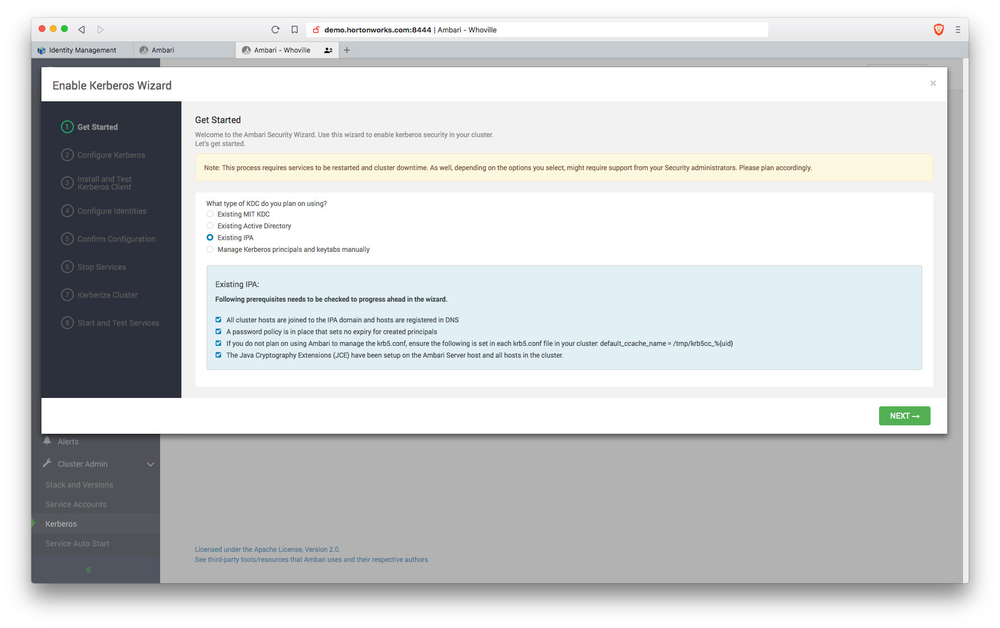
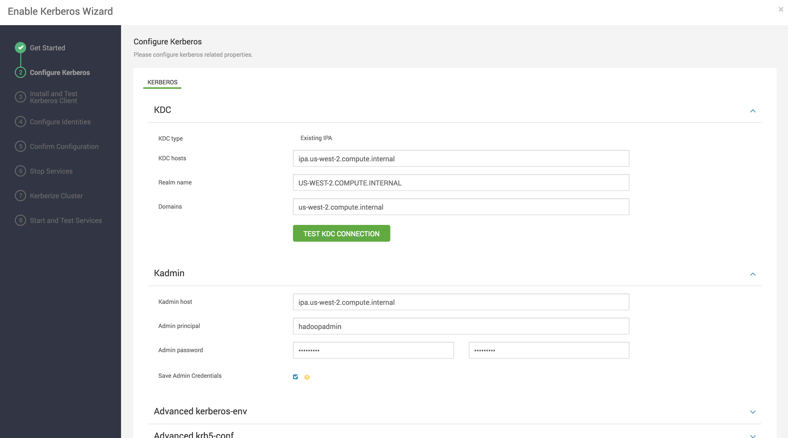
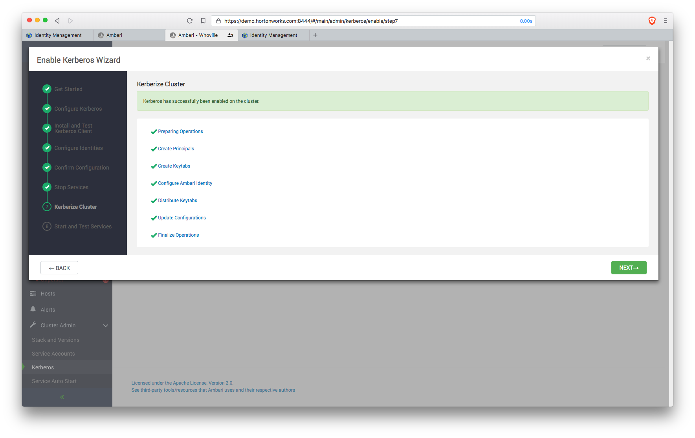
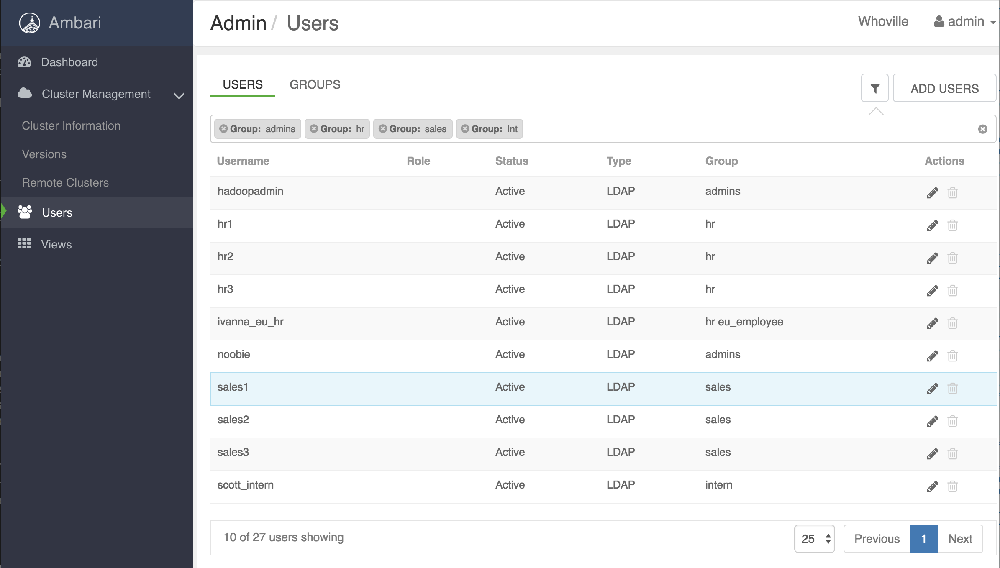

## Instuctions for IPA Lab 

### Pre-reqs
- HDP 3.x / Ambari 2.7.1 cluster<br>
- Access to an IPA server that has been setup as descibed in [Hortonworks documentation](https://docs.hortonworks.com/HDPDocuments/HDP3/HDP-3.0.1/authentication-with-kerberos/content/kerberos_optional_use_an_existing_ipa.html)

**Lab Topics**<br>

1. [Register cluster nodes as IPA Clients](#section-1)
2. [Secure Ambari via ambari-server setup-security](#section-2)
3. [Enable Kerberos for cluster services](#section-3)
4. [Enable LDAP for ambari](#section-4)


## <a name="section-1"></a>1. Register cluster nodes as IPA clients
- Run below on *all nodes of HDP cluster* (replace $INTERNAL_IP_OF_IPA)

```
echo "$INTERNAL_IP_OF_IPA ipa.hortonworks.com ipa" >> /etc/hosts
```

- Install yum packages
```
sudo yum install -y ipa-client
```

- Update /etc/resolve.conf (replace INTERNAL_IP_OF_IPA)
```
mv /etc/resolv.conf /etc/resolv.conf.bak 
echo "search hortonworks.com" > /etc/resolv.conf
echo "nameserver $INTERNAL_IP_OF_IPA" >> /etc/resolv.conf
```
- Install IPA client

  ```	
	sudo ipa-client-install \
	--server=ipa.hortonworks.com \
	--realm=HORTONWORKS.COM \
	--domain=hortonworks.com \
	--mkhomedir \
	--principal=admin -w BadPass#1 \
	--unattended
  ```
Note: restarting dbus seems to be required sometimes `service dbus restart`

- Make sure you don't see below message from the output of previous command
```
Missing A/AAAA record(s) for host xxxxxxxxx
```

- To uninstall in case of issues:
```
sudo ipa-client-install --uninstall
```

- Note by changing the DNS, its possible the node may not be able to connect to public internet. When you need to do so (e.g. for yum install, you can temporarily revert back the /etc/resolv.conf.bak)


### Verify

- By registering as a client of the IPA server, SSSD is automatically setup. So now the host recognizes users defined in IPA
```
id hadoopadmin
```

- You can also authenticate and get a kerberos ticket (password is BadPass#1)
```
kinit -V hadoopadmin
```

---


# <a name="section-2"></a> 2. Secure Ambari via ambari-server setup-security

Lets use FreeIPA Generated certificate for Options 1 and 4 in `ambari-server setup-security`
	
  ```
Security setup options...
===========================================================================
Choose one of the following options:
  *[1] Enable HTTPS for Ambari server.
  *[2] Encrypt passwords stored in ambari.properties file.
  [3] Setup Ambari kerberos JAAS configuration.
  *[4] Setup truststore.
  [5] Import certificate to truststore.
===========================================================================
  ```

**Preparation:** Create certificates on all ipa-client hosts (run this on each node)

Ensure SELinux is not enforcing, else requesting a certificate as the root user with admin's kerberos ticket will be denied by the system and certificate will not be created. 

```
getenforce
# If result is "Enforcing", run the following
sudo su
setenforce 0
```

Obtain kerberos ticket as **admin**(or an IPA Privileged User), and request a x509 certificate pair saved as "host.key" and "host.crt" on each host. 

```
echo BadPass#1 | kinit admin 
mkdir /etc/security/certificates/
cd /etc/security/certificates/
ipa-getcert request -v -f /etc/security/certificates/host.crt -k /etc/security/certificates/host.key
```

List the directory to verify certificates are created. 

```
[root@demo certificates]# ls -ltr /etc/security/certificates/
total 8
-rw------- 1 root root 1704 Sep 30 04:56 host.key
-rw------- 1 root root 1724 Sep 30 04:56 host.crt
```


### 2.1 Enable HTTPS for Ambari server
If you are running knox on this host (which is highly not recommended) changing the default port from 8443 will avoid the port conflict. 

```
Security setup options...
===========================================================================
Choose one of the following options:
  [1] Enable HTTPS for Ambari server.
  [2] Encrypt passwords stored in ambari.properties file.
  [3] Setup Ambari kerberos JAAS configuration.
  [4] Setup truststore.
  [5] Import certificate to truststore.
===========================================================================

# Enable SSL
Enter choice, (1-5): 1
Do you want to configure HTTPS [y/n] (y)? y
SSL port [8443] ? 8444
Enter path to Certificate: /etc/security/certificates/host.crt
Enter path to Private Key: /etc/security/certificates/host.key
Please enter password for Private Key: changeit
```

### Verify
Restart ambari-server. Curl ambari on the new https port **without** specifying the "-k" flag.
```
[root@demo ~]$ curl -u admin:"password" https://`hostname -f`:8444/api/v1/clusters
```

### 2.2 Encrypt passwords stored in ambari.properties file.
This step is required for the kerberos wizard to persist the KDC credentials (`hadoopadmin`). It is also required for persisting the `ldapbind` password, without which, enabling ldaps in Ambari 2.7.1 seems to have some challenges.  

```
[root@demo ~]# ambari-server setup-security
Using python  /usr/bin/python
Security setup options...
===========================================================================
Choose one of the following options:
  [1] Enable HTTPS for Ambari server.
  [2] Encrypt passwords stored in ambari.properties file.
  [3] Setup Ambari kerberos JAAS configuration.
  [4] Setup truststore.
  [5] Import certificate to truststore.
===========================================================================
Enter choice, (1-5): 2
Please provide master key for locking the credential store:
Re-enter master key:
Do you want to persist master key. If you choose not to persist, you need to provide the Master Key while starting the ambari server as an env variable named AMBARI_SECURITY_MASTER_KEY or the start will prompt for the master key. Persist [y/n] (y)? y
Adjusting ambari-server permissions and ownership...
Ambari Server 'setup-security' completed successfully.
```


### 2.3 Setup truststore.

Setting up the truststore ahead of time and restarting Ambari seems to make the ldap integration happier. 
Ambari can leverage the `/etc/pki/java/cacerts` truststore managed by IPA Clients on the hosts. This truststore contains the public CAs, along with the IPA CA, which should be the only certificates needed.    

```
# Example for ipa hostname: ipa.hortonworks.com

[root@demo ~]# /usr/java/default/bin/keytool -list \
-keystore /etc/pki/java/cacerts \
-v -storepass changeit | grep ipa

Alias name: hortonworks.comipaca
   accessLocation: URIName: http://ipa-ca.hortonworks.com/ca/ocsp
```


```
[root@demo certificates]# ambari-server setup-security
Using python  /usr/bin/python
Security setup options...
===========================================================================
Choose one of the following options:
  [1] Enable HTTPS for Ambari server.
  [2] Encrypt passwords stored in ambari.properties file.
  [3] Setup Ambari kerberos JAAS configuration.
  [4] Setup truststore.
  [5] Import certificate to truststore.
===========================================================================
Enter choice, (1-5): 4
Do you want to configure a truststore [y/n] (y)? y
TrustStore type [jks/jceks/pkcs12] (jks):
Path to TrustStore file :/etc/pki/java/cacerts
Password for TrustStore: changeit
Re-enter password: changeit
Ambari Server 'setup-security' completed successfully.
```


### 2.4 Restart ambari for changes to take effect

```
ambari-server restart
```

<br> 

---

# <a name="section-3"></a>3. Enable kerberos on the cluster

Enable Kerberos for cluster services via the wizard in Ambari, located in the Cluster Admin menu in the bottom left navigation panel. https://demo.hortonworks.com:8444/#/main/admin/kerberos

 
  


At this point, requirements are met.The ambari-managed principals group is no required and password expiration policies should not affect the service keytabs as they have not been given passwords. The `hadoopadmin` and `ldapbind` user password will expire and need to be changed in 90 days (along with the rest of the users), but that's a good thing. See the docs for explanations https://docs.hortonworks.com/HDPDocuments/HDP3/HDP-3.0.1/authentication-with-kerberos/content/kerberos_optional_use_an_existing_ipa.html 




If all goes well, go grab a beer. 



Useful CLI for verifying the newly created Service Principals:

	#Usage: ipa service-show <principal>
	[root@demo ~]# ipa service-show spark/demo.hortonworks.com@HORTONWORKS.COM
	  Principal name: spark/demo.hortonworks.com@HORTONWORKS.COM
	  Principal alias: spark/demo.hortonworks.com@HORTONWORKS.COM
	  Keytab: True
	  Managed by: demo.hortonworks.com

---  


# <a name="section-4"></a>4. Enable LDAP For Ambari

#### FreeIPA Tips for determining LDAP Search Properties

- IPA Clients contain `/etc/ipa/default.conf` with various ldap server properties 

		[root@demo ~]# cat /etc/ipa/default.conf 
		basedn = dc=hortonworks,dc=com
		realm = HORTONWORKS.COM
		domain = hortonworks.com
		server = ipa.hortonworks.com

- Determining valid **user** attributes (posixaccount, uid, etc):
		
		ipa user-show hadoopadmin --raw --all
		
- Determining valid **group** attributes (posixgroup, member, memberUid, etc)

		ipa group-show admins --raw --all
		
- Verifying ldapbind account and search base via `ldapsearch`

		[root@demo ~]# yum install -y openldap-clients 
		
		# Test ldap bind properties
		AM_LDAP_SEARCHBASE="cn=accounts,dc=hortonworks,dc=com"
		AM_LDAP_BINDDN="uid=ldapbind,cn=users,cn=accounts,dc=hortonworks,dc=com"
		AM_LDAP_BINDDN_PW="BadPass#1"
		AM_LDAP_URL=ldaps://ipa.hortonworks.com:636
		
		# Search for a valid uid and ensure the searchbase, bind dn, and ldapurl resolve properly
		[root@demo ~]# ldapsearch -D ${AM_LDAP_BINDDN} \
		-w ${AM_LDAP_BINDDN_PW} \
		-b ${AM_LDAP_SEARCHBASE} \
		-H ${AM_LDAP_URL} uid=hadoopadmin
		
		# Tail results of a valid ldapsearch for a single uid:
		numResponses: 2
		numEntries: 1


### 4.1 Enable LDAP for Ambari Server

Ambari 2.7.1 offers a CLI option in `ambari-server setup-ldap` for choosing ldap type as IPA, which attempts to set some of the defaults required for integration. It seems to still have a few challenges, so few of the defaults need to be change. 

On the ambari-server host:

```
[root@demo certificates]# ambari-server setup-ldap
Currently 'no auth method' is configured, do you wish to use LDAP instead [y/n] (y)?  
Please select the type of LDAP you want to use (AD, IPA, Generic LDAP):IPA
Primary LDAP Host (ipa.ambari.apache.org): ipa.hortonworks.com
Primary LDAP Port (636):
Secondary LDAP Host <Optional>:
Secondary LDAP Port <Optional>:
Use SSL [true/false] (true):
Do you want to provide custom TrustStore for Ambari [y/n] (y)?
TrustStore type [jks/jceks/pkcs12] (jks):
Path to TrustStore file (/etc/pki/java/cacerts):
Password for TrustStore:
Re-enter password:
User object class (posixUser): posixaccount
User ID attribute (uid):
Group object class (posixGroup):
Group name attribute (cn):
Group member attribute (memberUid): member
Distinguished name attribute (dn):
Search Base (dc=ambari,dc=apache,dc=org): cn=accounts,dc=hortonworks,dc=com
Referral method [follow/ignore] (follow):
Bind anonymously [true/false] (false):
Bind DN (uid=ldapbind,cn=users,cn=accounts,dc=ambari,dc=apache,dc=org): uid=ldapbind,cn=users,cn=accounts,dc=hortonworks,dc=com
Enter Bind DN Password:
Confirm Bind DN Password:
Handling behavior for username collisions [convert/skip] for LDAP sync (skip):
Force lower-case user names [true/false]:
Results from LDAP are paginated when requested [true/false]:
```

### 4.2 Sync users
LDAP Users must be synced by invoked a command on the Ambari Server Host. User additions, and group associations made on the LDAP server will not propagate to Ambari automatically, only when this command is invoked. 

```
[root@demo ~]# ambari-server sync-ldap --all
Using python  /usr/bin/python
Syncing with LDAP...
Enter Ambari Admin login: admin
Enter Ambari Admin password:

Fetching LDAP configuration from DB.
Syncing all...

Completed LDAP Sync.
Summary:
  memberships:
    removed = 0
    created = 16
  users:
    skipped = 1
    removed = 0
    updated = 0
    created = 15
  groups:
    updated = 0
    removed = 0
    created = 26

Ambari Server 'sync-ldap' completed successfully.
```
Sometimes restarting ambari server again helps. 

### 4.2.1 Verify user group associations in Ambari

Log in to Ambari as an Admin and Navigate to Manage Ambari > Users. Example user/groups from this lab:


