# Contents  (HDP 3.1.0 using Active Directory)

- [Lab 1](#lab-1)
  - Access cluster
  - Security w/o kerberos
- [Lab 2](#lab-2)
  - Review use case
  - AD overview
  - Configure Name Resolution & AD Certificate
  - Setup Access to Active Directory Server
- [Lab 3](#lab-3): Ambari Server Security
  - Enable Active Directory Authentication for Ambari
  - Ambari server as non-root
  - Ambari Encrypt Database and LDAP Passwords
  - SSL For Ambari server
- [Lab 4](#lab-4): Kerberos
  - Kerborize cluster
  - Setup AD/Operating System Integration using SSSD - AD KDC
  - Kerberos for Ambari Views
  - SPNEGO
- [Lab 5](#lab-5)
  - Ranger install pre-reqs
  - Ranger install
- [Lab 6](#lab-6)
  - NiFi install
  - NiFi SSL/TLS
  - NiFi login via browser certificate
  - Nifi identity mappings
  - NiFi Ranger plugin
- [Lab 7a](#lab-7a)
  - Ranger KMS install
  - Add a KMS on another node
- [Lab 7b](#lab-7b) 
  - HDFS encryption exercises
  - Move Hive warehouse to EZ
- [Lab 8](#lab-8)
  - Secured Hadoop exercises
    - HDFS
    - Hive (including row filtering/masking)
    - HBase
    - Sqoop
- [Lab 9](#lab-9)
  - Tag-Based Policies (Atlas+Ranger Integration)
    - Tag-Based Access Control
    - Attribute-Based Access Control
    - Tag-Based Masking
	- Location-Based Access Control
    - Time-Based Policies
  - Policy Evaluation and Precedence
- [Lab 10](#lab-10)
  - Install Knox
  - Configure Knox to authenticate via AD
  - Utilize Knox to Connect to Hadoop  Cluster Services
    - WebHDFS
    - Hive


---------------

# Lab 1

## Accessing your Cluster

Credentials will be provided for these services by the instructor:

* SSH
* Ambari

## Use your Cluster

### To connect using Putty from Windows laptop

- Right click to download [this ppk key](https://github.com/HortonworksUniversity/Security_Labs/raw/master/training-keypair.ppk) > Save link as > save to Downloads folder
- Use putty to connect to your node using the ppk key:
  - Connection > SSH > Auth > Private key for authentication > Browse... > Select training-keypair.ppk


- Make sure to click "Save" on the session page before logging in
- When connecting, it will prompt you for username. Enter `centos`

### To connect from Linux/MacOSX laptop

- SSH into Ambari node of your cluster using below steps:
- Right click to download [this pem key](https://raw.githubusercontent.com/HortonworksUniversity/Security_Labs/master/training-keypair.pem)  > Save link as > save to Downloads folder
  - Copy pem key to ~/.ssh dir and correct permissions
  ```
  cp ~/Downloads/training-keypair.pem ~/.ssh/
  chmod 400 ~/.ssh/training-keypair.pem
  ```
 - Login to the Ambari node of the cluster you have been assigned by replacing IP_ADDRESS_OF_AMBARI_NODE below with Ambari node IP Address (your instructor will provide this)   
  ```
  ssh -i  ~/.ssh/training-keypair.pem centos@IP_ADDRESS_OF_AMBARI_NODE
  ```
  - To change user to root you can:
  ```
  sudo su -
  ```

- Similarly login via SSH to each of the other nodes in your cluster as you will need to run commands on each node in a future lab

- Tip: Since in the next labs you will be required to run *the same set of commands* on each of the cluster hosts, now would be a good time to setup your favorite tool to do so: examples [here](https://www.reddit.com/r/sysadmin/comments/3d8aou/running_linux_commands_on_multiple_servers/)
  - On OSX, an easy way to do this is to use [iTerm](https://www.iterm2.com/): open multiple tabs/splits and then use 'Broadcast input' feature (under Shell -> Broadcast input)
  - If you are not already familiar with such a tool, you can also just run the commands on the cluster, one host at a time

#### Login to Ambari

- Login to Ambari web UI by opening http://AMBARI_PUBLIC_IP:8080 and log in with admin/BadPass#1

- You will see a list of Hadoop components running on your cluster on the left side of the page
  - They should all show green (ie started) status. If not, start them by Ambari via 'Service Actions' menu for that service

#### Finding internal/external hosts

- Following are useful techniques you can use in future labs to find your cluster specific details:

  - From SSH terminal, how can I find the cluster name?
  ```
  #run on ambari node to fetch cluster name via Ambari API
  PASSWORD=BadPass#1
  output=`curl -u admin:$PASSWORD -i -H 'X-Requested-By: ambari'  http://localhost:8080/api/v1/clusters`
  cluster=`echo $output | sed -n 's/.*"cluster_name" : "\([^\"]*\)".*/\1/p'`
  echo $cluster
  ```
  - From SSH terminal, how can I find internal hostname (aka FQDN) of the node I'm logged into?
  ```
  $ hostname -f
  ip-172-30-0-186.us-west-2.compute.internal  
  ```
  
  - From Ambari how do I check the cluster name?
    - It is displayed on the top left of the Ambari dashboard, next to the Ambari logo. If the name appears truncated, you can hover over it to produce a helptext dialog with the full name
    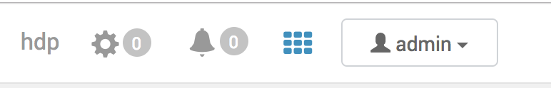
  
  - From Ambari how can I find external hostname of node where a component (e.g. Resource Manager or Hive) is installed?
    - Click the parent service (e.g. YARN) and *hover over* the name of the component. The external hostname will appear.
    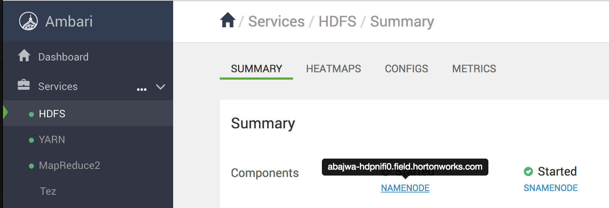

  - From Ambari how can I find internal hostname of node where a component (e.g. Resource Manager or Hive) is installed?
    - Click the parent service (e.g. YARN) and *click on* the name of the component. It will take you to hosts page of that node and display the internal hostname on the top.
    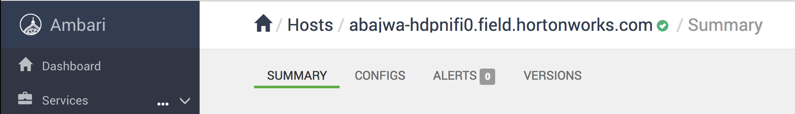  
  
  - In future labs you may need to provide private or public hostname of nodes running a particular component (e.g. YARN RM or Mysql or HiveServer)
  
  
#### Import sample data into Hive 


- Run below *on the node where HiveServer2 is installed* to download data and import it into a Hive table for later labs
  - You can either find the node using Ambari as outlined in Lab 1
  - Download and import data
  ```
  cd /tmp
  wget https://raw.githubusercontent.com/HortonworksUniversity/Security_Labs/master/labdata/sample_07.csv
  wget https://raw.githubusercontent.com/HortonworksUniversity/Security_Labs/master/labdata/sample_08.csv
  ```
  - Create user dir for admin, sales1 and hr1
  ```
   sudo -u hdfs hdfs dfs  -mkdir /user/admin
   sudo -u hdfs hdfs dfs  -chown admin:hadoop /user/admin

   sudo -u hdfs hdfs dfs  -mkdir /user/sales1
   sudo -u hdfs hdfs dfs  -chown sales1:hadoop /user/sales1
   
   sudo -u hdfs hdfs dfs  -mkdir /user/hr1
   sudo -u hdfs hdfs dfs  -chown hr1:hadoop /user/hr1   
  ```
  - Copy csv's into HDFS
  ```
  sudo -u hdfs hdfs dfs -mkdir -p /hive_data/salary
  sudo -u hdfs hdfs dfs -put /tmp/sample*  /hive_data/salary
  sudo -u hdfs hdfs dfs -chown -R hive:hive /hive_data/
  ```
  - Now create Hive table in default database by 
    - Start beeline shell from the node where Hive is installed: 
```
beeline -n hive -u "jdbc:hive2://localhost:10000/default"
```

  - At beeline prompt, run below:
    
```
CREATE EXTERNAL TABLE sample_07 (
code string ,
description string ,  
total_emp int ,  
salary int )
ROW FORMAT DELIMITED FIELDS TERMINATED BY '\t' STORED AS TextFile
LOCATION '/hive_data/salary';
```
```
CREATE EXTERNAL TABLE sample_08 (
code string ,
description string ,  
total_emp int ,  
salary int )
ROW FORMAT DELIMITED FIELDS TERMINATED BY '\t' STORED AS TextFile
LOCATION '/hive_data/salary';
```
```
!q
```

- Notice that in the JDBC connect string for connecting to an unsecured Hive while its running in default (ie binary) transport mode :
  - port is 10000
  - no kerberos principal was needed 

- This will change after we:
  - enable kerberos
  - configure Hive for http transport mode (to go through Knox)
    
### Why is security needed?


##### HDFS access on unsecured cluster

- On your unsecured cluster try to access a restricted dir in HDFS
```
hdfs dfs -ls /tmp/hive   
## this should fail with Permission Denied
```

- Now try again after setting HADOOP_USER_NAME env var
```
export HADOOP_USER_NAME=hdfs
hdfs dfs -ls /tmp/hive   
## this shows the file listing!
```
- Unset the env var and it will fail again
```
unset HADOOP_USER_NAME
hdfs dfs -ls /tmp/hive  
```

##### WebHDFS access on unsecured cluster

- From *node running NameNode*, make a WebHDFS request using below command:
```
curl -sk -L "http://$(hostname -f):50070/webhdfs/v1/user/?op=LISTSTATUS"
```

- In the absence of Knox, notice it goes over HTTP (not HTTPS) on port 50070 and no credentials were needed

##### Web UI access on unsecured cluster

- From Ambari notice you can open the WebUIs without any authentication
  - HDFS > Quicklinks > NameNode UI
  - Mapreduce > Quicklinks > JobHistory UI
  - YARN > Quicklinks > ResourceManager UI
    
- This should tell you why kerberos (and other security) is needed on Hadoop :)


-----------------------------

# Lab 2

### Review use case

Use case: Customer has an existing cluster which they would like you to secure for them

- Current setup:
  - The customer has multiple organizational groups (i.e. sales, hr, legal) which contain business users (sales1, hr1, legal1 etc) and hadoopadmin
  - These groups and users are defined in Active Directory (AD) under its own Organizational Unit (OU) called CorpUsers 
  - There are empty OUs created in AD to store hadoop principals/hadoop nodes (HadoopServices, HadoopNodes)
  - Hadoopadmin user has administrative credentials with delegated control of "Create, delete, and manage user accounts" on above OUs
  - Hadoop cluster running HDP has already been setup using Ambari (including HDFS, YARN, Hive, Hbase, Solr, Zookeeper)
  
- Goals:
  - Integrate Ambari with AD - so that hadoopadmin can administer the cluster
  - Integrate Hadoop nodes OS with AD - so business users are recognized and can submit Hadoop jobs
  - Enable kerberos - to secured the cluster and enable authentication
  - Install Ranger and enable Hadoop plugins - to allow admin to setup authorization policies and review audits across Hadoop components
  - Install Ranger KMS and enable HDFS encryption - to be able to create encryption zones
  - Encrypt Hive backing dirs - to protect hive tables
  - Configure Ranger policies to:
    - Protect /sales HDFS dir - so only sales group has access to it
    - Protect sales hive table - so only sales group has access to it
      - Fine grained access: sales users should only have access to code, description columns in default.sample_07, but only for rows where total_emp<5000. Also total_emp column should be masked
    - Protect sales HBase table - so only sales group has access to it
  - Install Knox and integrate with AD - for perimeter security and give clients access to APIs w/o dealing with kerberos
  - Enable Ambari views to work on secured cluster

We will run through a series of labs and step by step, achieve all of the above goals
  
### AD overview

- Active Directory will already be setup by the instructor. A basic structure of OrganizationalUnits will have been pre-created to look something like the below:
  - CorpUsers OU, which contains:
    - business users and groups (e.g. it1, hr1, legal1) and 
    - hadoopadmin: Admin user (for AD, Ambari, ...)
  
  
  - ServiceUsers OU: service users - that would not be created by Ambari  (e.g. ambari etc)
  
  
  - HadoopServices OU: hadoop service principals (will be created by Ambari)
    
  
  - HadoopNodes OU: list of nodes registered with AD
  

- In addition, the below steps would have been completed in advance [per doc](http://docs.hortonworks.com/HDPDocuments/Ambari-2.2.2.0/bk_Ambari_Security_Guide/content/_use_an_existing_active_directory_domain.html):
  - Ambari Server and cluster hosts have network access to, and be able to resolve the DNS names of, the Domain Controllers.
  - Active Directory secure LDAP (LDAPS) connectivity has been configured.
  - Active Directory User container for principals has been created and is on-hand. For example, "ou=HadoopServices,dc=lab,dc=hortonworks,dc=net"
  - Active Directory administrative credentials with delegated control of "Create, delete, and manage user accounts" on the previously mentioned User container are on-hand. e.g. hadoopadmin


- For general info on Active Directory refer to Microsoft website [here](https://technet.microsoft.com/en-us/library/hh831484(v=ws.11).aspx) 


### Configure name resolution & certificate to Active Directory

**Run below on all nodes**

1. Add your Active Directory's internal IP to /etc/hosts (if not in DNS). Make sure you replace the IP address of your AD from your instructor below.
  - **Change the IP to match your ADs internal IP**
   ```
ad_ip=GET_THE_AD_IP_FROM_YOUR_INSTRUCTOR
echo "${ad_ip} ad01.lab.hortonworks.net ad01" | sudo tee -a /etc/hosts
   ```

2. Add your CA certificate (if using self-signed & not already configured)
  - In this case we have pre-exported the CA cert from our AD and made available for download. 
   ```
cert_url=https://raw.githubusercontent.com/HortonworksUniversity/Security_Labs/master/extras/ca.crt
sudo yum -y install openldap-clients ca-certificates
sudo curl -sSL "${cert_url}" -o /etc/pki/ca-trust/source/anchors/hortonworks-net.crt

sudo update-ca-trust force-enable
sudo update-ca-trust extract
sudo update-ca-trust check
   ```

3. Test certificate & name resolution with `ldapsearch`

```
## Update ldap.conf with our defaults
sudo tee -a /etc/openldap/ldap.conf > /dev/null << EOF
TLS_CACERT /etc/pki/tls/cert.pem
URI ldaps://ad01.lab.hortonworks.net ldap://ad01.lab.hortonworks.net
BASE dc=lab,dc=hortonworks,dc=net
EOF

##test connection to AD using openssl client
openssl s_client -connect ad01:636 </dev/null

## test connection to AD using ldapsearch (when prompted for password, enter: BadPass#1)
ldapsearch -W -D ldap-reader@lab.hortonworks.net
```

**Make sure to repeat the above steps on all nodes**

4. **On Ambari node** create a symlink from JDK cacerts dir to newly updated cacerts file (to ensure Ambari picks up the cert) and restart Ambari
```
 ln -s -f /etc/pki/java/cacerts /usr/jdk64/jdk1.8*/jre/lib/security/cacerts
 sudo ambari-server restart
```


# Lab 3

## Security options for Ambari

Further documentation [here](http://docs.hortonworks.com/HDPDocuments/Ambari-2.2.0.0/bk_Ambari_Security_Guide/content/ch_amb_sec_guide.html)

### Ambari server as non-root

- Create a user for the Ambari Server if it does not exists
```
useradd -d /var/lib/ambari-server -G hadoop -M -r -s /sbin/nologin ambari
```
- Otherwise - Update the Ambari Server with the following
```
usermod -d /var/lib/ambari-server -G hadoop -s /sbin/nologin ambari
```

- Grant the user 'sudoers' rights. This is required for Ambari Server to create it's Kerberos keytabs. You can remove this after kerberizing the cluster
```
echo 'ambari ALL=(ALL) NOPASSWD:SETENV: /bin/mkdir, /bin/cp, /bin/chmod, /bin/rm, /bin/chown' > /etc/sudoers.d/ambari-server
```

- Now run `visudo` to edit sudoers file to include below section, right above the line that starts `## Next comes the main part:` (see [doc](here))
```
Defaults exempt_group = ambari
Defaults !env_reset,env_delete-=PATH
Defaults: ambari !requiretty 
```


- To setup Ambari server as non-root run below on Ambari-server node:
```
sudo ambari-server setup
```
- Then enter the below at the prompts:
  - OK to continue? y
  - Customize user account for ambari-server daemon? y
  - Enter user account for ambari-server daemon (root):ambari
  - Do you want to change Oracle JDK [y/n] (n)? n
  - Enable Ambari Server to download and install GPL Licensed LZO packages [y/n] (n)? y
  - Enter advanced database configuration [y/n] (n)? n

- Sample output:
```
# sudo ambari-server setup
Using python  /usr/bin/python
Setup ambari-server
Checking SELinux...
SELinux status is 'disabled'
Customize user account for ambari-server daemon [y/n] (n)? y
Enter user account for ambari-server daemon (root):ambari
Adjusting ambari-server permissions and ownership...
Checking firewall status...
Checking JDK...
Do you want to change Oracle JDK [y/n] (n)?
Check JDK version for Ambari Server...
JDK version found: 8
Minimum JDK version is 8 for Ambari. Skipping to setup different JDK for Ambari Server.
Checking GPL software agreement...
GPL License for LZO: https://www.gnu.org/licenses/old-licenses/gpl-2.0.en.html
Enable Ambari Server to download and install GPL Licensed LZO packages [y/n] (n)? y
Completing setup...
Configuring database...
Enter advanced database configuration [y/n] (n)? n
Configuring database...
Default properties detected. Using built-in database.
Configuring ambari database...
Checking PostgreSQL...
Configuring local database...
Configuring PostgreSQL...
Backup for pg_hba found, reconfiguration not required
Creating schema and user...
done.
Creating tables...
done.
Extracting system views...
.....
Ambari repo file contains latest json url http://public-repo-1.hortonworks.com/HDP/hdp_urlinfo.json, updating stacks repoinfos with it...
Adjusting ambari-server permissions and ownership...
Ambari Server 'setup' completed successfully.

```


### Run ambari-agent as non-root

- For now we will skip configuring Ambari Agents for Non-Root but steps outlined in doc [here](https://docs.hortonworks.com/HDPDocuments/Ambari-2.5.0.3/bk_ambari-security/content/how_to_configure_an_ambari_agent_for_non-root.html)

### Ambari Encrypt Database and LDAP Passwords

- Needed to allow Ambari to cache the admin password. Run below on Ambari-server node:

- To encrypt password, run below
```
sudo ambari-server stop
sudo ambari-server setup-security
```
- Then enter the below at the prompts:
  - enter choice: 2
  - provide master key: BadPass#1
  - re-enter master key: BadPass#1
  - do you want to persist? y

- Then start ambari
```
sudo ambari-server start
```  
- Sample output
```
$ sudo ambari-server setup-security
Using python  /usr/bin/python2
Security setup options...
===========================================================================
Choose one of the following options:
  [1] Enable HTTPS for Ambari server.
  [2] Encrypt passwords stored in ambari.properties file.
  [3] Setup Ambari kerberos JAAS configuration.
  [4] Setup truststore.
  [5] Import certificate to truststore.
===========================================================================
Enter choice, (1-5): 2
Please provide master key for locking the credential store:
Re-enter master key:
Do you want to persist master key. If you choose not to persist, you need to provide the Master Key while starting the ambari server as an env variable named AMBARI_SECURITY_MASTER_KEY or the start will prompt for the master key. Persist [y/n] (y)? y
Adjusting ambari-server permissions and ownership...
Ambari Server 'setup-security' completed successfully.
```

### SSL For Ambari server

- Enables Ambari WebUI to run on HTTPS instead of HTTP

#### Create self-signed certificate

- For this lab we will be generating a self-signed certificate. In production environments you would want to use a signed certificate (either from a public authority or your own CA).

- Generate the certificate & key using CN=(Public hostname of Ambari host) e.g. CN=ec2-52-89-61-196.us-west-2.compute.amazonaws.com
```
public_hostname=$(hostname -f)  
openssl req -x509 -newkey rsa:4096 -keyout ambari.key -out ambari.crt -days 1000 -nodes -subj "/CN=${public_hostname}"
```

- Move & secure the certificate & key
```
  chown ambari ambari.crt ambari.key
  chmod 0400 ambari.crt ambari.key
  mv ambari.crt /etc/pki/tls/certs/
  mv ambari.key /etc/pki/tls/private/
```

#### Configure Ambari Server for HTTPS (using the above certificate & key)

- Stop Ambari server
```
sudo ambari-server stop
```

- Setup HTTPS for Ambari 
```
# sudo ambari-server setup-security
Using python  /usr/bin/python2
Security setup options...
===========================================================================
Choose one of the following options:
  [1] Enable HTTPS for Ambari server.
  [2] Encrypt passwords stored in ambari.properties file.
  [3] Setup Ambari kerberos JAAS configuration.
  [4] Setup truststore.
  [5] Import certificate to truststore.
===========================================================================
Enter choice, (1-5): 1
Do you want to configure HTTPS [y/n] (y)? y
SSL port [8443] ? 8443
Enter path to Certificate: /etc/pki/tls/certs/ambari.crt
Enter path to Private Key: /etc/pki/tls/private/ambari.key
Please enter password for Private Key: BadPass#1
Importing and saving Certificate...done.
Adjusting ambari-server permissions and ownership...
```

- Start Ambari
```
sudo ambari-server start
```

- Now you can access Ambari on **HTTPS** on port 8443 e.g. https://ec2-52-32-113-77.us-west-2.compute.amazonaws.com:8443
  - If you were not able to access the Ambari UI, make sure you are trying to access *https* not *http*

- Note that the browser will not trust the new self signed ambari certificate. You will need to trust that cert first.
  - If Firefox, you can do this by clicking on 'i understand the risk' > 'Add Exception...'
    
  - If Chome, you can do this by clicking on 'Advanced' > 'Proceed to xxxxxx'
    


### Setup Ambari/AD sync

Run below on only Ambari node:

- Trust the ambari certificate on Ambari host
```
sudo keytool -import -trustcacerts -keystore /etc/pki/java/cacerts -storepass changeit -noprompt -alias ambari -file /etc/pki/tls/certs/ambari.crt
```

- Recently Redhat changed default behaviour for checking SSL certificates (see [here](https://access.redhat.com/articles/2039753) for more details). To get around this there are 2 options:

  - Set below to just disable python HTTPS verification before running LDAP sync
```
export PYTHONHTTPSVERIFY=0
```

- This puts our AD-specific settings into variables for use in the following command
```
ad_host="ad01.lab.hortonworks.net"
ad_root="ou=CorpUsers,dc=lab,dc=hortonworks,dc=net"
ad_user="cn=ldap-reader,ou=ServiceUsers,dc=lab,dc=hortonworks,dc=net"
```

- Execute the following to configure Ambari to sync with LDAP.
  - when prompted for type of LDAP, enter: AD
  - password: BadPass#1
- Use the default password used throughout this course.
  ```
  sudo ambari-server setup-ldap \
    --ldap-url=${ad_host}:389 \
    --ldap-secondary-url="" \
    --ldap-secondary-host=""  \
    --ldap-ssl=false \
    --ldap-base-dn=${ad_root} \
    --ldap-manager-dn=${ad_user} \
    --ldap-bind-anonym=false \
    --ldap-dn=distinguishedName \
    --ldap-member-attr=member \
    --ldap-group-attr=cn \
    --ldap-group-class=group \
    --ldap-user-class=user \
    --ldap-user-attr=sAMAccountName \
    --ldap-save-settings \
    --ldap-manager-password=BadPass#1    \
    --ldap-sync-username-collisions-behavior=convert  \
    --ldap-force-setup  \
    --ldap-force-lowercase-usernames=false \
    --ldap-pagination-enabled=false \
    --ambari-admin-username=admin  \
    --ldap-referral=""
  ```
   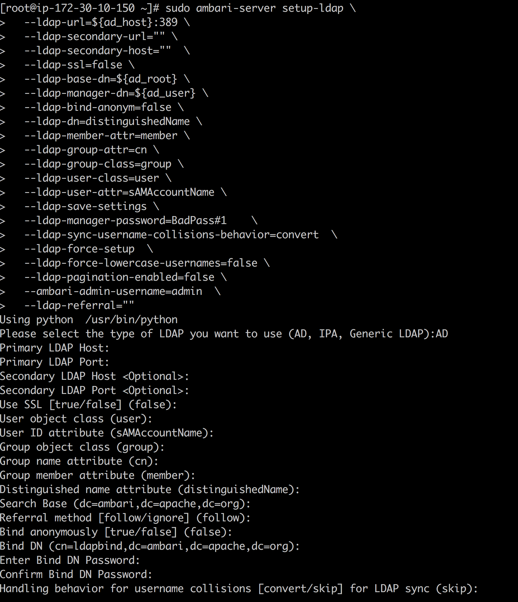
   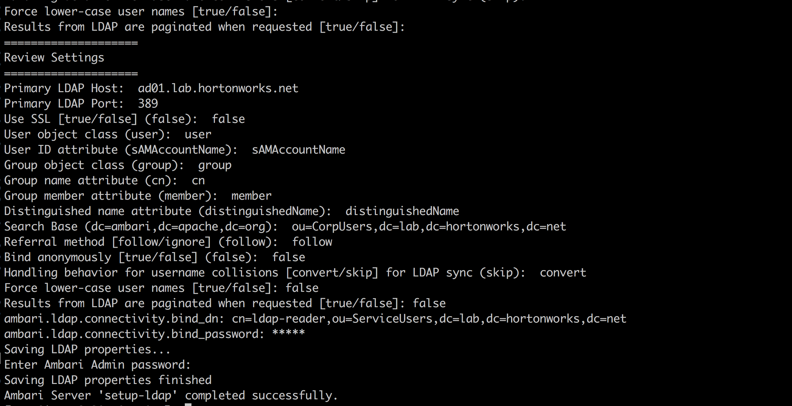


- Restart Ambari server
  ```
   sudo ambari-server restart
  ```

- Run LDAPsync to sync only the groups we want
  - When prompted for user/password, use the *local* Ambari admin credentials (i.e. admin/BadPass#1)
  ```
  echo hadoop-users,hr,sales,legal,hadoop-admins > groups.txt
  sudo ambari-server sync-ldap --groups groups.txt
  ```
  
  - This should show a summary of what objects were created
  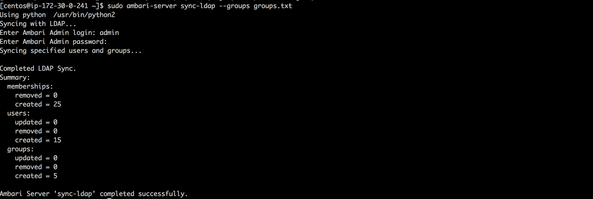
  
- Give 'hadoop-admin' admin permissions in Ambari to allow the user to manage the cluster
  - Login to Ambari as your local 'admin' user (i.e. admin/BadPass#1)
  - Grant 'hadoopadmin' user permissions to manage the cluster:
    - Click the dropdown on top right of Ambari UI
    - Click 'Manage Ambari'
    - Under 'Users', select 'hadoopadmin'
    
    - Change 'Ambari Admin' to Yes 
    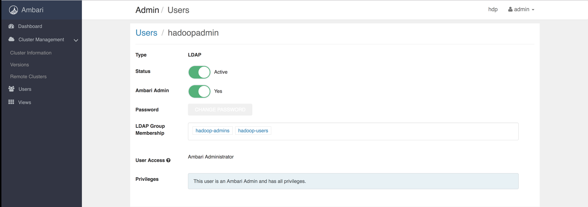
    
    
- Sign out and then log back into Ambari, this time as 'hadoopadmin' and verify the user has rights to monitor/manage the cluster

- (optional) Disable local 'admin' user using the same 'Manage Ambari' menu

### Ambari views 

Ambari views setup on secure cluster will be covered in later lab so we will skip this for now ([here](https://github.com/HortonworksUniversity/Security_Labs#other-security-features-for-ambari))


# Lab 4

## Kerberize the Cluster

### Run Ambari Kerberos Wizard against Active Directory environment

- Enable kerberos using Ambari security wizard (On the bottom left > Kerberos > Enable > Proceed Anyway). 
  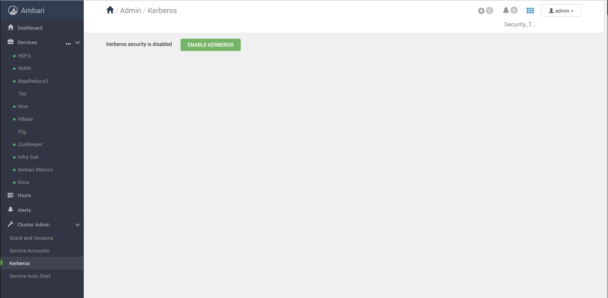

- Select "Existing Active Directory" and check all the boxes
  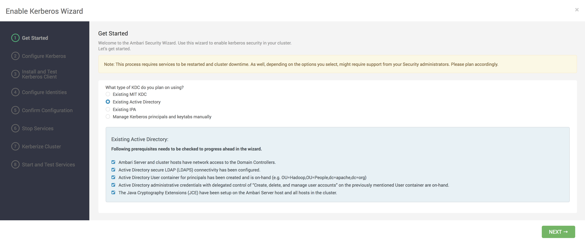
  
- Enter the below details:

- KDC:
    - KDC host: `ad01.lab.hortonworks.net`
    - Realm name: `LAB.HORTONWORKS.NET`
    - LDAP url: `ldaps://ad01.lab.hortonworks.net`
    - Container DN: `ou=HadoopServices,dc=lab,dc=hortonworks,dc=net`
    - Domains: `us-west-2.compute.internal,.us-west-2.compute.internal`
- Kadmin:
    - Kadmin host: `ad01.lab.hortonworks.net`
    - Admin principal: `hadoopadmin@LAB.HORTONWORKS.NET`
    - Admin password: `BadPass#1`

  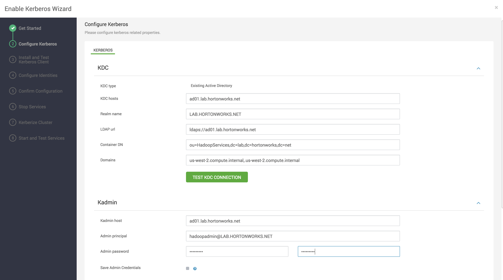
  
  - Notice that the "Save admin credentials" checkbox is available, clicking the check box will save the "admin principal".
  - Sometimes the "Test Connection" button may fail (usually related to AWS issues), but if you previously ran the "Configure name resolution & certificate to Active Directory" steps *on all nodes*, you can proceed.
  
- Now click Next on all the following screens to proceed with all the default values  

  

  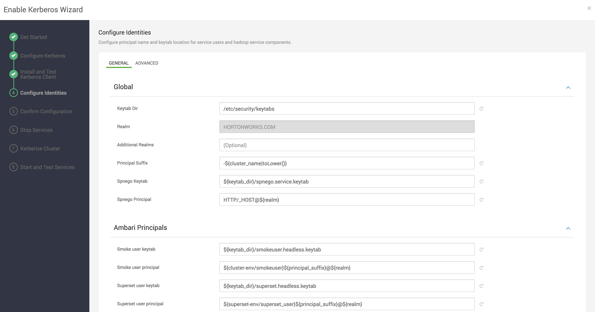

  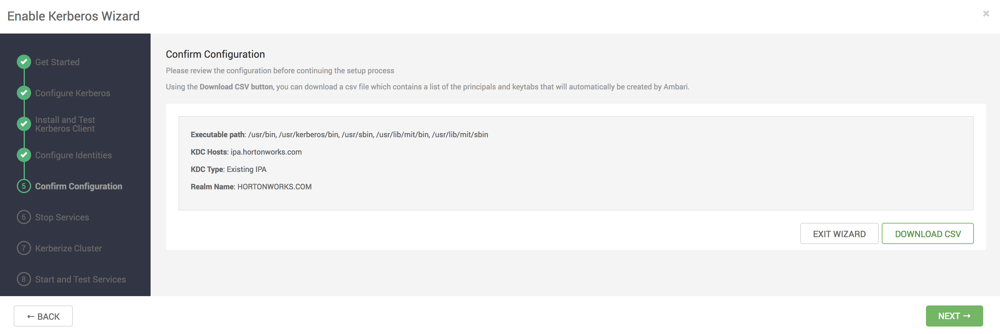

  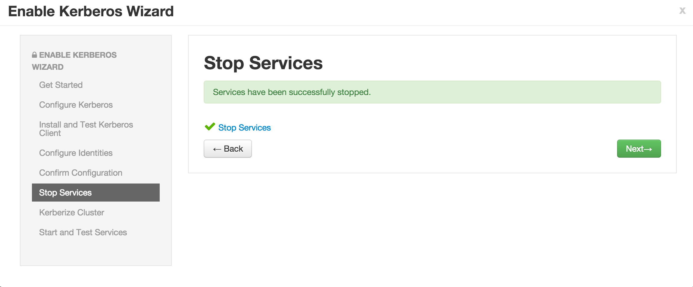

  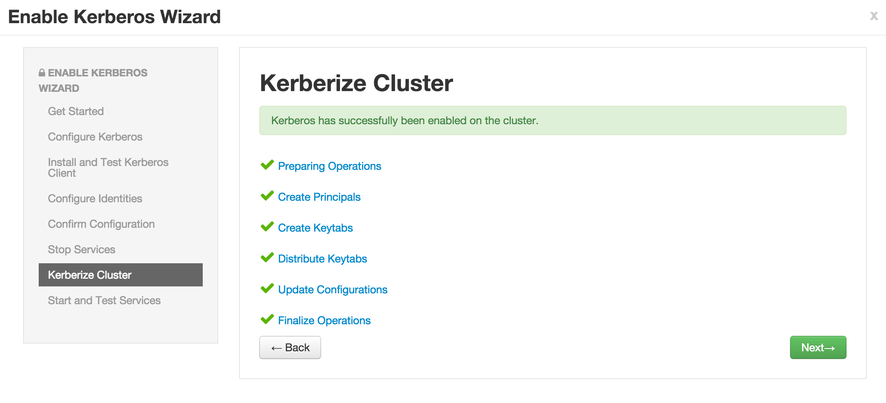

  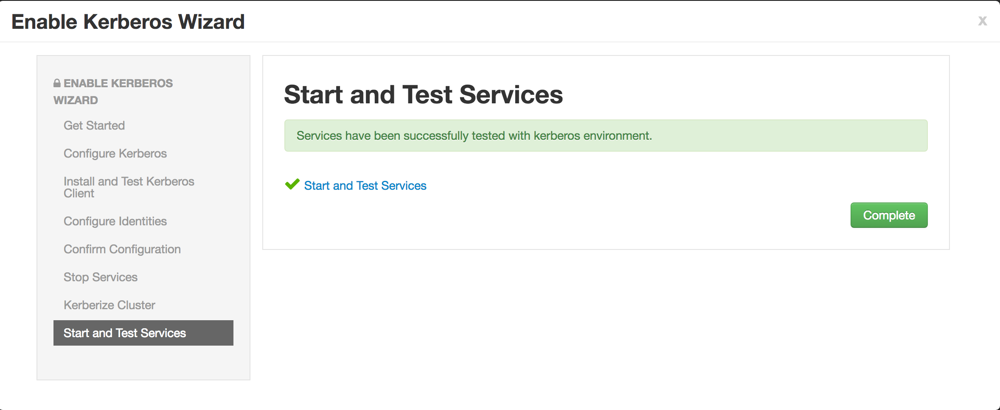

  - Note if the wizard fails after completing more than 90% of "Start and test services" phase, you can just click "Complete" and manually start any unstarted services (e.g. WebHCat or HBase master)


- Check the keytabs directory and notice that keytabs have been generated here:
```
ls -la /etc/security/keytabs/
```

- Run a `klist -ekt`  one of the service keytab files to see the principal name it is for. Sample output below (*executed on host running Namenode*):
```
$ sudo klist -ekt /etc/security/keytabs/nn.service.keytab
Keytab name: FILE:/etc/security/keytabs/nn.service.keytab
KVNO Timestamp           Principal
---- ------------------- ------------------------------------------------------
   0 10/03/2016 22:20:12 nn/ip-172-30-0-181.us-west-2.compute.internal@LAB.HORTONWORKS.NET (des3-cbc-sha1)
   0 10/03/2016 22:20:12 nn/ip-172-30-0-181.us-west-2.compute.internal@LAB.HORTONWORKS.NET (arcfour-hmac)
   0 10/03/2016 22:20:12 nn/ip-172-30-0-181.us-west-2.compute.internal@LAB.HORTONWORKS.NET (des-cbc-md5)
   0 10/03/2016 22:20:12 nn/ip-172-30-0-181.us-west-2.compute.internal@LAB.HORTONWORKS.NET (aes128-cts-hmac-sha1-96)
   0 10/03/2016 22:20:12 nn/ip-172-30-0-181.us-west-2.compute.internal@LAB.HORTONWORKS.NET (aes256-cts-hmac-sha1-96)
```

- Notice how the service keytabs are divided into the below 3 parts. The instance here is the FQDN of the node so these keytabs are *host specific*.
```
{name of entity}/{instance}@{REALM}. 
```

- Run a `klist -kt`  on one of the headless keytab files to see the principal name it is for. Sample output below (*executed on host running Namenode*):
```
$ sudo klist -ekt /etc/security/keytabs/hdfs.headless.keytab
Keytab name: FILE:/etc/security/keytabs/hdfs.headless.keytab
KVNO Timestamp           Principal
---- ------------------- ------------------------------------------------------
   0 10/03/2016 22:20:12 hdfs-Security-HWX-LabTesting-100@LAB.HORTONWORKS.NET (des3-cbc-sha1)
   0 10/03/2016 22:20:12 hdfs-Security-HWX-LabTesting-100@LAB.HORTONWORKS.NET (arcfour-hmac)
   0 10/03/2016 22:20:12 hdfs-Security-HWX-LabTesting-100@LAB.HORTONWORKS.NET (des-cbc-md5)
   0 10/03/2016 22:20:12 hdfs-Security-HWX-LabTesting-100@LAB.HORTONWORKS.NET (aes128-cts-hmac-sha1-96)
   0 10/03/2016 22:20:12 hdfs-Security-HWX-LabTesting-100@LAB.HORTONWORKS.NET (aes256-cts-hmac-sha1-96)
```

- Notice how the headless keytabs are divided into the below 3 parts. These keytabs are *cluster specific* (i.e one per cluster)
```
{name of entity}-{cluster}@{REALM}. 
```

### Setup AD/OS integration via SSSD

- Why? 
  - Currently your hadoop nodes do not recognize users/groups defined in AD.
  - You can check this by running below:
  ```
  id hr1
  groups hr1
  hdfs groups hr1
  ## groups: hr1: no such user
  ```
- Pre-req for below steps: Your AD admin/instructor should have given 'registersssd' user permissions to add the workstation to OU=HadoopNodes (needed to run 'adcli join' successfully)

- *Note: the below is just a sample way of using SSSD.  It will vary completely by environment and needs tuning and testing for your environment.*

- **Run the steps in this section on each node**

```
ad_user="registersssd"
ad_domain="lab.hortonworks.net"
ad_dc="ad01.lab.hortonworks.net"
ad_root="dc=lab,dc=hortonworks,dc=net"
ad_ou="ou=HadoopNodes,${ad_root}"
ad_realm=${ad_domain^^}

sudo kinit ${ad_user}
## enter BadPass#1 for password
```

```
sudo yum makecache fast
##sudo yum -y -q install epel-release ## epel is required for adcli   --Erik Maxwell - epel not required in RHEL 7 for adcli
sudo yum -y -q install sssd oddjob-mkhomedir authconfig sssd-krb5 sssd-ad sssd-tools
sudo yum -y -q install adcli
```

```
#paste all the lines in this block together, in one shot
sudo adcli join -v \
  --domain-controller=${ad_dc} \
  --domain-ou="${ad_ou}" \
  --login-ccache="/tmp/krb5cc_0" \
  --login-user="${ad_user}" \
  -v \
  --show-details
 
## This will output a lot of text. In the middle you should see something like below:  
## ! Couldn't find a computer container in the ou, creating computer account directly in: ou=HadoopNodes,dc=lab,dc=hortonworks,dc=net
## * Calculated computer account: CN=IP-172-30-0-206,ou=HadoopNodes,dc=lab,dc=hortonworks,dc=net
## * Created computer account: CN=IP-172-30-0-206,ou=HadoopNodes,dc=lab,dc=hortonworks,dc=net  
```


```
#paste all the lines in this block together, in one shot
sudo tee /etc/sssd/sssd.conf > /dev/null <<EOF
[sssd]
## master & data nodes only require nss. Edge nodes require pam.
services = nss, pam, ssh, autofs, pac
config_file_version = 2
domains = ${ad_realm}
override_space = _

[domain/${ad_realm}]
id_provider = ad
ad_server = ${ad_dc}
#ad_server = ad01, ad02, ad03
#ad_backup_server = ad-backup01, 02, 03
auth_provider = ad
chpass_provider = ad
access_provider = ad
enumerate = False
krb5_realm = ${ad_realm}
ldap_schema = ad
ldap_id_mapping = True
cache_credentials = True
ldap_access_order = expire
ldap_account_expire_policy = ad
ldap_force_upper_case_realm = true
fallback_homedir = /home/%d/%u
default_shell = /bin/false
ldap_referrals = false

[nss]
memcache_timeout = 3600
override_shell = /bin/bash
EOF
```

```
sudo chmod 0600 /etc/sssd/sssd.conf
sudo service sssd restart
sudo authconfig --enablesssd --enablesssdauth --enablemkhomedir --enablelocauthorize --update

sudo chkconfig oddjobd on
sudo service oddjobd restart
sudo chkconfig sssd on
sudo service sssd restart

sudo kdestroy
```

- Confirm that your nodes OS can now recognize AD users
```
id sales1
groups sales1
```


### Refresh HDFS User-Group mappings

- **Once the above is completed on all nodes you need to refresh the user group mappings in HDFS & YARN by running the below commands**

- **Restart HDFS service via Ambari**. This is needed for Hadoop to recognize the group mappings (else the `hdfs groups` command will not work)

- Execute the following on the Ambari node:
```
export PASSWORD=BadPass#1

#detect name of cluster
output=`curl -k -u hadoopadmin:$PASSWORD -i -H 'X-Requested-By: ambari'  https://localhost:8443/api/v1/clusters`
cluster=`echo $output | sed -n 's/.*"cluster_name" : "\([^\"]*\)".*/\1/p'`

#refresh user and group mappings
sudo sudo -u hdfs kinit -kt /etc/security/keytabs/hdfs.headless.keytab hdfs-"${cluster,,}"
sudo sudo -u hdfs hdfs dfsadmin -refreshUserToGroupsMappings
```

- Execute the following on the node where the YARN ResourceManager is installed:
```
sudo sudo -u yarn kinit -kt /etc/security/keytabs/rm.service.keytab  rm/$(hostname -f)@LAB.HORTONWORKS.NET
sudo sudo -u yarn yarn rmadmin -refreshUserToGroupsMappings
```


- kinit as an end user (password is BadPass#1)
```
kinit hr1
```

- check the group mappings
```
hdfs groups
sudo sudo -u yarn yarn rmadmin -getGroups hr1
```

- output should look like below, indicating both OS-level and hadoop-level group mappings :
```
$ hdfs groups
hr1@LAB.HORTONWORKS.NET : domain_users hr hadoop-users
$ sudo sudo -u yarn yarn rmadmin -getGroups hr1
hr1 : domain_users hadoop-users hr
```

- remove kerberos ticket
```
kdestroy
```

### Test OS/AD integration and Kerberos security

- Login as sales1 user and try to access the same /tmp/hive HDFS dir
```
sudo su - sales1

hdfs dfs -ls /tmp/hive   
## since we did not authenticate, this fails with GSSException: No valid credentials provided

#authenticate
kinit
##enter BadPass#1

klist
## shows the principal for sales1

hdfs dfs -ls /tmp/hive 
## fails with Permission denied

#Now try to get around security by setting the same env variable
export HADOOP_USER_NAME=hdfs
hdfs dfs -ls /tmp/hive 

#log out as sales1
logout
```
- Notice that now that the cluster is kerberized, we were not able to circumvent security by setting the env var 


### Enabling SPNEGO Authentication for Hadoop

- This is needed to secure the Hadoop components webUIs (e.g. Namenode UI, JobHistory UI, Yarn ResourceManager UI etc...)

- As of HDP 3.0, this is taken care of as part of setting up Kerberos via Ambari Security Wizard

- Now when you try to open any of the web UIs like below you will get `401: Authentication required`
  - HDFS: Namenode UI
  - Mapreduce: Job history UI
  - YARN: Resource Manager UI

------------------

# Lab 5

## Ranger install

Goal: In this lab we will install Apache Ranger via Ambari and setup Ranger plugins for Hadoop components: HDFS, Hive, Hbase, YARN, Knox. We will also enable Ranger audits to Solr and HDFS

### Ranger prereqs

##### Create & confirm MySQL user 'root'

Prepare MySQL DB for Ranger use.

- Run these steps on the node where MySQL/Hive is located. To find this, you can either:
  - use Ambari UI or
  - Just run `mysql` on each node: if it returns `mysql: command not found`, move onto next node

- On the MySQL node, run below to start mysql shell:
  - `sudo mysql -h $(hostname -f)`
 
- Execute following in the MySQL shell to create "Ranger DB root User" in MySQL. Ambari will use this user to create rangeradmin user.
```sql
CREATE USER 'root'@'%';
GRANT ALL PRIVILEGES ON *.* to 'root'@'%' WITH GRANT OPTION;
SET PASSWORD FOR 'root'@'%' = PASSWORD('BadPass#1');
SET PASSWORD = PASSWORD('BadPass#1');
FLUSH PRIVILEGES;
exit
```

- Confirm MySQL user: `mysql -u root -h $(hostname -f) -p -e "select count(user) from mysql.user;"`
  - Output should be a simple count. 
  - In case of errors, check the previous step for errors. 
  - If you encounter below error, modeify /etc/my.conf by removing `skip-grant-tables` and then restarting the service by `service mysqld restart`
  
`ERROR 1290 (HY000): The MySQL server is running with the --skip-grant-tables option so it cannot execute this statement`
 
  - If it still does not work, try creating user admin instead. If you do this, make sure to enter admin insted of root when prompted for "Ranger DB root User" in Ambari

##### Prepare Ambari for MySQL
- Run this on Ambari node
- Add MySQL JAR to Ambari:
  - `sudo ambari-server setup --jdbc-db=mysql --jdbc-driver=/usr/share/java/mysql-connector-java.jar`
    - If the file is not present, it is available on RHEL/CentOS with: `sudo yum -y install mysql-connector-java`


###### Setup Solr for Ranger audit 

- Starting HDP 2.5, if you have deployed Ambari Infra Solr service installed, this can be used for Ranger audits.
- **Make sure Ambari Infra Solr service is installed and started before starting Ranger install**


## Ranger install

##### Install Ranger

- Start the Ambari 'Add Service' wizard and select Ranger
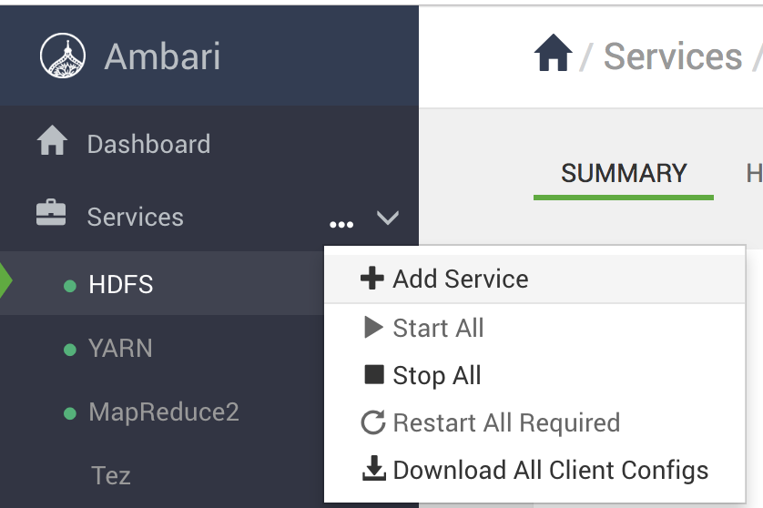
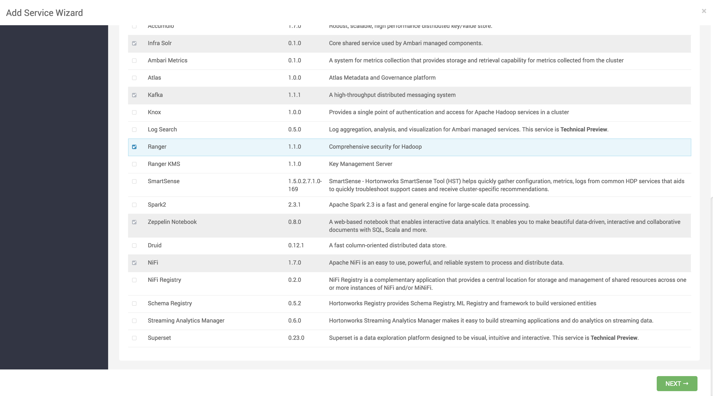

- When prompted for where to install it, choose any node you like

- On "Assigning slaves and clients", click Next to select Ranger tagsync component

- On the 'Customize Services' page of the wizard there are a number of tabs that need to be configured as below

- Go through each Ranger config tab, making below changes:

1. Ranger Admin tab:
  - Ranger DB Host = FQDN of host where Mysql is running (e.g. ip-172-30-0-242.us-west-2.compute.internal)
  - Enter passwords: BadPass#1
  - Click 'Test Connection' button


2. Ranger User info tab
  - 'Sync Source' = LDAP/AD 
  - Common configs subtab
    - LDAP/AD URL: `ldap://ad01.lab.hortonworks.net:389`
    - Bind User: `cn=ldap-reader,ou=ServiceUsers,dc=lab,dc=hortonworks,dc=net`
    - Binde User password: `BadPass#1`


3. Ranger User info tab 
  - User configs subtab
    - Username Attribute: `sAMAccountName`
    - User Object Class: `person`
    - User Search Base: `ou=CorpUsers,dc=lab,dc=hortonworks,dc=net`
    - User Search Filter: `(objectcategory=person)`
    - User Search Scope: `sub`
    - User Group Name Attribute: `memberof, ismemberof`


4. Ranger User info tab 
  - Group configs subtab
    - Make sure Group sync is disabled


5. Ranger plugins tab
  - Enable all plugins


6. Ranger Audits tab 
  - SolrCloud = ON
  - External SolrCloud = OFF


7.Advanced tab
  - Complete passwords (BadPass#1)


- Click Next > Proceed Anyway to proceed
    
- If prompted, on Configure Identities page, you may have to enter your AD admin credentials:
  - Admin principal: `hadoopadmin@LAB.HORTONWORKS.NET`
  - Admin password: BadPass#1
  - Notice that you can now save the admin credentials. Check this box too
  
  
- Click Next > Deploy to install Ranger

- Once installed, restart components that require restart (e.g. HDFS, YARN, Hive etc)


- (Optional) In case Ranger fails to install, its usually caused by incorrectly entering the Mysql nodes FQDN in the config above. If this happens, delete Ranger service from Ambari and retry.

- (Optional) Enable Deny Conditions in Ranger 
  - The deny condition in policies is optional by default and must be enabled for use.
  - From Ambari>Ranger>Configs>Advanced>Custom ranger-admin-site, add: `ranger.servicedef.enableDenyAndExceptionsInPolicies=true`
  - Restart Ranger
  - More info [here](https://docs.hortonworks.com/HDPDocuments/HDP2/HDP-2.6.1/bk_security/content/about_ranger_policies.html)


##### Check Ranger

- Open Ranger UI at http://RANGERHOST_PUBLIC_IP:6080 using admin/BadPass#1
- Confirm that repos for HDFS, YARN, Hive, HBase, Knox appear under 'Access Manager tab'


- Confirm that audits appear under 'Audit' > 'Access' tab


  - If audits do not show up here, you may need to restart Ambari Infra Solr from Ambari
  - In case audits still don't show up and Ranger complains that audit collection not found: try [these steps](https://community.hortonworks.com/articles/96618/how-to-clean-up-recreate-collections-on-ambari-inf.html)
  
- Confirm that plugins for HDFS, YARN, Hive etc appear under 'Audit' > 'Plugins Status' tab 


- Confirm users/group sync from AD into Ranger are working by clicking 'Settings' > 'Users/Groups tab' in Ranger UI and noticing AD users/groups are present


You can also see log of usersync history here:


- Confirm HDFS audits working by querying the audits dir in HDFS:

```
####  1.authenticate
export PASSWORD=BadPass#1

#detect name of cluster
output=`curl -u hadoopadmin:$PASSWORD -k -i -H 'X-Requested-By: ambari'  https://localhost:8443/api/v1/clusters`
cluster=`echo $output | sed -n 's/.*"cluster_name" : "\([^\"]*\)".*/\1/p'`

echo $cluster
## this should show the name of your cluster

## if not you can manully set this as below
## cluster=Security-HWX-LabTesting-XXXX

#then kinit as hdfs using the headless keytab and the principal name
sudo -u hdfs kinit -kt /etc/security/keytabs/hdfs.headless.keytab "hdfs-${cluster,,}"
    
#### 2.read audit dir in hdfs 
sudo -u hdfs hdfs dfs -cat /ranger/audit/hdfs/*/*
```

<!---
- Confirm Solr audits working by querying Solr REST API *from any solr node* - SKIP 
```
curl "http://localhost:6083/solr/ranger_audits/select?q=*%3A*&df=id&wt=csv"
```

- Confirm Banana dashboard has started to show HDFS audits - SKIP
http://PUBLIC_IP_OF_SOLRLEADER_NODE:6083/solr/banana/index.html#/dashboard


--->
------------------

# Lab 6

## Install NiFi

- Enable Ambari to recognize HDF components by installing HDF management pack:
```
export mpack_url="http://public-repo-1.hortonworks.com/HDF/centos7/3.x/updates/3.2.0.0/tars/hdf_ambari_mp/hdf-ambari-mpack-3.2.0.0-520.tar.gz"
sudo ambari-server install-mpack --verbose --mpack=${mpack_url}
sudo ambari-server restart
```

- Install NiFi via Ambari
  - select "Add service"
  
  - select NiFi 
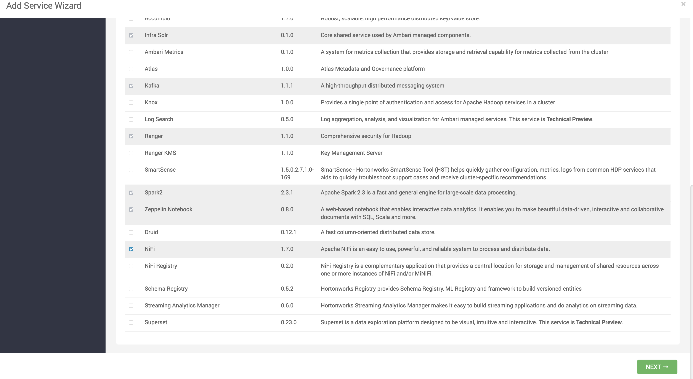    
  - choose any node
  - under "Assign Slaves and clients", ensure "Nifi Certificate Authority" is selected
  - under "Customize services", under "Advanced-nifi-ambari-config", set a long password for each of the required passwords: `BadPass#1BadPass#1` then click Next
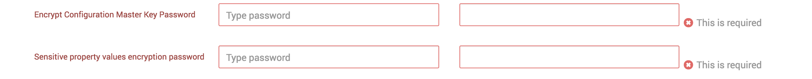      
  - Click Proceed anyway (you can ignore the warning about the token not being set for now)   
  
- After Nifi installs, you can use the Ambari quicklink to open its UI
  - Notice that NiFi UI comes up on port 9090 without any security
  
- Also notice that since we installed NiFi on kerberized cluster, Ambari has automatically created its keytab and configured NiFi to run in kerberos mode:
  - Run below on Node running NiFi
```
klist -kt /etc/security/keytabs/nifi.service.keytab
```
```
cat /etc/nifi/conf/nifi.properties | grep kerberos
```
```
tail /etc/nifi/conf/login-identity-providers.xml  
```

## Enable SSL/TLS for NiFi
  
- Assuming Nifi CA is already installed (via Ambari when you installed NiFi), you can make the below config changes in Ambari under Nifi > Configs > “Advanced nifi-ambari-ssl-config” and click Save to commit the changes:
  - a) Initial Admin Identity - set this to the long form (full DN) of identity for who your nifi admin user should be =  `CN=hadoopadmin, OU=LAB.HORTONWORKS.NET` (note the space after the comma)
  - b) Enable SSL? Check box
  - c) Clients need to authenticate? Check box
  - d) NiFi CA DN suffix- `, OU=LAB.HORTONWORKS.NET` (note the space after the comma)  
  - e) NiFi CA Token - Set this to long, random password (at least 16 chars) = `BadPass#1BadPass#1`
  - f) Node Identities - set this to the long form (full DN) of identity for each node running Nifi (replace CN entries below with FQDNs of nodes running Nifi...also note the space after the comma) e.g. if NiFi is running on 3 nodes:
```
<property name="Node Identity 1">CN=FQDN_OF_NODE1, OU=LAB.HORTONWORKS.NET</property>
<property name="Node Identity 2">CN=FQDN_OF_NODE2, OU=LAB.HORTONWORKS.NET</property>
<property name="Node Identity 3">CN=FQDN_OF_NODE3, OU=LAB.HORTONWORKS.NET</property>
```
  - Note: By default, the node identities are commented out using <!-- and --> tags. As you are updating this field, *make sure you remove these* or you changes will not take affect.
  
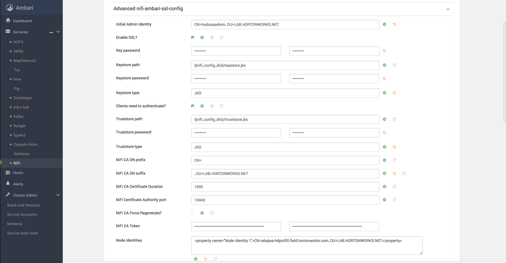   
  
- once the above changes have been made, Ambari will prompt you to restart Nifi.

- After restarting, it may take a minute for Nifi UI to come up. Now that we have enabled TLS, the NiFi url has changed from:
  - http://nifi_hostname:9090 to
  - https://nifi_hostname:9091  

- You can track the progress of NiFi startup by monitoring nifi-app.log
```
tail -f /var/log/nifi/nifi-app.log
```
- If you are not able to access the webUI, double check you are using *HTTPS://* and pointing to port *9091*

### Troubleshooting node identities issues

How will you know you made a mistake while setting node identities? 
- Usually if the node identities field was not correctly set, when you attempt to open the Nifi UI, you will see an untrusted proxy error similar to below in /var/log/nifi/nifi-user.log:
```
[NiFi Web Server-172] o.a.n.w.s.NiFiAuthenticationFilter Rejecting access to web api: Untrusted proxy CN=FQDN_OF_NODE_X, OU=LAB.HORTONWORKS.NET
```

In the above case, you would need to double check that the 'Node identity' values you provided in Ambari match the one from the log file (e.g. CN=FQDN_OF_NODE_X, OU=LAB.HORTONWORKS.NET) and ensure the values are not commented out. Next, you would manually delete /var/lib/nifi/conf/authorizations.xml from *all nodes running Nifi* and then restart Nifi service via Ambari.


## Authenticate to secured NiFi using certificate

In order to login to SSL-enabled Nifi, you will need to generate a client certificate and import into your browser. If you used the CA, you can use tls-toolkit that comes with Nifi CA:

First run below from Ambari node to download  the toolkit:
```
wget --no-check-certificate https://localhost:8443/resources/common-services/NIFI/1.0.0/package/archive.zip
```
- If you have not enabled SSL for Ambari, use below instead:
```
wget http://localhost:8080/resources/common-services/NIFI/1.0.0/package/archive.zip
```
- Install toolkit
```
unzip archive.zip
```

- Then run below to generate keystore. You will need to pass in your values for :
  - -D : pass in your “Initial Admin Identity” value
  - -t: pass in your “CA token” value.
  - -c: pass in the hostname of the node where Nifi CA is running 
```
export JAVA_HOME=/usr/java/default
./files/nifi-toolkit-*/bin/tls-toolkit.sh client -c $(hostname -f) -D "CN=hadoopadmin, OU=LAB.HORTONWORKS.NET" -p 10443 -t BadPass#1BadPass#1 -T pkcs12
```

  - Note: the hostname provided above, will be the same name you will use to login to NiFi UI via browser, so it should be resolvable by your laptop. If it is not, you can create a hosts entry on your local laptop to enable this.
  
- If you pass in the wrong password, you will see an error like:
```
Service client error: Received response code 403 with payload {"hmac":null,"pemEncodedCertificate":null,"error":"forbidden"}
```

- Before we can import the certificate, we will need to find the password to import. To do this, run below:
```
cat config.json | grep keyStorePassword
```

- The password generated above will be a long randomly generated string. If you want to change this password to one of your choosing instead, first run the below to remove the keystore/truststore:
```
rm -f keystore.pkcs12 truststore.pkcs12
```

- Then edit config.json by modifying the value of “keyStorePassword" to your desired password: `BadPass#1`
```
vi config.json
```
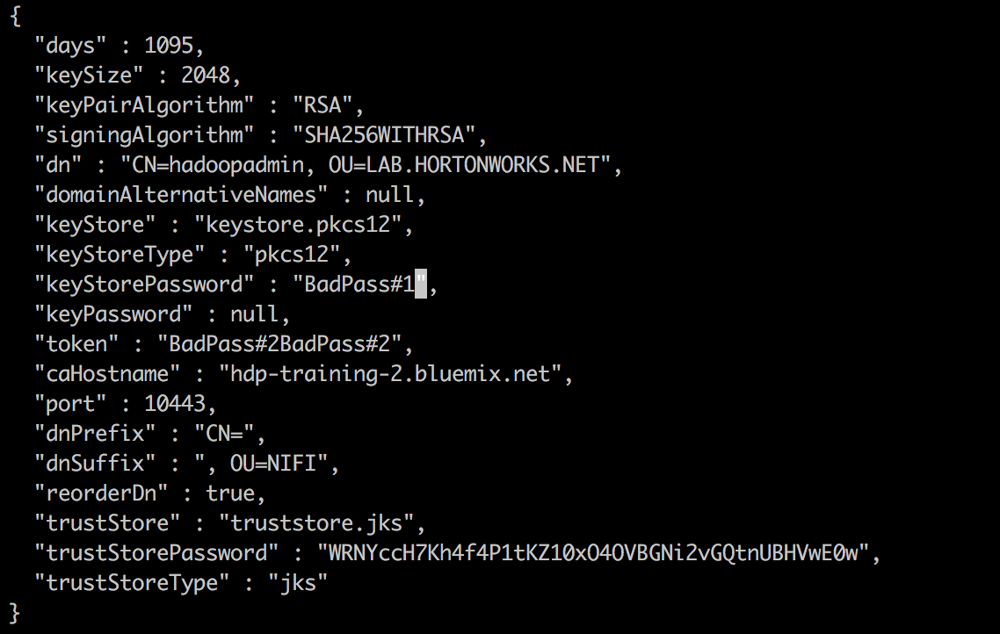   

Then re-run tls-toolkit.sh as below:
```
./files/nifi-toolkit-*/bin/tls-toolkit.sh  client -F
```

At this point the keystore.pkcs12 has been generated. Rename it to keystore.p12 and transfer it (e.g. via scp) over to your local laptop.

- Command to copy keystore to /tmp:
```
mv keystore.pkcs12 keystore.p12
mv keystore.p12 /tmp/
chmod 755 /tmp/keystore.p12
```

- Command to transfer keystore to MacBook - run this on your local MacBook, not Linux instance:
```
scp root@IP_ADDRESS:/tmp/keystore.p12 ~/Downloads/
```

- Now import certificate to your browser
The exact steps depend on your OS and browser.

For example if using Chrome on Mac, use “Keychain Access” app: File > Import items > Enter password from above (you will need to type it out)
For Firefox example see [here](https://blog.rosander.ninja/nifi/toolkit/tls/2016/09/19/tls-toolkit-intro.html)


## Check Nifi access

Now lets test that we can login to secured NiFi using the certificate we just imported. Recall that after enabling TLS, the NiFi webUI url has changed from:
  - http://nifi_hostname:9090 to
  - https://nifi_hostname:9091  


After selecting the certificate you imported earlier, follow the below screens to get through Chrome warnings and access the Nifi UI - the exact steps will depend on your browser:

- a) Select the certificate you just imported
- b) Choose "Always Allow"
- c) Since the certificate was self-signed, Chrome will warn you that the connection is not private. Click "Show Advanced" and click the "Proceed to <hostname>" link
- d) At this point, the Nifi UI should come up.  Note that on the top right, it shows you are logged in as "CN=hadoopadmin, OU=LAB.HORTONWORKS.NET"
- e) The /var/log/nifi/nifi-user.log log file will also confirm the user you are getting logged in as:
```
o.a.n.w.s.NiFiAuthenticationFilter Authentication success for CN=hadoopadmin, OU=LAB.HORTONWORKS.NET
```
f) Notice also that users.xml and authorizations.xml were created. Checking their content reveals that Nifi auto-created users and access policies for the 'Initial Admin Identity' and 'Node Identities'. More details on these files can be found [here](https://nifi.apache.org/docs/nifi-docs/html/administration-guide.html#multi-tenant-authorization)
```
cat /var/lib/nifi/conf/users.xml
```

With this you have successfully enabled SSL for Apache Nifi on your HDF cluster and logged in as `CN=hadoopadmin, OU=LAB.HORTONWORKS.NET`


#### Troubleshooting Nifi access

If instead of getting logged in to NiFi webUI, you are being shown a login page and prompted for a username and password, it could mean you are entering the wrong hostname into the browser or the hostname you provided while running the tls-toolkit is not resolvable from your laptop:
- 1. make sure you enter the same hostname into your browser as was passed into tls-toolkit (e.g the output of `hostname -f`)
- 2. if that hostname is not resolvable from your laptop, create an entry in your local laptop's host file to point to that hostname

## Setup Identity mappings

- Recall that the admin user in Ranger/AD is hadoopadmin, so we will need to use identity mappings to fine-tune the user string i.e. to map `CN=hadoopadmin, OU=LAB.HORTONWORKS.NET` to `hadoopadmin` (so it matches the user we have in Ranger/AD)

- First let's remove the authorization.xml on all nifi nodes to force Nifi to re-generate them. Without doing this, you will encounter an error at login saying: "Unable to perform the desired action due to insufficient permissions"
```
rm /var/lib/nifi/conf/authorizations.xml
```

- Now make the below changes in Ambari under Nifi > Configs and click Save. (Tip: Type .dn in the textbox to Filter the fields to easily find these fields)
```
nifi.security.identity.mapping.pattern.dn = ^CN=(.*?), OU=(.*?)$
nifi.security.identity.mapping.value.dn = $1
```
  - More info/examples of identity mapping/conversion [here](https://community.hortonworks.com/articles/61729/nifi-identity-conversion.html)
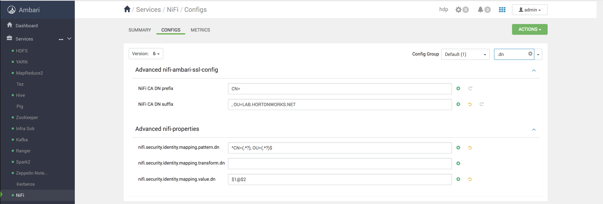     
  
- From Ambari, restart Nifi and wait for the Nifi nodes to join back the cluster
- After about a minute, refresh the Nifi UI and notice now you are logged in as hadoopadmin instead
- Opening /var/log/nifi/nifi-user.log confirms this:
```
o.a.n.w.s.NiFiAuthenticationFilter Authentication success for hadoopadmin
```

## Enable Ranger plugin

-  In Ambari > Ranger > Ranger Plugin tab: enable plugins for NiFi
- In Nifi configs, double check that
  - ranger-nifi-plugin-enabled is checked
  - xasecure.audit.destination.solr is checked
  - xasecure.audit.destination.solr.zookeepers is not blank
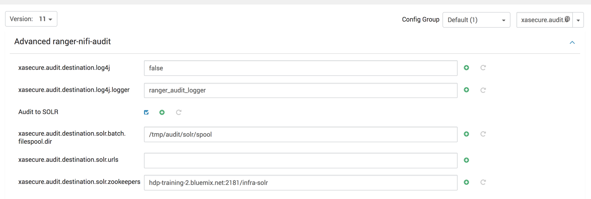   
  
- Restart NiFi

Attempting to open Nifi UI results in "Access denied" due to insufficient permissions:

Navigate to the ‘Audit’ tab in Ranger UI and notice that the requesting user showed up on Ranger audit. This shows the Ranger Nifi plugin is working

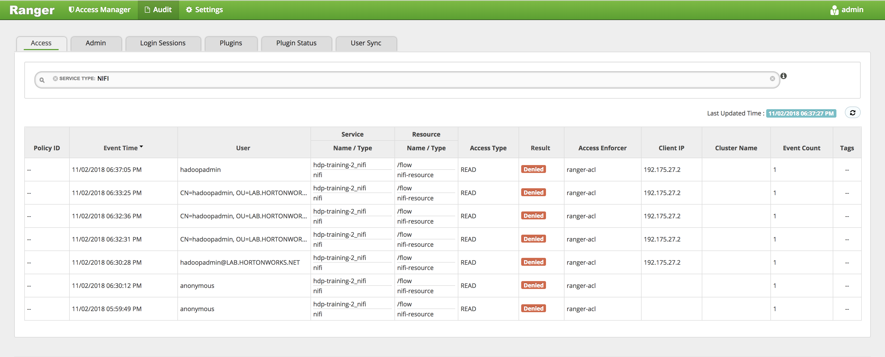   

- Notice how Ranger is showing details such as below for multiple HDF components:
  - what time access attempt occurred
  - user/IP who attempted the access
  - resource that was attempted to be accessed
  - whether access for allowed or denied
  - Also notice that Nifi now shows up as one of the registered plugins (under ‘Plugins’ tab)


## Create Ranger uses and policies

To be able to access the Nifi U we will need to create a number of objects. The details below assume you have already setup identity mappings for Nifi (as described in previous article), but you should be able follow similar steps even if you have not.

- 1- Create Ranger users node identities (in a real customer env, you would not be manually creating these: they would be synced over from Active Directory/LDAP)
  - hadoopadmin (already exists)
  - users corresponding to FQDNs of instances where NiFi is running (depending on how many nodes in your NiFi cluster)

To add user:
 - Ranger > Settings > User/groups
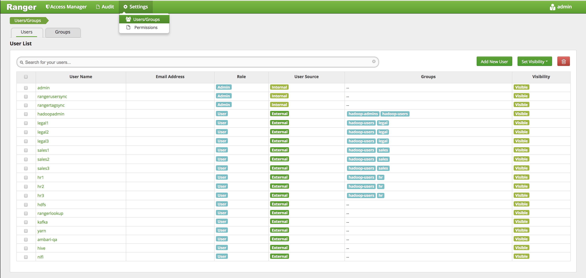
- Create user with username corresponding to your hosts hostnames e.g. hdp-training-2.bluemix.net
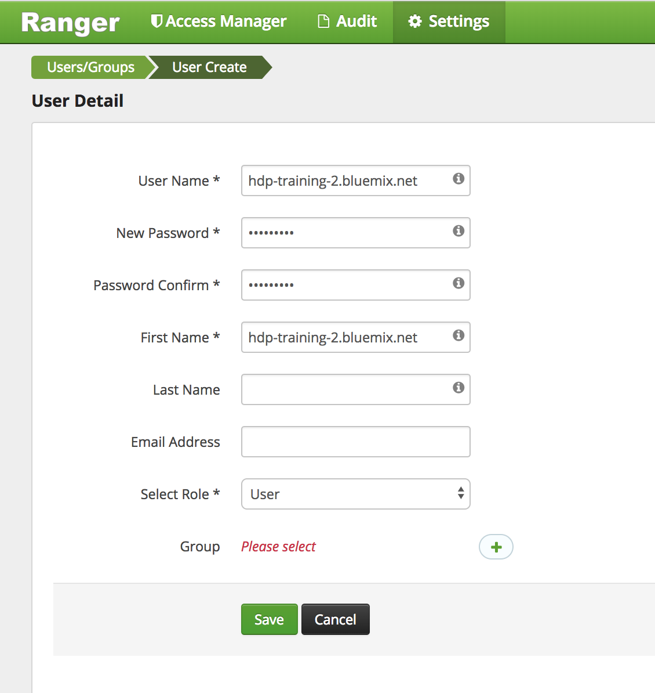   

- 2- Create Read policy on /flow for each host identities 
  - Open Ranger > Nifi repo > Add new policy and create /flow policy as below
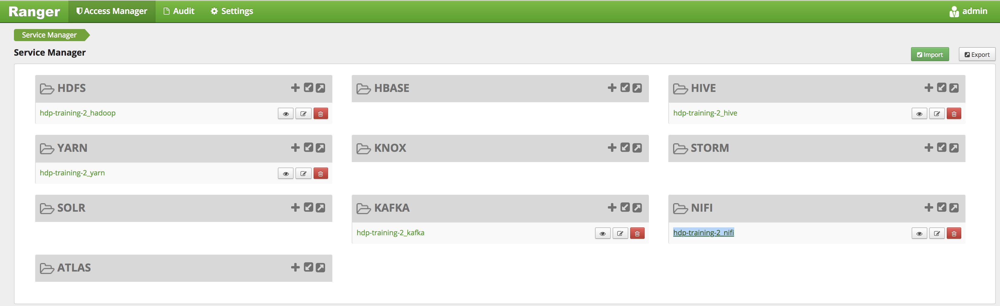 
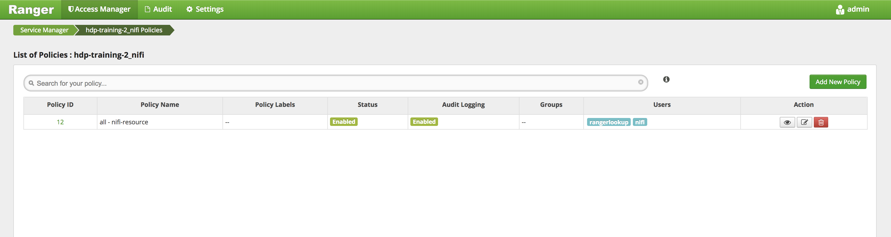 
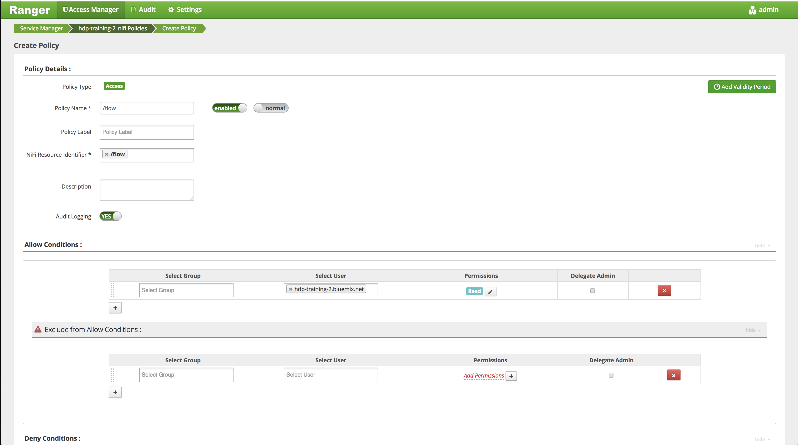 

- 3- Create Read/write policy on /proxy for each host identities
  - Similarly, create a new /proxy policy as below
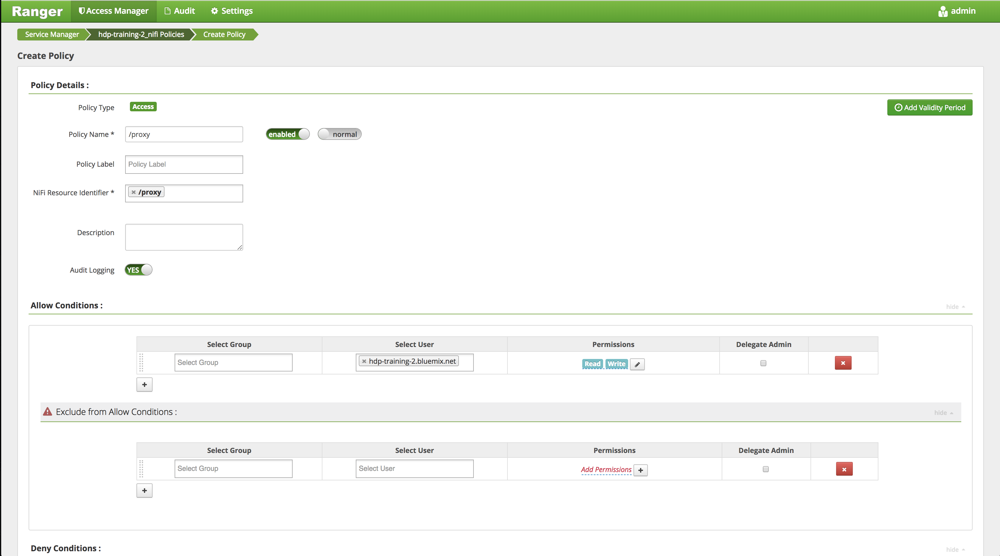 

- 4- Create Read/write policy on /data/* for each host identities (needed to list/delete queue)
  - Similarly, create a new /data/* policy as below
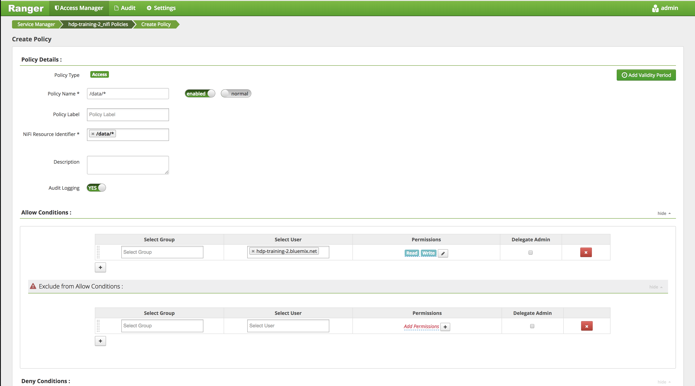 

- 5- Read/write policy on * for hadoopadmin identity (needed to make hadoopadmin a NiFi admin)
  - Edit the existing default NiFi policy (i.e. the first one) and add hadoopadmin as below
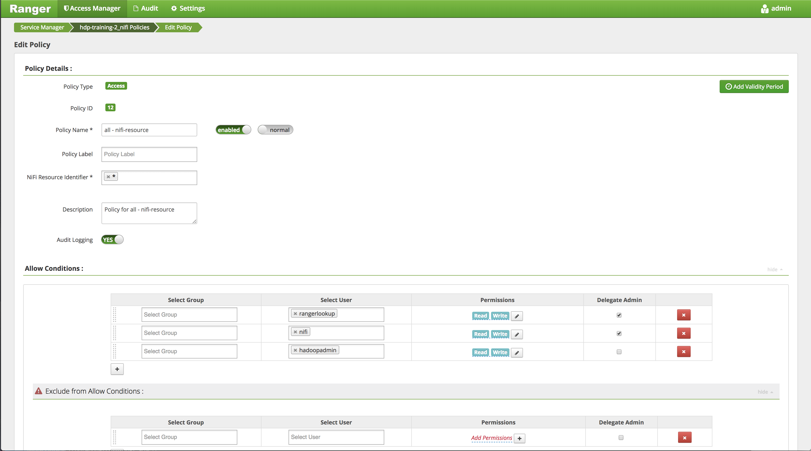 

- After creating the above, Open Nifi UI via Quicklink and confirm you are now able to login


## Auth via login page instead of certificate

When kerberos is enabled, NiFi can also authenticate via login page (instead of SSL cert). In order to do so, the Kerberos principal (e.g. hadoopadmin@LAB.HORTONWORKS.NET) would need to be converted to a username (e.g hadoopadmin) using another identity mapping.

- First, if the file exists, let's remove the authorization.xml from all nifi nodes to force Nifi to re-generate them. Without doing this, you will encounter an error at login saying: "Unable to perform the desired action due to insufficient permissions"
```
rm /var/lib/nifi/conf/authorizations.xml
```

- Delete the certificate you imported into your browser e.g on Mac you can use Keychain Access app
  - Note there will be multiple entries: one for hadoopadmin and one for the host you are logging into
  
- In Ambari > NiFi > Advance Nifi properties, make below changes. (Tip: Type .kerb in the textbox to Filter the fields to easily find these fields)
```
nifi.security.identity.mapping.pattern.kerb=^(.*?)@(.*?)$
nifi.security.identity.mapping.value.kerb=$1
```
  - More info/examples of identity mapping/conversion [here](https://community.hortonworks.com/articles/61729/nifi-identity-conversion.html)
  
- Restart Nifi via Ambari

- Now when you open NiFi UI, it should prompt you for user/password (if not, try to open in Incognito browser window)
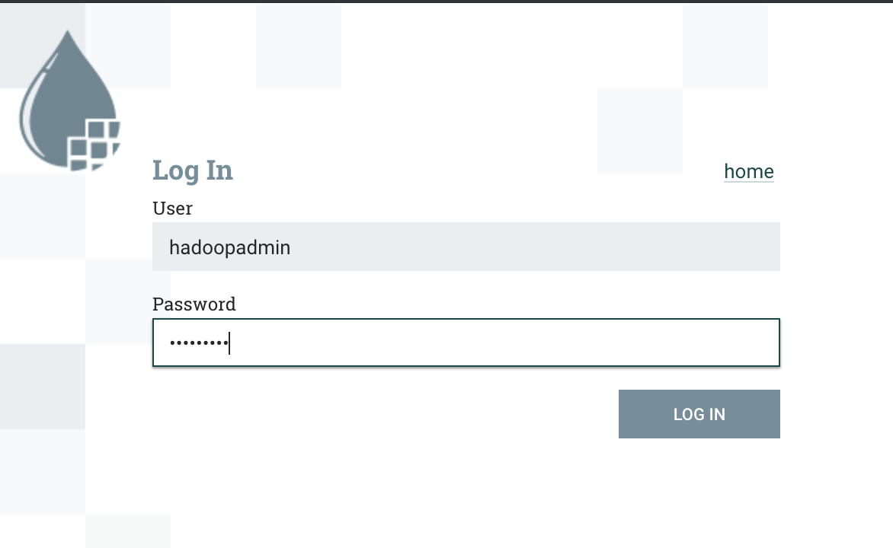 

- You should be able to login as hadoopadmin/BadPass#1
  - If not, use the nifi-user.log and Ranger audits to see what went wrong
```
tail -f  /var/log/nifi/nifi-user.log
```

- Log out and try to login as hr1/BadPass#1. Notice that the authetication worked (because the correct kerberos credentials were provided) but authorization failed (i.e. hr1 user has not been given any permissions in NiFi via Ranger):

```
2018-10-30 04:19:53,893 INFO [NiFi Web Server-33] o.a.n.w.s.NiFiAuthenticationFilter Authentication success for hr1
2018-10-30 04:19:53,914 INFO [NiFi Web Server-33] o.a.n.w.a.c.AccessDeniedExceptionMapper identity[hr1], groups[none] does not have permission to access the requested resource. Unable to view the user interface. Returning Forbidden response.
```

- This concludes the NiFi lab. We have shown how to enable Ranger plugin and kerberos for NiFi and login with both options: TLS certificate or kerberos credentials

------------------

# Lab 7a

## Ranger KMS/Data encryption setup


- Goal: In this lab we will install Ranger KMS via Ambari. Next we will create some encryption keys and use them to create encryption zones (EZs) and copy files into them. Reference: [docs](http://docs.hortonworks.com/HDPDocuments/HDP2/HDP-2.3.4/bk_Ranger_KMS_Admin_Guide/content/ch_ranger_kms_overview.html)

- In this section we will have to setup proxyusers. This is done to enable *impersonation* whereby a superuser can submit jobs or access hdfs on behalf of another user (e.g. because superuser has kerberos credentials but user joe doesn’t have any)
  - For more details on this, refer to the [doc](https://hadoop.apache.org/docs/stable/hadoop-project-dist/hadoop-common/Superusers.html)

- Before starting KMS install, find and note down the below piece of information. These will be used during KMS install
  - Find the internal hostname of host running *Mysql* and note it down
    - From Ambari > Hive > Mysql > click the 'Mysql Server' hyperlink. The internal hostname should appear in upper left of the page.

  
- Open Ambari > start 'Add service' wizard > select 'Ranger KMS'.
- Pick any node to install on
- Keep the default configs except for 
  - under Ambari > Ranger KMS > Settings tab :
    - Ranger KMS DB host: <FQDN of Mysql>
    - Ranger KMS DB password: `BadPass#1` 
    - DBA password: `BadPass#1`
    - KMS master secret password: `BadPass#1`
      
      
    
        
  - Under Advanced > Custom kms-site, enter below configs (Tip: to avoid adding one at a time, you can use 'bulk add' mode):
      - hadoop.kms.proxyuser.oozie.users=*
      - hadoop.kms.proxyuser.ambari.users=*
      - hadoop.kms.proxyuser.oozie.hosts=*
      - hadoop.kms.proxyuser.ambari.hosts=*
      - hadoop.kms.proxyuser.keyadmin.groups=*
      - hadoop.kms.proxyuser.keyadmin.hosts=*
      - hadoop.kms.proxyuser.keyadmin.users=*     
         

- Click Next > Proceed Anyway to proceed with the wizard

- If prompted, on Configure Identities page, you may have to enter your AD admin credentials:
  - Admin principal: `hadoopadmin@LAB.HORTONWORKS.NET`
  - Admin password: BadPass#1
  - Check the "Save admin credentials" checkbox
  
- Click Next > Deploy to install RangerKMS
        
- Confirm these properties got populated to kms://http@(kmshostname):9292/kms
  - HDFS > Configs > Advanced core-site:
    - hadoop.security.key.provider.path
  - HDFS > Configs > Advanced hdfs-site:
    - dfs.encryption.key.provider.uri  
    
- Restart the services that require it e.g. HDFS, Mapreduce, YARN via Actions > Restart All Required

- Restart Ranger and RangerKMS services.

- (Optional) Add another KMS:
  - Ambari > Ranger KMS > Service Actions > Add Ranger KMS Server > Pick any host
   
  - After it is installed, you can start it by:
    - Ambari > Ranger KMS > Service Actions > Start
    

------------------

# Lab 7b

## Ranger KMS/Data encryption exercise

- Before we can start exercising HDFS encryption, we will need to set:
  - policy for hadoopadmin access to HDFS
  - policy for hadoopadmin access to Hive  
  - policy for hadoopadmin access to the KMS keys we created
  
- Lets begin:
  - Add the user hadoopadmin to the Ranger HDFS global policies. 
    - Access Manager > HDFS > (clustername)_hadoop   
    - This will open the list of HDFS policies
    
    - Edit the 'all - path' global policy (the first one) and add hadoopadmin to global HDFS policy and Save 
     
    - Your policy now includes hadoopadmin
     
    
  - Add the user hadoopadmin to the Ranger Hive global policies. (Hive has multiple default policies)
    - Access Manager > HIVE > (clustername)_hive   
    - This will open the list of HIVE policies
    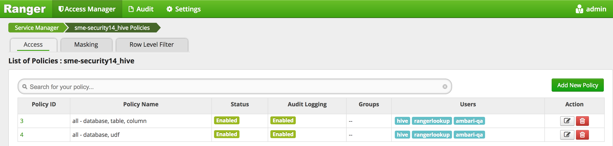 
    - Edit the 'all - global' policy (the second one) and add hadoopadmin to global HIVE policy and Save  
     
    - Your policies now includes hadoopadmin
      
     
  - Add the user hadoopadmin to the Ranger YARN global policies. 
    - Access Manager > YARN > (clustername)_yarn   
    - This will open the list of YARN policies
    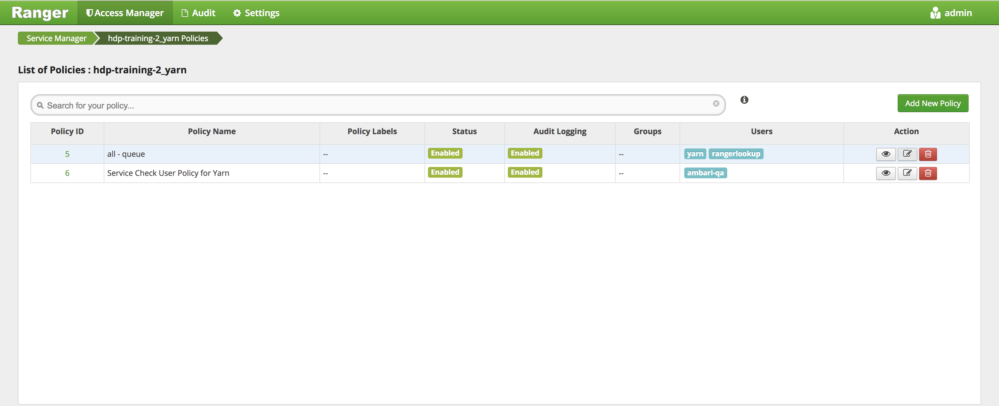 
    - Edit the 'all - global' policy (the second one) and add hadoopadmin to global YARN policy and Save  
    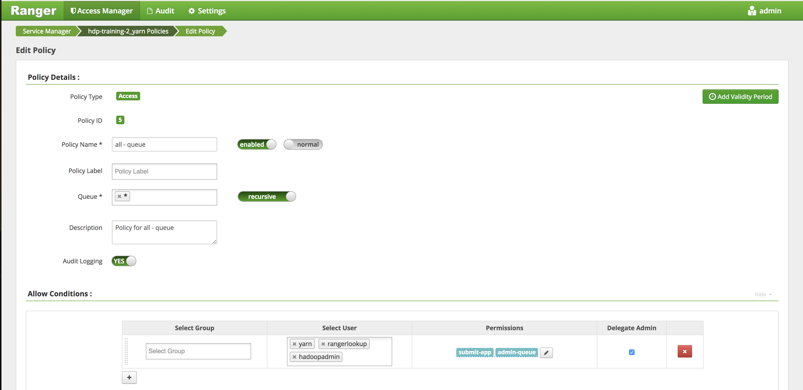 
   
    
- Logout of Ranger
  - Top right > admin > Logout      
- Login to Ranger as keyadmin/BadPass#1
- Confirm the KMS repo was setup correctly
  - Under Service Manager > KMS > Click the Edit icon (next to the trash icon) to edit the KMS repo
   
  - Click 'Test connection' and confirm it works

- Create a key called testkey - for reference: see [doc](http://docs.hortonworks.com/HDPDocuments/HDP2/HDP-2.5.0/bk_security/content/use_ranger_kms.html)
  - Select Encryption > Key Manager
  - Select KMS service > pick your kms > Add new Key
    - if an error is thrown, go back and test connection as described in previous step
  - Create a key called `testkey` > Save
  

- Similarly, create another key called `testkey2`
  - Select Encryption > Key Manager
  - Select KMS service > pick your kms > Add new Key
  - Create a key called `testkey2` > Save  

- Add user `hadoopadmin` to default KMS key policy
  - Click Access Manager tab
  - Click Service Manager > KMS > (clustername)_kms link
  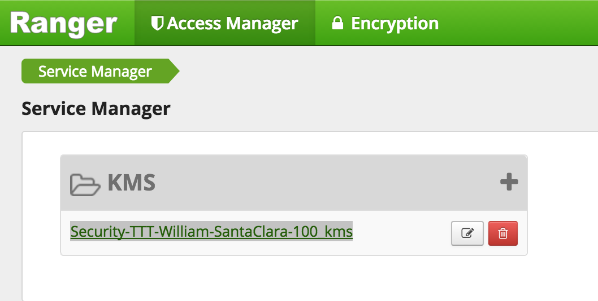

  - Edit the default policy
  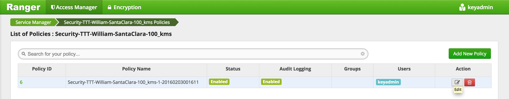
  
  - Under 'Select User', Add `hadoopadmin` user and click Save
   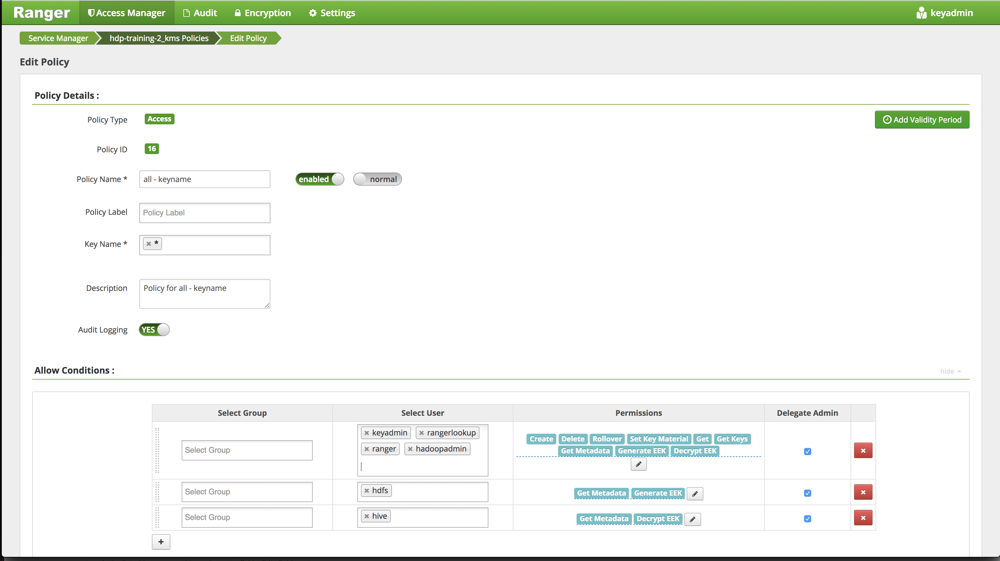
  
    - Note that:
      - `hdfs` user  needs `GetMetaData` and `GenerateEEK` privilege
      - `hive` user needs `GetMetaData` and `DecryptEEK` privilege

  
- Run below to create a zone using the key and perform basic key and encryption zone (EZ) exercises 
  - Create EZs using keys
  - Copy file to EZs
  - Delete file from EZ
  - View contents for raw file
  - Prevent access to raw file
  - Copy file across EZs
  - move hive warehouse dir to EZ
  
```
#run below on Ambari node

export PASSWORD=BadPass#1

#detect name of cluster
output=`curl -u hadoopadmin:$PASSWORD -k -i -H 'X-Requested-By: ambari'  https://localhost:8443/api/v1/clusters`
cluster=`echo $output | sed -n 's/.*"cluster_name" : "\([^\"]*\)".*/\1/p'`

echo $cluster
## this should show the name of your cluster

## if not you can manully set this as below
## cluster=Security-HWX-LabTesting-XXXX

#first we will run login 3 different users: hdfs, hadoopadmin, sales1

#kinit as hadoopadmin and sales using BadPass#1 
sudo -u hadoopadmin kinit
## enter BadPass#1
sudo -u sales1 kinit
## enter BadPass#1

#then kinit as hdfs using the headless keytab and the principal name
sudo -u hdfs kinit -kt /etc/security/keytabs/hdfs.headless.keytab "hdfs-${cluster,,}"

#as hadoopadmin list the keys and their metadata
sudo -u hadoopadmin hadoop key list -metadata

#as hadoopadmin create dirs for EZs
sudo -u hadoopadmin hdfs dfs -mkdir /zone_encr
sudo -u hadoopadmin hdfs dfs -mkdir /zone_encr2

#as hdfs create 2 EZs using the 2 keys
sudo -u hdfs hdfs crypto -createZone -keyName testkey -path /zone_encr
sudo -u hdfs hdfs crypto -createZone -keyName testkey2 -path /zone_encr2
# if you get 'RemoteException' error it means you have not given namenode user permissions on testkey by creating a policy for KMS in Ranger

#check EZs got created
sudo -u hdfs hdfs crypto -listZones  

#create test files
sudo -u hadoopadmin echo "My test file1" > /tmp/test1.log
sudo -u hadoopadmin echo "My test file2" > /tmp/test2.log

#copy files to EZs
sudo -u hadoopadmin hdfs dfs -copyFromLocal /tmp/test1.log /zone_encr
sudo -u hadoopadmin hdfs dfs -copyFromLocal /tmp/test2.log /zone_encr

sudo -u hadoopadmin hdfs dfs -copyFromLocal /tmp/test2.log /zone_encr2

#Notice that hadoopadmin allowed to decrypt EEK but not sales user (since there is no Ranger policy allowing this)
sudo -u hadoopadmin hdfs dfs -cat /zone_encr/test1.log
sudo -u hadoopadmin hdfs dfs -cat /zone_encr2/test2.log
#this should work

sudo -u sales1      hdfs dfs -cat /zone_encr/test1.log
## this should give you below error
## cat: User:sales1 not allowed to do 'DECRYPT_EEK' on 'testkey'
```

- Check the Ranger > Audit page and notice that the request from hadoopadmin was allowed but the request from sales1 was denied


- Now lets test deleting and copying files between EZs - ([Reference doc](https://docs.hortonworks.com/HDPDocuments/HDP2/HDP-2.3.4/bk_hdfs_admin_tools/content/copy-to-from-encr-zone.html))
```
#try to remove file from EZ using usual -rm command 
sudo -u hadoopadmin hdfs dfs -rm /zone_encr/test2.log
## This works because as of HDP2.4.3 -skipTrash option no longer needs to be specified

#confirm that test2.log was deleted and that zone_encr only contains test1.log
sudo -u hadoopadmin hdfs dfs -ls  /zone_encr/
 
#copy a file between EZs using distcp with -skipcrccheck option
sudo -u hadoopadmin hadoop distcp -skipcrccheck -update /zone_encr2/test2.log /zone_encr/
```
- Lets now look at the contents of the raw file
```
#View contents of raw file in encrypted zone as hdfs super user. This should show some encrypted characters
sudo -u hdfs hdfs dfs -cat /.reserved/raw/zone_encr/test1.log

#Prevent user hdfs from reading the file by setting security.hdfs.unreadable.by.superuser attribute. Note that this attribute can only be set on files and can never be removed.
sudo -u hdfs hdfs dfs -setfattr -n security.hdfs.unreadable.by.superuser  /.reserved/raw/zone_encr/test1.log

# Now as hdfs super user, try to read the files or the contents of the raw file
sudo -u hdfs hdfs dfs -cat /.reserved/raw/zone_encr/test1.log

## You should get below error
##cat: Access is denied for hdfs since the superuser is not allowed to perform this operation.

```
- Now lets move Hive warehouse dir to encrypted folder

- First let's review contents of Hive warehouse dir before moving anything
```
# sudo -u hadoopadmin hdfs dfs -ls /warehouse/tablespace/managed/hive
Found 4 items
drwxrwx---+  - hive hadoop          0 2018-10-26 18:31 /warehouse/tablespace/managed/hive/information_schema.db
drwxrwx---+  - hive hadoop          0 2018-11-02 18:09 /warehouse/tablespace/managed/hive/sample_07
drwxrwx---+  - hive hadoop          0 2018-11-02 18:09 /warehouse/tablespace/managed/hive/sample_08
drwxrwx---+  - hive hadoop          0 2018-10-26 18:31 /warehouse/tablespace/managed/hive/sys.db


# sudo -u hadoopadmin hdfs dfs -ls /warehouse/tablespace/external/hive
Found 2 items
drwxrwxrwx+  - hive hadoop          0 2018-10-26 18:31 /warehouse/tablespace/external/hive/information_schema.db
drwxr-xr-t+  - hive hadoop          0 2018-10-26 18:32 /warehouse/tablespace/external/hive/sys.db
```

- Configure Hive for HDFS Encryption using testkey
```
sudo -u hadoopadmin hdfs dfs -mv /warehouse /warehouse-old
sudo -u hadoopadmin hdfs dfs -mkdir /warehouse
sudo -u hdfs hdfs crypto -createZone -keyName testkey -path /warehouse
sudo -u hadoopadmin hadoop distcp -skipcrccheck -update /warehouse-old /warehouse
```

- To configure the Hive scratch directory (hive.exec.scratchdir) so that it resides inside an encryption zone:
  - Create EZ for hive temp
```
sudo -u hadoopadmin hdfs dfs -mkdir /apps/hive/tmp
sudo -u hdfs hdfs crypto -createZone -keyName testkey -path /apps/hive/tmp
```

- Make sure that the permissions for /apps/hive/tmp are set to 1777
```
sudo -u hdfs hdfs dfs -chmod -R 1777 /apps/hive/tmp
```

- Confirm permissions by accessing the scratch dir as sales1
```
sudo -u sales1 hdfs dfs -ls /apps/hive/tmp
## this should provide listing
```

- In Ambari > Hive > Configs > Advanced, change below to newly created dir
  - hive.exec.scratchdir = /apps/hive/tmp
- Restart Hive and any other components that need it
  

- Destroy ticket for sales1
```
sudo -u sales1 kdestroy
```

- Logout of Ranger as keyadmin user

------------------

# Lab 8

## Secured Hadoop exercises

In this lab we will see how to interact with Hadoop components (HDFS, Hive, Hbase) running on a kerborized cluster and create Ranger appropriate authorization policies for access. If you do not already have HBase installed, and would like to run the excercise, you can install it via Ambari 'Add service' wizard

- We will Configure Ranger policies to:
  - Protect /sales HDFS dir - so only sales group has access to it
  - Protect sales hive table - so only sales group has access to it
  - Protect sales HBase table - so only sales group has access to it

#### Access secured HDFS

- Goal: Create a /sales dir in HDFS and ensure only users belonging to sales group (and admins) have access
 
 
- Login to Ranger (using admin/BadPass#1) and confirm the HDFS repo was setup correctly in Ranger
  - In Ranger > Under Service Manager > HDFS > Click the Edit icon (next to the trash icon) to edit the HDFS repo
  - Click 'Test connection' 
  
   
- Create /sales dir in HDFS as hadoopadmin
```
#authenticate
sudo -u hadoopadmin kinit
# enter password: BadPass#1

#create dir and set permissions to 000
sudo -u hadoopadmin hdfs dfs -mkdir /sales
sudo -u hadoopadmin hdfs dfs -chmod 000 /sales
```  

- Now login as sales1 and attempt to access it before adding any Ranger HDFS policy
```
sudo su - sales1

hdfs dfs -ls /sales
```
- This fails with `GSSException: No valid credentials provided` because the cluster is kerberized and we have not authenticated yet

- Authenticate as sales1 user and check the ticket
```
kinit
# enter password: BadPass#1

klist
## Default principal: sales1@LAB.HORTONWORKS.NET
```
- Now try accessing the dir again as sales1
```
hdfs dfs -ls /sales
```
- This time it fails with authorization error: 
  - `Permission denied: user=sales1, access=READ_EXECUTE, inode="/sales":hadoopadmin:hdfs:d---------`

- In Ranger, click on 'Audit' to open the Audits page and filter by below. 
  - Service Type: `HDFS`
  - User: `sales1`
  
- Notice that Ranger captured the access attempt and since there is currently no policy to allow the access, it was "Denied"


- To create an HDFS Policy in Ranger, follow below steps:
  - On the 'Access Manager' tab click HDFS > (clustername)_hadoop
  
  - This will open the list of HDFS policies
  
  - Click 'Add New Policy' button to create a new one allowing `sales` group users access to `/sales` dir:
    - Policy Name: `sales dir`
    - Resource Path: `/sales`
    - Group: `sales`
    - Permissions : `Execute Read Write`
    - Add
  

- Wait 30s for policy to take effect
  
- Now try accessing the dir again as sales1 and now there is no error seen
```
hdfs dfs -ls /sales
```

- In Ranger, click on 'Audit' to open the Audits page and filter by below:
  - Service Type: HDFS
  - User: sales1
  
- Notice that Ranger captured the access attempt and since this time there is a policy to allow the access, it was `Allowed`
  

  - You can also see the details that were captured for each request:
    - Policy that allowed the access
    - Time
    - Requesting user
    - Service type (e.g. hdfs, hive, hbase etc)
    - Resource name 
    - Access type (e.g. read, write, execute)
    - Result (e.g. allowed or denied)
    - Access enforcer (i.e. whether native acl or ranger acls were used)
    - Client IP
    - Event count
    
- For any allowed requests, notice that you can quickly check the details of the policy that allowed the access by clicking on the policy number in the 'Policy ID' column
  

- Now let's check whether non-sales users can access the directory

- Logout as sales1 and log back in as hr1
```
kdestroy
#logout as sales1
logout

#login as hr1 and authenticate
sudo su - hr1

kinit
# enter password: BadPass#1

klist
## Default principal: hr1@LAB.HORTONWORKS.NET
```
- Try to access the same dir as hr1 and notice it fails
```
hdfs dfs -ls /sales
## ls: Permission denied: user=hr1, access=READ_EXECUTE, inode="/sales":hadoopadmin:hdfs:d---------
```

- In Ranger, click on 'Audit' to open the Audits page and this time filter by 'Resource Name'
  - Service Type: `HDFS`
  - Resource Name: `/sales`
  
- Notice you can see the history/details of all the requests made for /sales directory:
  - created by hadoopadmin 
  - initial request by sales1 user was denied 
  - subsequent request by sales1 user was allowed (once the policy was created)
  - request by hr1 user was denied
  

- Logout as hr1
```
kdestroy
logout
```
- We have successfully setup an HDFS dir which is only accessible by sales group (and admins)

#### Access secured Hive

- Goal: Setup Hive authorization policies to ensure sales users only have access to code, description columns in default.sample_07


- Confirm the HIVE repo was setup correctly in Ranger
  - In Ranger > Service Manager > HIVE > Click the Edit icon (next to the trash icon) to edit the HIVE repo
  - Click 'Test connection' 

- Now run these steps from node where Hive (or client) is installed 

- Login as sales1 and attempt to connect to default database in Hive via beeline and access sample_07 table

- Notice that in the JDBC connect string for connecting to an secured Hive while its running in default (ie binary) transport mode :
  - port remains 10000
  - *now a kerberos principal needs to be passed in*

- Login as sales1 without kerberos ticket and try to open beeline connection:
```
sudo su - sales1
kdestroy
beeline -u "jdbc:hive2://localhost:10000/default;principal=hive/$(hostname -f)@LAB.HORTONWORKS.NET"
```
- This fails with `GSS initiate failed` because the cluster is kerberized and we have not authenticated yet

- To exit beeline:
```
!q
```
- Authenticate as sales1 user and check the ticket
```
kinit
# enter password: BadPass#1

klist
## Default principal: sales1@LAB.HORTONWORKS.NET
```
- Now try connect to Hive via beeline as sales1
```
beeline -u "jdbc:hive2://localhost:10000/default;principal=hive/$(hostname -f)@LAB.HORTONWORKS.NET"
```

- If you get the below error, it is because you did not add hive to the global KMS policy in an earlier step (along with nn, hadoopadmin). Go back and add it in.
```
org.apache.hadoop.security.authorize.AuthorizationException: User:hive not allowed to do 'GET_METADATA' on 'testkey'
```

- This time it connects. Now try to run a query
```
beeline> select code, description from sample_07;
```
- Now it fails with authorization error: 
  - `HiveAccessControlException Permission denied: user [sales1] does not have [SELECT] privilege on [default/sample_07]`

- Login into Ranger UI e.g. at http://RANGER_HOST_PUBLIC_IP:6080/index.html as admin/admin

- In Ranger, click on 'Audit' to open the Audits page and filter by below. 
  - Service Type: `Hive`
  - User: `sales1`
  
- Notice that Ranger captured the access attempt and since there is currently no policy to allow the access, it was `Denied`


- To create an HIVE Policy in Ranger, follow below steps:
  - On the 'Access Manager' tab click HIVE > (clustername)_hive
  
  - This will open the list of HIVE policies
  
  - Click 'Add New Policy' button to create a new one allowing `sales` group users access to `code`, `description` and `total_emp` columns in `sample_07` dir:
    - Policy Name: `sample_07`
    - Hive Database: `default`
    - table: `sample_07`
    - Hive Column: `code` `description` `total_emp`
    - Group: `sales`
    - Permissions : `select`
    - Add
  
  
- Notice that as you typed the name of the DB and table, Ranger was able to look these up and autocomplete them

- Also, notice that permissions are only configurable for allowing access, and you are not able to explicitly deny a user/group access to a resource unless you have enabled Deny Conditions during your Ranger install (step 8).

- Wait 30s for the new policy to be picked up
  
- Now try accessing the columns again and now the query works
```
beeline> select code, description, total_emp from sample_07;
```

- Note though, that if instead you try to describe the table or query all columns, it will be denied - because we only gave sales users access to two columns in the table
  - `beeline> desc sample_07;`
  - `beeline> select * from sample_07;`
  
- In Ranger, click on 'Audit' to open the Audits page and filter by below:
  - Service Type: HIVE
  - User: sales1
  
- Notice that Ranger captured the access attempt and since this time there is a policy to allow the access, it was `Allowed`
  

  - You can also see the details that were captured for each request:
    - Policy that allowed the access
    - Time
    - Requesting user
    - Service type (e.g. hdfs, hive, hbase etc)
    - Resource name 
    - Access type (e.g. read, write, execute)
    - Result (e.g. allowed or denied)
    - Access enforcer (i.e. whether native acl or ranger acls were used)
    - Client IP
    - Event count
    
- For any allowed requests, notice that you can quickly check the details of the policy that allowed the access by clicking on the policy number in the 'Policy ID' column
  
 

- We are also able to limit sales1's access to only subset of data by using row-level filter.  Suppose we only want to allow the sales group access to data where `total_emp` is less than 5000. 

- On the Hive Policies page, select the 'Row Level Filter' tab and click on 'Add New Policy'
  
	- Please note that in order to apply a row level filter policy the user/group must already have 'select' permissions on the table. 

- Create a policy restricting access to only rows where `total_emp` is less than 5000:
    - Policy Name: `sample_07_filter_total_emp`
    - Hive Database: `default`
    - table: `sample_07`
    - Group: `sales`
    - Permissions : `select`
    - Row Level Filter : `total_emp<5000`
    	- The filter syntax is similar to what you would write after a 'WHERE' clause in a SQL query
    - Add
  
 
- Wait 30s for the new policy to be picked up
  
- Now try accessing the columns again and notice how only rows that match the filter criteria are shown
```
beeline> select code, description, total_emp from sample_07;
```

- Go back to the Ranger Audits page and notice how the filter policy was applied to the query


- Suppose we would now like to mask `total_emp` column from sales1.  This is different from denying/dis-allowing access in that the user can query the column but cannot see the actual data 

- On the Hive Policies page, select the 'Masking' tab and click on 'Add New Policy'
  
	- Please note that in order to mask a column, the user/group must already have 'select' permissions to that column.  Creating a masking policy on a column that a user does not have access to will deny the user access

- Create a policy masking the  `total_emp` column for `sales` group users:
    - Policy Name: `sample_07_total_emp`
    - Hive Database: `default`
    - table: `sample_07`
    - Hive Column: `total_emp`
    - Group: `sales`
    - Permissions : `select`
    - Masking Option : `redact`
    	- Notice the different masking options available
    	- The 'Custom' masking option can use any Hive UDF as long as it returns the same data type as that of the column 

    - Add
  
 
- Wait 30s for the new policy to be picked up
  
- Now try accessing the columns again and notice how the results for the `total_emp` column is masked
```
beeline> select code, description, total_emp from sample_07;
```

- Go back to the Ranger Audits page and notice how the masking policy was applied to the query.


- Exit beeline
```
!q
```
- Now let's check whether non-sales users can access the table

- Logout as sales1 and log back in as hr1
```
kdestroy
#logout as sales1
logout

#login as hr1 and authenticate
sudo su - hr1

kinit
# enter password: BadPass#1

klist
## Default principal: hr1@LAB.HORTONWORKS.NET
```
- Try to access the same table as hr1 and notice it fails
```
beeline -u "jdbc:hive2://localhost:10000/default;principal=hive/$(hostname -f)@LAB.HORTONWORKS.NET"
```
```
beeline> select code, description from sample_07;
```
- In Ranger, click on 'Audit' to open the Audits page and filter by 'Service Type' = 'Hive'
  - Service Type: `HIVE`

  
- Here you can see the request by sales1 was allowed but hr1 was denied

  

- Exit beeline
```
!q
```
- Logoff as hr1
```
logout
```


- We have setup Hive authorization policies to ensure only sales users have access to code, description columns in default.sample_07, but only for rows where total_emp<5000. 


#### Access secured HBase

- Goal: Create a table called 'sales' in HBase and setup authorization policies to ensure only sales users have access to the table
  
- Run these steps from any node where Hbase Master or RegionServer services are installed 

- Login as sales1
```
sudo su - sales1
```
-  Start the hbase shell
```
hbase shell
```
- List tables in default database
```
hbase> list 'default'
```
- This fails with `GSSException: No valid credentials provided` because the cluster is kerberized and we have not authenticated yet

- To exit hbase shell:
```
exit
```
- Authenticate as sales1 user and check the ticket
```
kinit
# enter password: BadPass#1

klist
## Default principal: sales1@LAB.HORTONWORKS.NET
```
- Now try connect to Hbase shell and list tables as sales1
```
hbase shell
hbase> list 'default'
```
- This time it works. Now try to create a table called `sales` with column family called `cf`
```
hbase> create 'sales', 'cf'
```
- Now it fails with authorization error: 
  - `org.apache.hadoop.hbase.security.AccessDeniedException: Insufficient permissions for user 'sales1@LAB.HORTONWORKS.NET' (action=create)`
  - Note: there will be a lot of output from above. The error will be on the line right after your create command

- Login into Ranger UI e.g. at http://RANGER_HOST_PUBLIC_IP:6080/index.html as admin/admin

- In Ranger, click on 'Audit' to open the Audits page and filter by below. 
  - Service Type: `Hbase`
  - User: `sales1`
  
- Notice that Ranger captured the access attempt and since there is currently no policy to allow the access, it was `Denied`


- To create an HBASE Policy in Ranger, follow below steps:
  - On the 'Access Manager' tab click HBASE > (clustername)_hbase
  
  - This will open the list of HBASE policies
  
  - Click 'Add New Policy' button to create a new one allowing `sales` group users access to `sales` table in HBase:
    - Policy Name: `sales`
    - Hbase Table: `sales`
    - Hbase Column Family: `*`
    - Hbase Column: `*`
    - Group : `sales`    
    - Permissions : `Admin` `Create` `Read` `Write`
    - Add
  
  
- Wait 30s for policy to take effect
  
- Now try creating the table and now it works
```
hbase> create 'sales', 'cf'
```
  
- In Ranger, click on 'Audit' to open the Audits page and filter by below:
  - Service Type: HBASE
  - User: sales1
  
- Notice that Ranger captured the access attempt and since this time there is a policy to allow the access, it was `Allowed`
  

  - You can also see the details that were captured for each request:
    - Policy that allowed the access
    - Time
    - Requesting user
    - Service type (e.g. hdfs, hive, hbase etc)
    - Resource name 
    - Access type (e.g. read, write, execute)
    - Result (e.g. allowed or denied)
    - Access enforcer (i.e. whether native acl or ranger acls were used)
    - Client IP
    - Event count
    
- For any allowed requests, notice that you can quickly check the details of the policy that allowed the access by clicking on the policy number in the 'Policy ID' column
  

- Exit hbase shell
```
hbase> exit
```

- Now let's check whether non-sales users can access the table

- Logout as sales1 and log back in as hr1
```
kdestroy
#logout as sales1
logout

#login as hr1 and authenticate
sudo su - hr1

kinit
# enter password: BadPass#1

klist
## Default principal: hr1@LAB.HORTONWORKS.NET
```
- Try to access the same dir as hr1 and notice this user does not even see the table
```
hbase shell
hbase> describe 'sales'
hbase> list 'default'
```


- Try to create a table as hr1 and it fails with `org.apache.hadoop.hbase.security.AccessDeniedException: Insufficient permissions`
```
hbase> create 'sales', 'cf'
```
- In Ranger, click on 'Audit' to open the Audits page and filter by:
  - Service Type: `HBASE`
  - Resource Name: `sales`

- Here you can see the request by sales1 was allowed but hr1 was denied

  

- Exit hbase shell
```
hbase> exit
```

- Logout as hr1
```
kdestroy
logout
```
- We have successfully created a table called 'sales' in HBase and setup authorization policies to ensure only sales users have access to the table

- This shows how you can interact with Hadoop components on kerberized cluster and use Ranger to manage authorization policies and audits

<!---
- **TODO: fix for 2.5. Skip for now** At this point your Silk/Banana audit dashboard should show audit data from multiple Hadoop components e.g. http://54.68.246.157:6083/solr/banana/index.html#/dashboard

  
--->

#### (Optional) Use Sqoop to import 

- If Sqoop is not already installed, install it via Ambari on same node where Mysql/Hive are installed:
  - Admin > Stacks and Versions > Sqoop > Add service > select node where Mysql/Hive are installed and accept all defaults and finally click "Proceed Anyway"
  - You will be asked to enter admin principal/password:
    - `hadoopadmin@LAB.HORTONWORKS.NET`
    - BadPass#1
  
- *On the host running Mysql*: change user to root and download a sample csv and login to Mysql
```
sudo su - 
wget https://raw.githubusercontent.com/HortonworksUniversity/Security_Labs/master/labdata/PII_data_small.csv
mysql -u root -pBadPass#1
```

- At the `mysql>` prompt run below to: 
  - create a table in Mysql
  - give access to sales1
  - import the data from csv
  - test that table was created
```
create database people;
use people;
create table persons (people_id INT PRIMARY KEY, sex text, bdate DATE, firstname text, lastname text, addresslineone text, addresslinetwo text, city text, postalcode text, ssn text, id2 text, email text, id3 text);
GRANT ALL PRIVILEGES ON people.* to 'mysqladmin'@'%' IDENTIFIED BY 'BadPass#1';
LOAD DATA LOCAL INFILE '~/PII_data_small.csv' REPLACE INTO TABLE persons FIELDS TERMINATED BY ',' LINES TERMINATED BY '\n';

select people_id, firstname, lastname, city from persons where lastname='SMITH';
exit
```

- logoff as root
```
logout
```

- Create HDFS policy allowing all users to access their home dir in HDFS
  - Access Manager > HDFS > (cluster)_hadoop > Add new policy > Enter below info
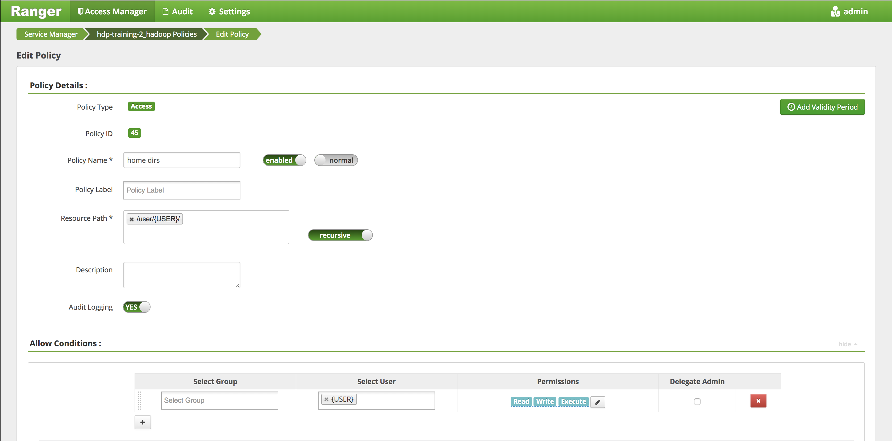

- Create HDFS policy allowing hive user access on /warehouse dir in HDFS
  - Access Manager > HDFS > (cluster)_hadoop > Add new policy > Enter below info


  
- Create Ranger policy to allow `hadoopadmin` group `all permissions` on `persons` table in Hive
  - Access Manager > Hive > (cluster)_hive > Add new policy > Enter below info > Click Add
    - Policy Name: persons
    - Database: default
    - table: persons
    - hive col: *
    - user: hadoopadmin
    - permissions: select all
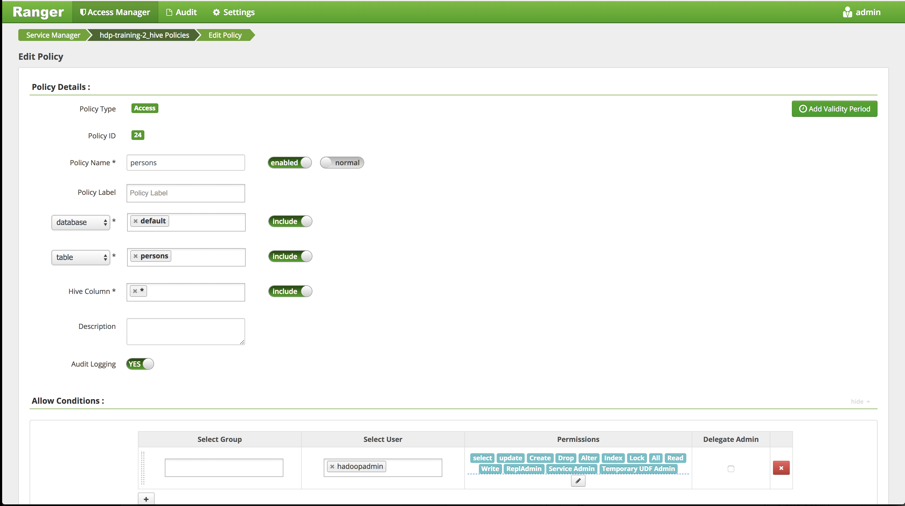


- Login as hadoopadmin
```
sudo su - hadoopadmin
```

- As hadoopadmin user, kinit and run sqoop job to create persons table in Hive (in ORC format) and import data from MySQL. Below are the details of the arguments passed in:
  - Table: MySQL table name
  - username: Mysql username
  - password: Mysql password
  - hcatalog-table: Hive table name
  - create-hcatalog-table: hive table should be created first
  - driver: classname for Mysql driver
  - m: number of mappers
  
```
kinit
## enter BadPass#1 as password

##verify sqoop can connect using the connect info
sqoop eval --connect "jdbc:mysql://$(hostname -f)/people"  --username mysqladmin --password BadPass#1 --query "SELECT * FROM persons limit 10"

```

- Import Mysql table to Hive
```
sqoop import --connect "jdbc:mysql://$(hostname -f)/people"  --username mysqladmin --password BadPass#1 --table persons --hive-import --create-hive-table --hive-table default.persons --target-dir /user/hive/person
```
- This will start a mapreduce job to import the data from Mysql to Hive in ORC format

- Note: in case of error and you need to re-run, it will complain about the table already existing. In ths case, run with --hive-overwrite instead:
```
sqoop import --connect "jdbc:mysql://$(hostname -f)/people"  --username sales1 --password BadPass#1 --table persons --hive-import --hive-overwrite  --hive-table default.persons --target-dir /user/hive/person
```

- Note: if the mapreduce job fails with below, most likely you have not given sales group all the permissions needed on the EK used to encrypt Hive directories 
```
 java.lang.RuntimeException: com.mysql.jdbc.exceptions.jdbc4.CommunicationsException: Communications link failure
```


- Login to beeline
```
beeline -u "jdbc:hive2://localhost:10000/default;principal=hive/$(hostname -f)@LAB.HORTONWORKS.NET"
```

- Query persons table in beeline
```
beeline> select * from persons;
```
- Since the authorization policy is in place, the query should work

- Ranger audit should show the request was allowed:
  - Under Ranger > Audit > query for
    - Service type: HIVE
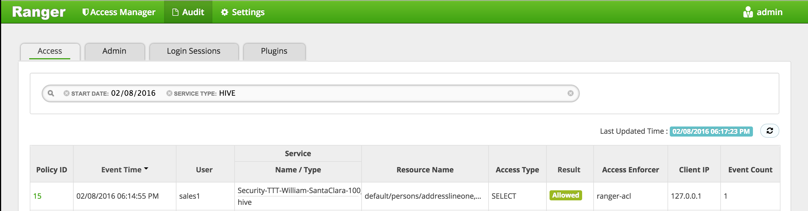


##### Drop Encrypted Hive tables 

- From beeline, drop the persons table:
```
beeline> drop table persons;
```

- Destroy the ticket and logout as hadoopadmin
```
kdestroy
logout
```

- This completes the lab. You have now interacted with Hadoop components in secured mode and used Ranger to manage authorization policies and audits

------------------

# Lab 9

## Tag-Based Policies (Atlas+Ranger Integration)

Goal: In this lab we will explore how Atlas and Ranger integrate to enhance data access and authorization through tags 

#### Atlas Install

- Similar to how you installed other components, use Add Service wizard to install Atlas. For password, use: BadPass#1
- Restart all components that require it

#### Ranger policies for Atlas

- Open the Ranger policies for Atlas and edit the first one "all - entity-type, entity-classification, entity"
  - Add "Read Entity" "Create Entity" permission for kafka on all Atlas entities (see last entry in screenshot below)


- Create two new Ranger policies for Kafka
- 1. On ATLAS_HOOK topic:
  - Allow atlas user Consume/Describe on ATLAS_HOOK topic
  - Allow hive and hadoopadmin users Publish/Describe on ATLAS_HOOK topic 

- 2. On ATLAS_ENTITIES topic
  - Allow atlas user Publish/Describe on ATLAS_ENTITIES topic 
  - Allow rangertagsync user Consume/Describe on ATLAS_ENTITIES topic


#### Import Hive entities via bridge

- How do we get Atlas to recognize the Hive tables we already created before installing Atlas?

- Run import-hive.sh as root
```
/usr/hdp/current/atlas-server/hook-bin/import-hive.sh -Dsun.security.jgss.debug=true -Djavax.security.auth.useSubjectCredsOnly=false -Djava.security.krb5.conf=/etc/krb5.conf -Djava.security.auth.login.config=/etc/kafka/conf/kafka_jaas.conf
```

#### Atlas Preparation

To create Tag-Based Policies, we will first need to create tags in Atlas and associate them to entities

- Use Ambari quicklink login to the Atlas UI using admin/BadPass#1 for the username and pass


- Select the "Classification" tab and click on "Create Classification"


- Create a new tag/classification by inputing
	- Name: `Private`
	- Create


- Repeat the tag creation process above and create an additional tag named "Restricted" 

- Create a third tag named "Sensitive", however, during creation, click on "Add New Attributes" and input:
	- Attribute Name: `level`
	- Type: `int`


- Create a fourth tag named "EXPIRES_ON", and during creation, click on "Add New Attributes" and input:
	- Attribute Name: `expiry_date`
	- Type: `int`


- Under the "Classification" tab in the main screen you should see the list of newly created tags


- In the search tab search using the following:
	- Search By Type: `hive_table`
	- Search By Text: `sample_08`
	- Search


- To associate a tag to the "sample_08" table, click on the "+" under the Classifications column in the search results for "sample_08"


- From the dropdown select `Private` and click `Add`


- You should see that the "Private" tag has been associated to the "sample_08" table


- Now, in the same manner, associate the "EXPIRES_ON" tag to the "sample_08" table
	When prompted, select a date in the past for "expiry_date"


- In the search results panel, click on the "sample_08" link


- Scroll down and select the "Schema" tab


- Select the "+" button under the Tag column for "salary" and associate the `Restricted` tag to it

- Select the "+" button under the Tag column for "total_emp" and associate the `Sensitive` tag to it
	- When prompted, input `5` for the "level"


- On the "sample_08" table schema page you should see the table columns with the associated tags


We have now completed our preparation work in Atlas and have created the following tags and associations:
	- "Private" tag associated to "sample_08" table
	- "Sensitive" tag with a "level" of '5', associated to "sample_08.total_emp" column
	- "Restricted" tag associated to "sample_08.salary" column

#### Ranger Preparation

To enable Ranger for Tag-Based Policies complete the following:

- Select "Access Manager" and then "Tag Based Policies" from the upper left hand corner of the main Ranger UI page


- Click on the "+" to create a new tag service


- In the tag service page input:
	- Service Name: `tags`
	- Save


- On the Ranger UI main page, select the edit button next to your (clustername)_hive service


- In the Edit Service page add the below and then click save
	- Select Tag Service: `tags`


We should now be able to create Tag-Based Policies for Hive

#### Tag-Based Access Control
Goal: Create a Tag-Based policy for sales to access all entities tagged as "Private"

- Restart Tagsync once before creating tag based policies
  - Ambari > Ranger > Actions > restart tagsyncs
  
- Select "Access Manager" and then "Tag Based Policies" from the upper left hand corner of the main Ranger UI page


- Select the "tags" service that you had previously created

- On the "tags Policies" page, click on "Add New Policy"


- Input the following to create the new policy
	- Policy Name: `Private Data Access`
	- TAG: `Private`
	- Under "Allow Conditions"
		- Select Group: `sales`
		- Component Permissions: (select `Hive` and enable all actions)
		
	- Add


- Run these steps from node where Hive (or client) is installed 

- From node where Hive (or client) is installed, login as sales1 and connect to beeline:
```
su - sales1
klist
## Default principal: sales1@LAB.HORTONWORKS.NET
```
```
beeline -u "jdbc:hive2://localhost:10000/default;principal=hive/$(hostname -f)@LAB.HORTONWORKS.NET"
```
- Now try accessing table "sample_08" and notice that the access fails:
```
beeline> select * from sample_08;
```
- Check Ranger audits, and it should show that it is due to the EXPIRES_ON policy

- Lets disable the policy for now
  -  On the "tags Policies" page, select EXPIRES_ON and click disable and Save


- Wait 30s

- Now try accessing table "sample_08" and notice that access works:
```
beeline> select * from sample_08;
```

- Check Ranger audits to confirm this was due to the tag based policy


#### Attribute-Based Access Control
Goal: Disallow everybody's access to data tagged as "Sensitive" and has an attribute "level" 5 or above

- Return to the Ranger "tags Policies" page and "Add New Policy" with the below parameters
	- Policy Name: `Sensitive Data Access`
	- TAG: `Sensitive`
	- Under "Deny Conditions" 
		- Select Group: `public`
		- Policy Conditions/Enter boolean expression: `level>=5`
			- Note: Boolean expressions are written in Javascript
		- Component Permissions: (select `Hive` and enable all actions)
	- Add


- Wait 30 seconds before trying to access the "total_emp" column in table "sample_08" and notice how you are denied access
```
beeline> select total_emp from sample_08;
```

- Audits show that the access was denied because the column is marked Sensitive data which no one is allowed access:


- Now try to access the other columns and notice how you are allowed access to them access
```
beeline> select code, description, salary from sample_08;
```

- Audits show that the access was allowed, which policy allowed access (policy ID) as well as the query itself:


#### Tag-Based Masking 
Goal: Mask data tagged as "Restricted"

- Return to the Ranger "tags Policies" page, click on the "Masking" tab in the upper right hand 


- Click on "Add New Policy" and input the below parameters
	- Policy Name: `Restricted Data Access`
	- TAG: `Restricted`
	- Under "Mask Conditions" 
		- Select Group: `public`
		- Component Permissions: (select `Hive` and enable all actions)
		- Select Masking Option: `Redact`	
	- Add


- Wait 30 seconds and try run the below query.  Notice how salary data has been masked
```
beeline> select code, description, salary from sample_08;
```

- The audits confirm that the column was masked:


#### Location-Based Access Control
Goal: Restrict access to data based on a user's physical location at the time.

- Return to the Ranger "tags Policies" page ("Access" tab) and "Add New Policy" with the below parameters
	- Policy Name: `Geo-Location Access`
	- TAG: `Restricted`
	- Under "Deny Conditions" 
		- Select Group: `public`
		- Policy Conditions/Enter boolean expression: `country_code=='USA'`
			- If you are outside of USA use `country_code!='USA'` instead
		- Component Permissions: (select `Hive` and enable all actions)
	- Add


- Wait 30 seconds and try run the below query and notice it fails
```
beeline> select code, description, salary from sample_08;
```

- Audits show how you are now denied access to the "salary" column because of your location


#### Time-Based Policies
Goal: To place an expiry date on sales' access policy to data tagged as "Private" after which access will be denied

- Return to the Ranger "tags Policies" page ("Access" tab) and re-enable the default policy named "EXPIRES_ON"


- Wait 30 seconds and try run the below query. This will fail
```
beeline> select code, description from sample_08;
```
-  Audits show how you are now denied access to the entire "sample_08" table because it is accessed after the expiry date tagged in Atlas


- Exit beeline
```
!q
```
- Logoff as sales1
```
logout
```

## Policy Evaluation and Precedence

Notice how in the policies above, ones that deny access always take precedence over ones that allow access.  For example, even though sales had access to "Private" data in the Tag-Based Access Control section, they were gradually disallowed access over the following sections as we set up "Deny" policies.  This applies to both, Tag-Based as well as Resource-Based policies.  To understand better the sequence of policy evaluation, take a look at the following flow-chart.


------------------

# Lab 10

## Knox 

Goal: In this lab we will configure Apache Knox for AD authentication and make WebHDFS, Hive requests over Knox (after setting the appropriate Ranger authorization polices for access)

### Install Knox via Ambari

- Login to Ambari web UI by opening http://AMBARI_PUBLIC_IP:8080 and log in with admin/BadPass#1
- Use the 'Add Service' Wizard (under 'Actions' dropdown) to install Knox *on a node other than the one running Ambari*
  - **Make sure not to install Knox on same node as Ambari or if you are running single node setup, change Knox port from 8443 to 8444)
    - Reason: Since we enabled SSL for Ambari, it will run on port 8443
  - When prompted for the `Knox Master Secret`, set it to `knox`
  - Do *not* use password with special characters (like #, $ etc) here as seems beeline may have problem with it
   
  - Click Next > Proceed Anyway > Deploy to accept all defaults

- Do not restart affected services yet, because we need to change HDFS configs for Knox next

- Troubleshooting Knox install
  - If Knox install fails with `JAR does not exist or is not a normal file: /var/lib/ambari-agent/lib/fast-hdfs-resource.jar`:
    - `cp /var/lib/ambari-agent/cache/stack-hooks/before-START/files/fast-hdfs-resource.jar /var/lib/ambari-agent/lib/`
  - If Knox install fails with `java.net.BindException: Address already in use`:
    - Make sure you configured Knox to use a port that is not already in use

### Knox Configuration 

#### HDFS Configuration for Knox

-  Tell Hadoop to allow our users to access Knox from any node of the cluster. Modify the below properties under Ambari > HDFS > Config > Custom core-site  ('users' group should already part of the groups so just add the rest)
  - hadoop.proxyuser.knox.groups=users,hadoop-admins,sales,hr,legal
  - hadoop.proxyuser.knox.hosts=*
    - (better would be to put a comma separated list of the FQDNs of the hosts)
  - Now restart HDFS
  - Without this step you will see an error like below when you run the WebHDFS request later on:
  ```
   org.apache.hadoop.security.authorize.AuthorizationException: User: knox is not allowed to impersonate sales1"
  ```
  
  

#### Knox Configuration for AD authentication
 
- Run these steps on the node where Knox was installed earlier

- To configure Knox for AD authentication we need to enter AD related properties in topology xml via Ambari

- The problem is it requires us to enter LDAP bind password, but we do not want it exposed as plain text in the Ambari configs

- The solution? Create keystore alias for the ldap manager user (which you will later pass in to the topology via the 'systemUsername' property)
   - Read password for use in following command (this will prompt you for a password and save it in knoxpass environment variable). Enter BadPass#1:
   ```
   read -s -p "Password: " knoxpass
   ```
  - This is a handy way to set an env var without storing the command in your history

   - Create password alias for Knox called knoxLdapSystemPassword
   ```
   sudo -u knox /usr/hdp/current/knox-server/bin/knoxcli.sh create-alias knoxLdapSystemPassword --cluster default --value ${knoxpass}
   unset knoxpass
   ```
  
- Now lets configure Knox to use our AD for authentication. Replace below content in Ambari > Knox > Config > Advanced topology. 
  - How to tell what configs were changed from defaults? 
    - Default configs remain indented below
    - Configurations that were added/modified are not indented
```
        <topology>

            <gateway>

                <provider>
                    <role>authentication</role>
                    <name>ShiroProvider</name>
                    <enabled>true</enabled>
                    <param>
                        <name>sessionTimeout</name>
                        <value>30</value>
                    </param>
                    <param>
                        <name>main.ldapRealm</name>
                        <value>org.apache.hadoop.gateway.shirorealm.KnoxLdapRealm</value> 
                    </param>

<!-- changes for AD/user sync -->

<param>
    <name>main.ldapContextFactory</name>
    <value>org.apache.hadoop.gateway.shirorealm.KnoxLdapContextFactory</value>
</param>

<!-- main.ldapRealm.contextFactory needs to be placed before other main.ldapRealm.contextFactory* entries  -->
<param>
    <name>main.ldapRealm.contextFactory</name>
    <value>$ldapContextFactory</value>
</param>

<!-- AD url -->
<param>
    <name>main.ldapRealm.contextFactory.url</name>
    <value>ldap://ad01.lab.hortonworks.net:389</value> 
</param>

<!-- system user -->
<param>
    <name>main.ldapRealm.contextFactory.systemUsername</name>
    <value>cn=ldap-reader,ou=ServiceUsers,dc=lab,dc=hortonworks,dc=net</value>
</param>

<!-- pass in the password using the alias created earlier -->
<param>
    <name>main.ldapRealm.contextFactory.systemPassword</name>
    <value>${ALIAS=knoxLdapSystemPassword}</value>
</param>

                    <param>
                        <name>main.ldapRealm.contextFactory.authenticationMechanism</name>
                        <value>simple</value>
                    </param>
                    <param>
                        <name>urls./**</name>
                        <value>authcBasic</value> 
                    </param>

<!--  AD groups of users to allow -->
<param>
    <name>main.ldapRealm.searchBase</name>
    <value>ou=CorpUsers,dc=lab,dc=hortonworks,dc=net</value>
</param>
<param>
    <name>main.ldapRealm.userObjectClass</name>
    <value>person</value>
</param>
<param>
    <name>main.ldapRealm.userSearchAttributeName</name>
    <value>sAMAccountName</value>
</param>

<!-- changes needed for group sync-->
<param>
    <name>main.ldapRealm.authorizationEnabled</name>
    <value>true</value>
</param>
<param>
    <name>main.ldapRealm.groupSearchBase</name>
    <value>ou=CorpUsers,dc=lab,dc=hortonworks,dc=net</value>
</param>
<param>
    <name>main.ldapRealm.groupObjectClass</name>
    <value>group</value>
</param>
<param>
    <name>main.ldapRealm.groupIdAttribute</name>
    <value>cn</value>
</param>


                </provider>

                <provider>
                    <role>identity-assertion</role>
                    <name>Default</name>
                    <enabled>true</enabled>
                </provider>

                <provider>
                    <role>authorization</role>
                    <name>XASecurePDPKnox</name>
                    <enabled>true</enabled>
                </provider>

<!--
  Knox HaProvider for Hadoop services
  -->
<provider>
     <role>ha</role>
     <name>HaProvider</name>
     <enabled>true</enabled>
     <param>
         <name>OOZIE</name>
         <value>maxFailoverAttempts=3;failoverSleep=1000;enabled=true</value>
     </param>
     <param>
         <name>HBASE</name>
         <value>maxFailoverAttempts=3;failoverSleep=1000;enabled=true</value>
     </param>
     <param>
         <name>WEBHCAT</name>
         <value>maxFailoverAttempts=3;failoverSleep=1000;enabled=true</value>
     </param>
     <param>
         <name>WEBHDFS</name>
         <value>maxFailoverAttempts=3;failoverSleep=1000;maxRetryAttempts=300;retrySleep=1000;enabled=true</value>
     </param>
     <param>
        <name>HIVE</name>
        <value>maxFailoverAttempts=3;failoverSleep=1000;enabled=true;zookeeperEnsemble=machine1:2181,machine2:2181,machine3:2181;
       zookeeperNamespace=hiveserver2</value>
     </param>
</provider>
<!--
  END Knox HaProvider for Hadoop services
  -->


            </gateway>

            <service>
                <role>NAMENODE</role>
                <url>{{namenode_address}}</url>
            </service>

            <service>
                <role>JOBTRACKER</role>
                <url>rpc://{{rm_host}}:{{jt_rpc_port}}</url>
            </service>

            <service>
                <role>WEBHDFS</role>
                {{webhdfs_service_urls}}
            </service>

            <service>
                <role>WEBHCAT</role>
                <url>http://{{webhcat_server_host}}:{{templeton_port}}/templeton</url>
            </service>

            <service>
                <role>OOZIE</role>
                <url>http://{{oozie_server_host}}:{{oozie_server_port}}/oozie</url>
            </service>

            <service>
                <role>OOZIEUI</role>
                <url>http://{{oozie_server_host}}:{{oozie_server_port}}/oozie/</url>
            </service>


            <service>
                <role>WEBHBASE</role>
                <url>http://{{hbase_master_host}}:{{hbase_master_port}}</url>
            </service>

            <service>
                <role>HIVE</role>
                <url>http://{{hive_server_host}}:{{hive_http_port}}/{{hive_http_path}}</url>
            </service>

            <service>
                <role>RESOURCEMANAGER</role>
                <url>http://{{rm_host}}:{{rm_port}}/ws</url>
            </service>

            <service>
                <role>DRUID-COORDINATOR-UI</role>
                {{druid_coordinator_urls}}
            </service>

            <service>
                <role>DRUID-COORDINATOR</role>
                {{druid_coordinator_urls}}
            </service>

            <service>
                <role>DRUID-OVERLORD-UI</role>
                {{druid_overlord_urls}}
            </service>

            <service>
                <role>DRUID-OVERLORD</role>
                {{druid_overlord_urls}}
            </service>

            <service>
                <role>DRUID-ROUTER</role>
                {{druid_router_urls}}
            </service>

            <service>
                <role>DRUID-BROKER</role>
                {{druid_broker_urls}}
            </service>

            <service>
                <role>ZEPPELINUI</role>
                {{zeppelin_ui_urls}}
            </service>

            <service>
                <role>ZEPPELINWS</role>
                {{zeppelin_ws_urls}}
            </service>

        </topology>
```

- At this point, you can restart Knox and all other impacted servces via Ambari


#### Ranger Configuration for WebHDFS over Knox
  
- Setup a Knox policy for sales group for WEBHDFS by:
- Login to Ranger > Access Manager > KNOX > click the cluster name link > Add new policy
  - Policy name: webhdfs
  - Topology name: default
  - Service name: WEBHDFS
  - Group permissions: sales 
  - Permission: check Allow
  - Add


#### WebHDFS over Knox exercises 

- Now we can post some requests to WebHDFS over Knox to check its working. We will use curl with following arguments:
  - -i (aka –include): used to output HTTP response header information. This will be important when the content of the HTTP Location header is required for subsequent requests.
  - -k (aka –insecure) is used to avoid any issues resulting from the use of demonstration SSL certificates.
  - -u (aka –user) is used to provide the credentials to be used when the client is challenged by the gateway.
  - Note that most of the samples do not use the cookie features of cURL for the sake of simplicity. Therefore we will pass in user credentials with each curl request to authenticate.

- *From the host where Knox is running*, send the below curl request to the port where Knox is running to run `ls` command on `/` dir in HDFS:
```
curl -ik -u sales1:BadPass#1 https://localhost:8444/gateway/default/webhdfs/v1/?op=LISTSTATUS
```
  - This should return json object containing list of dirs/files located in root dir and their attributes

- To avoid passing password on command prompt you can pass in just the username (to avoid having the password captured in the shell history). In this case, you will be prompted for the password  
```
curl -ik -u sales1 https://localhost:8444/gateway/default/webhdfs/v1/?op=LISTSTATUS

## enter BadPass#1
```

- For the remaining examples below, for simplicity, we are passing in the password on the command line, but feel free to remove the password and enter it in manually when prompted

- Try the same request as hr1 and notice it fails with `Error 403 Forbidden` :
  - This is expected since in the policy above, we only allowed sales group to access WebHDFS over Knox
```
curl -ik -u hr1:BadPass#1 https://localhost:8444/gateway/default/webhdfs/v1/?op=LISTSTATUS
```

- Notice that to make the requests over Knox, a kerberos ticket is not needed - the user authenticates by passing in AD/LDAP credentials

- Check in Ranger Audits to confirm the requests were audited:
  - Ranger > Audit > Service type: KNOX

  


- Other things to access WebHDFS with Knox

  - A. Use cookie to make request without passing in credentials
    - When you ran the previous curl request it would have listed HTTP headers as part of output. One of the headers will be 'Set Cookie'
    - e.g. `Set-Cookie: JSESSIONID=xxxxxxxxxxxxxxx;Path=/gateway/default;Secure;HttpOnly`
    - You can pass in the value from your setup and make the request without passing in credentials:
      - Make sure you copy the JSESSIONID from a request that worked (i.e the one from sales1 not hr1)
  ```
  curl -ik --cookie "JSESSIONID=xxxxxxxxxxxxxxx;Path=/gateway/default;Secure;HttpOnly" -X GET https://localhost:8444/gateway/default/webhdfs/v1/?op=LISTSTATUS
  ```
  
  - B. Open file via WebHDFS
    - Sample command to list files under /tmp:
    ```
    curl -ik -u sales1:BadPass#1 https://localhost:8444/gateway/default/webhdfs/v1/tmp?op=LISTSTATUS
    ```
      - You can run below command to create a test file into /tmp
      
      ```
      echo "Test file" > /tmp/testfile.txt
      sudo -u sales1 kinit
      ## enter BadPass#1
      sudo -u sales1 hdfs dfs -put /tmp/testfile.txt /tmp
      sudo -u sales1 kdestroy
      ```
      
    - Open this file via WebHDFS 
    ```
    curl -ik -u sales1:BadPass#1 -X GET https://localhost:8444/gateway/default/webhdfs/v1/tmp/testfile.txt?op=OPEN
    ```
      - Look at value of Location header. This will contain a long url 
      
            
    - Access contents of file /tmp/testfile.txt by passing the value from the above Location header
    ```
    curl -ik -u sales1:BadPass#1 -X GET '{https://localhost:8444/gateway/default/webhdfs/data/v1/webhdfs/v1/tmp/testfile.txt?_=AAAACAAAABAAAAEwvyZNDLGGNwahMYZKvaHHaxymBy1YEoe4UCQOqLC7o8fg0z6845kTvMQN_uULGUYGoINYhH5qafY_HjozUseNfkxyrEo313-Fwq8ISt6MKEvLqas1VEwC07-ihmK65Uac8wT-Cmj2BDab5b7EZx9QXv29BONUuzStCGzBYCqD_OIgesHLkhAM6VNOlkgpumr6EBTuTnPTt2mYN6YqBSTX6cc6OhX73WWE6atHy-lv7aSCJ2I98z2btp8XLWWHQDmwKWSmEvtQW6Aj-JGInJQzoDAMnU2eNosdcXaiYH856zC16IfEucdb7SA_mqAymZuhm8lUCvL25hd-bd8p6mn1AZlOn92VySGp2TaaVYGwX-6L9by73bC6sIdi9iKPl3Iv13GEQZEKsTm1a96Bh6ilScmrctk3zmY4vBYp2SjHG9JRJvQgr2XzgA}'
    ```
      
  - C. Use groovy scripts to access WebHDFS
    - Edit the groovy script to set:
      - gateway = "https://localhost:8444/gateway/default"
    ```
    sudo vi /usr/hdp/current/knox-server/samples/ExampleWebHdfsLs.groovy
    ```
    - Run the script and enter credentials when prompted username: sales1 and password: BadPass#1
    ```
    sudo java -jar /usr/hdp/current/knox-server/bin/shell.jar /usr/hdp/current/knox-server/samples/ExampleWebHdfsLs.groovy
    ```
    - Notice output show list of dirs in HDFS
    ```
    [app-logs, apps, ats, hdp, mapred, mr-history, ranger, tmp, user, zone_encr]
    ```
    
  - D. Access via browser 
    - Take the same url we have been hitting via curl and replace localhost with public IP of Knox node (remember to use https!) e.g. **https**://PUBLIC_IP_OF_KNOX_HOST:8444/gateway/default/webhdfs/v1?op=LISTSTATUS
    - Open the URL via browser
    - Login as sales1/BadPass#1
    
     
     
     
      

- We have shown how you can use Knox to avoid the end user from having to know about internal details of cluster
  - whether its kerberized or not
  - what the cluster topology is (e.g. what node WebHDFS was running)


#### Hive over Knox 

##### Configure Hive for Knox

- In Ambari, under Hive > Configs > set the below and restart Hive component.
  - hive.server2.transport.mode = http
- Give users access to jks file.
  - This is only for testing since we are using a self-signed cert.
  - This only exposes the truststore, not the keys.
```
sudo chmod o+x /usr/hdp/current/knox-server /usr/hdp/current/knox-server/data /usr/hdp/current/knox-server/data/security /usr/hdp/current/knox-server/data/security/keystores
sudo chmod o+r /usr/hdp/current/knox-server/data/security/keystores/gateway.jks
```

##### Ranger Configuration for Hive over Knox
  
- Setup a Knox policy for sales group for HIVE by:
- Login to Ranger > Access Manager > KNOX > click the cluster name link > Add new policy
  - Policy name: hive
  - Topology name: default
  - Service name: HIVE
  - Group permissions: sales 
  - Permission: check Allow
  - Add

  


##### Use Hive for Knox

- By default Knox will use a self-signed (untrusted) certificate. To trust the certificate:
  
    - First on Knox node, create the /tmp/knox.crt certificate

```
knoxserver=$(hostname -f)
openssl s_client -connect ${knoxserver}:8444 <<<'' | openssl x509 -out /tmp/knox.crt
```
  - On node where beeline will be run from (e.g. Hive node):
      - copy over the /tmp/knox.crt
        - easiest option is to just open it in `vi` and copy/paste the contents over:
        `vi /tmp/knox.crt`
      - trust the certificate by running the command below      

```
sudo keytool -import -trustcacerts -keystore /etc/pki/java/cacerts -storepass changeit -noprompt -alias knox -file /tmp/knox.crt
```

  - Now connect via beeline, making sure to replace KnoxserverInternalHostName first below:
  
```
beeline -u "jdbc:hive2://<KnoxserverInternalHostName>:8444/;ssl=true;transportMode=http;httpPath=gateway/default/hive" -n sales1 -p BadPass#1
```

- Notice that in the JDBC connect string for connecting to an secured Hive running in http transport mode:
  - *port changes to Knox's port*
  - *traffic between client and Knox is over HTTPS*
  - *a kerberos principal not longer needs to be passed in*


- Test these users:
  - sales1/BadPass#1 should work
  - hr1/BadPass#1 should *not* work
    - Will fail with:
    ```
    Could not create http connection to jdbc:hive2://<hostname>:8444/;ssl=true;transportMode=http;httpPath=gateway/default/hive. HTTP Response code: 403 (state=08S01,code=0)
    ```

- Check in Ranger Audits to confirm the requests were audited:
  - Ranger > Audit > Service type: KNOX
  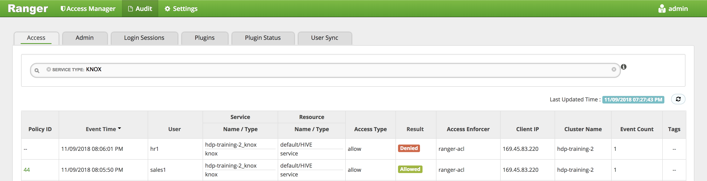


- This shows how Knox helps end users access Hive securely over HTTPS using Ranger to set authorization policies and for audits

------------------

